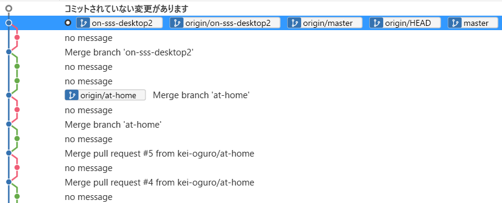

2020 [4月](2020-04.md)  [5月](2020-05.md) [6月](2020-06.md) [7月](2020-07.md) 今月

## 08/17 月
  * 今日はハダニが見つからなかった。
    * ついに全滅したのか、またそのうち増えるのか。
  * バジルもパクチーもなかなか発芽しない。
    * パクチーは発芽に時間がかかるからともかく、バジルはやりなおしかな。
      * 何がダメなんだろう。
        * 水が多過ぎる？
      * 10本程度発芽したんだけど、発芽率が悪過ぎるので、スポンジに切れ込みを入れて、そこに仕込んだ。
        * 水やスポンジをそのまま使ったせいかも知れないから、種を全部捨てて洗ってからもう一度試そうか。
  * LOOK4 買いに行くのを忘れてた。無くなっちゃった。
  * 金曜、会社で書いた分の日記を push し忘れてマージ。
  * mp4 は埋め込めないのか。
    * gif にした。金曜夜の渋谷。
  * __ランチ__ はSSS 14Fの `ラ・コキーナ` のサラダランチ。
    * https://tabelog.com/tokyo/A1303/A130301/13239515/
    * 1100円でちゃんと草が沢山入ってる。クリスプサラダワークスの方が量に対してやや割安だが、この立地で座って食べられるなら悪くないだろう。
    * お昼ご飯をサラダで済ませたのは、今晩、蟹食べ放題に行くため。
  * 
 SSS 17F ローソンで `リンツ` のトリュフが半額。
   * 元がいくらなのか分からない状態で買ってきた。
     * 元が 486円、半額で10粒486円。
       * 1粒50円程度で、言うほど安くはないな。
  * 蟹食べ放題。
    * いくらの時ほど盛り上がらない。
    * いくらはいくらだけ食べ続けるのは無理だが、蟹はずっと蟹だけでいい。
      *  この蟹を3人で食べると、
        *  この殻入れが半分になる。
          * 2皿で殻入れを交換。
        * 5皿食べたので、殻入れが2個半ずつ。
    * 蟹の品質はイマイチ。
      * 1980円であれだけ食べれば文句言えないというか、安いことは確か。
    * 3人で行った。
      * 蟹ブースト蟹チャーハンを作るために、僕は蟹を小皿にストックしておいた。
        *  この蟹チャーハンが、
          *  こうなる。
            * うーん、思ってたほど盛り上がらない。
            * 食べてみると蟹触感優勢で結構いい。
        * チャーハン自体は醤油が強くて塩辛い。胡椒も強くて、それはBグルっぽくて美味しい。

## 08/16 日
  * :walking: 9.74km
    * あっつ！
      * かなりピンポイントに雨が降っていた。
    * 方南町のホームセンター `島忠` へ。
      * 何か面白い苗がないかと見に行ったが、野菜やハーブはあまり充実してなかった。花や観葉植物メインになる季節なのかな。
      * 鉢受け皿、アンプルの肥料、ペットボトルの口に取り付けるとじょうろになる品、マスクを買ってきた。
      * コーヒーを淹れるのに、フィルターにお湯を注ぐのが安定しないので、急須か何かが欲しかったんだけど、結局買わなかった。
        * なんでだっけ？
        * 水だしのお茶を会社で作ろうと思って、水出しポットを買わなかったのは、一度フレンチプレスでやってみようということで、理由を覚えてる。
  * 方南町で買い物を終えたころ、友達からラインの返信。
    * 出かける前ににメシに誘っていた。
    * 1人だと色々頼めないせいで行きにくい店に行きたかったので。
      * ビア缶チキンに興味があった https://tabelog.com/tokyo/A1304/A130401/13157090/
      * フランスのBグルを出すという看板の店 https://tabelog.com/tokyo/A1318/A131802/13211400/
      * 大衆バカ盛り酒場 https://gftm401.gorp.jp/
    * ピンとこないそうだ。
    * ヘルシーなのがいいというので、刺身や寿司やサラダバーの店を挙げても反応薄い。
    * 最近できた新大久保のベトナム料理バイキング `みちゃん` で合意。
      * https://www.hotpepper.jp/strJ001247037/
      * 
      * 行ってみたら、時間が遅い(21:00)からビュッフェの補充をしたくないみたいで、断られた。
    * 前から気になっていた韓国刺身のお店へ。
      * 4年かそこら前に、歌舞伎町に韓国刺身の店ができて、少しずつ店舗が増えてた。
      * いいだこの刺身が人気で、テレビ取材もたまにくるし、6割の人が注文するそうで、頼んでみた。
        * 
        * 足が動く。
          * レモン汁をかけるともっと動くよ！ということでポッカレモンがついてきた。
          * 動画撮ったけど、ちょいグロいし、あんまり派手に動かない。
        * 値段の割には量が少なく、硬くて食べにくいし、エンターテインメントの料理かな。
      * ヤンニョムケジャンも頼んで、こちらは安いわりに量が多くて良かった。
      * 肝心の韓国刺身を頼まなかった。
        * メニューを見ると、サンチュに巻いて食べるようだ。
        * また、丸の魚から3枚下ろしする刺身は、中骨と頭で鍋にできるそうだ。
        * それはちょっと興味あるので、いずれまた行ってみたい。
          * そこそこ値が張るけど。
  * iPhone で撮影した写真を共有アルバムに分類してる。
    * カメラロールやアルバムから共有アルバムへ移すと、位置情報を iPhone で見れない。
      * 写真を探すときに不便。
    * 食い物屋 https://www.icloud.com/sharedalbum/#B16532ODWykvUq
    * 手料理 https://www.icloud.com/sharedalbum/#B165qXGF1Hu7Qp
    * 園芸 https://www.icloud.com/sharedalbum/#B16GY8gBYGyPDja
  *  ずっと閉まってた新中野のタイ料理屋さんが、かなり久しぶりに見たが復活したみたいだ。前と同じ店なのかどうか分からないけど。

## 08/15 土

  * 災害級の猛暑だと、ニュース記事は言っている。
  * ケークサレが膨らまないのは、そういう仕上がりを狙ったレシピなのではないかと思って、マフィンとかパウンドケーキのレシピを見てみると、やっぱり結構違う。お手本にした本では、水分がはっきりと多い。
    *  膨らむじゃん。
      * みっしりした感じのを狙ってたということだね。
    * それと別に、パウンド型が大き過ぎる気がする。というか大き過ぎる。
     *  18cm のを買ってきたはずなんだけど。
  * 焼けるのを待つ間にビールなどを飲む。
    * 自家製アンチョビとレモンをかじって、パセリを箸休めにする。
      * このアンチョビは2年前だっけ？アンチョビ自体が悪くなるわけはないが、オリーブオイルが酸敗臭してる。
        * 一度とりかえたが、さっさと使わないとキリがないな。
    * ビールの後は、たまたまあったライムジュースに、ジンやウォッカは当たり前すぎるので、安ブランデーやオールドパーを入れてみる。
      * 安ブランデーは悪くない。パーはもったいない。
  * しばらく会ってない飲み仲間が誕生日だとLINEのタイムラインに。
    * 見かけると、やっすいLINEギフトを送りがち。親しくない女の子とかには送らないけど。
      * ローソンの唐揚げ216円とかが丁度いい。
      * 相手の住んでる場所によって、ミスドにしたり。
    * そんで、終戦記念日が誕生日の人が徳島に赴任してて、むしろ徳島にないお店のを送った。
      * 数百円だと使うために頑張らないだろうから3000円くらいのにしたかった。
      * スープストックトーキョーとか、丁度四国になくて丁度良かったんだけど、ピーチジョンのギフト券があるのを見つけてしまった。
        * 単身赴任で娘のいるその飲み仲間に送るには、なかなか楽しい選択肢だと思う。
        * ギフト券の期限は今年いっぱいなんだけど、使うのだろうか。誰のを買うのだろうか。
          * その飲み仲間がコッチで飲むときに、みんなと話題の広がる、なかなかの選択だったと思う。
  * 方南町の島忠に苗を見に行こうと思っていたが、その前にベランダの植木を見てたら、暑くて無理。
    * このあとに中野に行くんだけど、それも途中でバスかタクシーに乗るかも。流石災害級猛暑。
    * 結局やめた。
  * :walking: 5.32km
    * 中野にテイクアウトしに行く。
      * 途中、早稲田通りの爬虫類屋さんが店を拡大してて驚いた。
        *  隣の新店舗。
        *  奥の旧店舗。
    *  `珉珉` というお店の四珉麺という四川風冷やし中華をリクエストされたけども、それは中野店ではやってないそうだ。
      * そして、冷やし中華は汁物だから持ち帰りできないと。
      * 何も頼まないのもどうかと思い、辛いチャーハンと、豚肉の唐揚げを持ち帰り。
    * 辛くはないけれど、少し話題になりそうなものをということで、
      * `みかさ` https://tabelog.com/tokyo/A1319/A131902/13241897/ の焼きそばと、
      * `ようすけ` https://tabelog.com/tokyo/A1319/A131902/13241897/ の冷やし鶏そば  
      を持ち帰る。
    *  中野五差路の魚河岸何とかいう寿司屋が潰れてた。
      * 朝4時までやってて便利だと思ってたけど、夜中に行ったら煙草モクモクしてて行かなくなった。
        * 喫煙禁止が厳しかったのかも知れない。
  * 大久保通りから帰って、`鶏笑` という唐揚げ屋でテイクアウト。
    * 少し前にテレビで取材されていたと聞いたので、話題になるだろうと。
    * ムネ、モモ、砂肝、せせり、あとなんだか頼んだ。
    * 15分くらいかかるというので、唐揚げを待っている間、どこかで一杯やろうと思ったが、丁度6時前でもあるし、お盆休みだし。
      *  スーパーがやってないなんて。
      *  なんでそんなウソつくの。open の電気がついてて、札は営業中なのに、中は電気がついてない。
      * どこもやってなくて少し離れたファミマのイートインで350缶を。
        * ストロングラムネを買ってみたが、アルコールのにおいがキツ過ぎて厳しい。
          * 残しても困るので無理して飲んだが、飲み残しを捨てるところがあった。素晴らしい。
    * 唐揚げを取りに戻ったら、取り違えがあった。
      * 僕の注文は他の人に渡してしまったそうで、揚げ直すから待ってくれと。
        * いやいや、一杯飲みながら待つ場所があればいいけど。
        * で、間違いの商品を受け取って、差額を返してもらった。
      * お店には災難だ。
        * 僕の注文は 1890円で、取り違えのは960円。
  *  ケークサレの断面。まあまあ膨らんでる。
  * 酔って転んだ。
    * 青になる直前の赤信号を無視して渡って、渡り切った青になった瞬間に転んで、たったそれだけ急いだせいで転んだみたいで恥ずかしい。
  * `git branch --show-current` が、自宅のバージョンではエラーになってた。
    * `git update` する。
      * `git update-git-for-windows` にしとけ、と言われたが、それに目がいかずに `[N/y]` というのだけ見て y にした。

## 08/14 金

  *  薬局でタバコを売るんだ。
  * 8:30 過ぎの電車が思ったより混んでた。お盆なのに。
  * 職場周辺でコーヒー豆を買おうとちょっと検索してみたが、東急本店の地下にキャピタルがあるくらい。
    * 移転前の職場の辺りには沢山あったのに。
* __ランチ__ は中食。ヒカリエの地下でサラダ、SSS地下で鯖味噌煮とアジフライを買った。
  * でかい！ 
  * 今ならセットで1600円。バラで買うともう少しする。
* `東京たらこスパゲッティ` は今日も盛況だった。
  *  `焚火家` のヒマラヤGOと迷ったけど、ランチは __タパス食べ放題__ を謳うクロスタワーの `イルドレ` へ。
    * http://iledere.jp/menu/
    * でも、外から見えるところに、その手のことが書いてない。パス。
      * 戻るエスカレーターから、ちょっとソレっぽいのが見えたので、また覗きに行ってみよう。
  * ということで、昨日気になっていた鯖味噌煮とアジフライを。持ち帰りなら焚火家で良かったんだけど。
  * 満腹過ぎる。サラダ不要だった。
  * `ポールバセット` でエチオピアのナチュラル製法の __コーヒー豆__ を買ってきた。酸味が強いらしい。どちらかと言えば苦手だが。というか、ポールバセットで酸味少な目となってる豆でも酸っぱ過ぎる。
  * `すぐに push` のチェックボックスをつけたまま amend commit して面倒になった。
  * Fortnite というバカ売れのゲームが iPhone と Android のストアから排除された。
    * 30%のロイヤリティは高過ぎると。
    * この Epic Games という会社は、過去にも Steam という PC 向けゲームを売るプラットフォームに同じ理由でケンカを売った。
      * まあ、それが悪いワケではないが、キレイ事を言っていても結局儲けのため、ポジショントークだということを忘れるべきでない。
  * note のソースにIPアドレスが書かれていたというのが、今まで話題になってなかったというのが意外。
    * 個人HPの掲示板でよくあったわけで、それがポリシーでやっていたならむしろ好感を持つけど。
      * もちろん、注意喚起したうえでね。
      * 個人情報をガンガン公開しろとまで言ってるワケではない。
    * まあ、匿名だからと好き勝手言ってた連中に同情する気にはなれない。
  *  金曜夜の渋谷は流石に混んでるな！
    * と思って動画を取ったが、動画で見ると、23:00 過ぎにこの程度なら、程々に自粛してるな、と思い直した。
    * スクランブル交差点はそこまで混んでなかった。
    * センター街にはそれなりに人がいたが、宇田川町交番の通りは、人はいるけど金曜夜としてはガラガラと言っていい。
  *  西新宿の焼き鳥屋がラーメン屋になってた。
    * 新潟のご当地ラーメンで、燕のは東京であんまり聞かないので、少し楽しみ。
      * 長岡の生姜のが多いかな。
  * :walking: 5.68km
    * ここのところ就業が遅くなりがちで電車が多かったが、今日は歩いて帰った。
    * 帰り道、2度も落ちてるセミを蹴った。
      * 申し訳ないと思わなくもない。

## 08/13 木

  * まだ __ハダニ__ がいた。
    * なかなかゼロにはならない。終息ではなかった。
  * アブラムシだと思っていたのは、見た目の現象を調べるとハダニのようだ。
    * クモの巣🕸みたいなのも確かにあった。
    * 今日ベランダに __蜘蛛__ 🕷がいた。
      * 頑張って食べ尽くして欲しい。
  * 今日は宅急便受け取りで早く帰りたいので、 __早く家を出た__ 。
    * 8:30 過ぎくらいで、いつもなら公務員や銀行などの 9:00 出社の人で 9:30 頃よりも人が多いのだけど、今日は少ないな、と思ったら __お盆__ か。
      * いつもは 8:00 過ぎから 8:20 くらいが一番混む。
        * 学生がいるから。それに少し早く行きたい会社員。
    * エレベーターホールが冷房効いてるのに、オフィスは効いてないので暑く感じる。
  * 昨日空振りした `神南軒` は、1600円で昼からBBQできるそうだ。屋上で。但し2名から。
    * http://beergarden.jinnanken.com/
    * この値段だとお代わりはできないんだろうなあ。
      * お肉のグラム数はどのくらいなんだろう。
  * ランチに行くにも、お盆休みのところが多いんだろうなあ。
    * お盆期間中なら `東京たらこスパゲッティ` もすぐ座れるかな？むしろ集まってくるかな？
    * `もうやん` が休みだそうだ。
  * __ランチ__ はSSS2Fの `クリスプサラダワークス` の持ち帰り。
    * 7/29に食べた時よりもハムのカットが小さい。もっと大振りの方が美味しいよ！
    * やっぱりナッツは存在感を感じない。
    * タンパク質を追加するのに、SSS地下で何か買おうかと思ったがピンとこなかった。
      * やたらでかいサバ味噌とやたらでかいアジフライがセットで1600円で心を惹かれたが、あれは多い。
    * 今日の昼、友達とお茶の約束があるのを忘れてた。危うく外に食べに行くところだった。
      * 
 友人とお茶して、その店を出て初めて、 __飲めるオムライス__ の看板に気付いた。
        * https://tabelog.com/tokyo/A1303/A130301/13163276/
        * 頼んでも良かった。
  *  `英雄的ゲリラ` という写真だそうだ(Wikipedia より)。
    * イデオロギーと関係なくファッションに使われるようになる過程を表現した `Chevolution` という映画があるそうだ。
  * 8272歩。
  *  宅急便を無事受け取った。


## 08/12 水

  * 35°C。
  * 日記の __移行先__。
    * note はどうか。
      * 広告は出ないけど、ブログのように新着何件を並べて表示しないのは不便か。
        * 現状の月替わりページのやりかたにしたら一緒だけど。
    * ツリー型の掲示板が、今のところの僕の理想なのかもしれない。
      * 元記事の新着何件、という表示は、現状の月替わりページよりも便利だ。
      * いや、変更履歴が見れないな。
    * ツリー型は、話題の掛かり受けを明示できるので良いと思う。
    * 自前で github からデプロイすれば、細かい部分でやりたいようにできる。
      * 面倒になってやらないだろうけど。
      * 他人のコメントを受け付けたいか？
        * なら、ブログなどのサービスから選ぶべきだろう。
  * __コーヒー__。
    * 高温でゆっくり出した。
      * 昨日よりはマシ。
        * ゆっくりといっても、今の器材では __お湯が暴れ__ てしまう。
        * ガラスでないと、レンチンできない。
          * 職場に電熱器の類を持ち込めないので、電子レンジで沸騰させる。突沸注意。
        * __急須__ という手があった。
          * 口の細い急須(できればガラス)を探してこよう。
  * __ランチ__ は `SPICELY` で、パスタ＋サラダバー＋ __ローストビーフお代わり自由__ 1600円。
    * https://tabelog.com/tokyo/A1303/A130301/13240889/
    * 以前はローストビーフがなく、その代わりに __カレー__ とお惣菜が __ビュッフェ__ だった。
    * 昨日の `フィオーレ` の方がモノがいい。
      * コッチはちょくちょくお代わりを聞きに来てくれる。向こうは自分のスマホで注文。
        * 頼みやすさはどちらも素晴らしい。
    * ローストビーフを2回お代わり、都合3皿食べた。
      * 2皿目だけ、やたら厚切りだったし、量も多かった。
      * 薄切りの方が美味しい。肉も違うのではないかというくらい。
  * タワレコの先の `OLIVE` に行くつもりで会社を出た。__サラダバー__ が目当て。
    * https://tabelog.com/tokyo/A1303/A130301/13173329/
    * 表のメニューを見るとやってなさそうだったのでスルー。
  * 次は `神南軒` を覗いた。ここも __サラダバー__ 目当て。
    * https://tabelog.com/tokyo/A1303/A130301/13005411/
    * ちゃんと書いてあったが、屋上のビアガーデンしかやってないそうだ。予約すれば昼からもできるとか。
      *  エレベータの中にも、公式サイトにも書いてた。
  *  昨日と打って変わって不穏な空。この写真だとまあまあ明るいけど、雷も鳴ってる。
  * 親から日本酒🍶を __宅急便__ で送ったとメール。
    * いつもは連絡なしで不在通知で気付く。
    * 今週末は、家族で会食しようということになっていたけど、それがコロナの自粛要請でお流れになった。
  * 7743歩。

## 08/11 火

  * ハバネロにアブラムシが湧いていたが、終息したようだ。
    * 木酢液を沢山スプレーしてて、減りつつはあったけどなかなか全滅しないので、手で丁寧に払ったらようやく見当たらなくなった。
  *  SSS オフィスロビーから見た空が青い！今日は暑そう！
  * 新しい __コーヒー__ はポールバセットのガテマラ。
    * 温度高めのお湯で短い時間で出したが、酸っぱいのと発酵臭が凄い。
      * これは淹れ方を失敗したのか。浅煎り好きの人はこういうのを好むのか。
  * __日記移行先__ として `evernote` を使ってる人の記事をいくつか読んでみたが、これなら sns の方がいいな。
    * というか、ブログサービスでいいんじゃないのか。
    * 移行とか、バックアップを考えると、github からデプロイするのが良さそうではある。
      * github がアカウント無しで閲覧できればいいのに。バージョン履歴も見れるし最高じゃん。
  * 家を出るときに、エアコンを消さなかった気がする。
  * __ランチ__ はフィオーレ。
    * https://tabelog.com/tokyo/A1303/A130301/13235900/
    *  ビュッフェ！
    *  ローストビーフお代わり自由！
      * 以前は並んでるところから取ってきてたが、今の形式の方が美味しい。
        * 前の方が一切れが小さかった。今のは薄くて大きいので触感が良い。
      * 100g 近く入ってそうに見える。気前いい。
    *  ビュッフェ！
      * 奥のテーブルには、カレー、鶏もものトマト煮込み、チーズドリア、ラグーのペンネ。
      * 取りに行くたびに手を消毒して、新しい皿を使い、トングを使う方の手に使い捨て手袋。
    *  サラダバー！
      * 客入りが悪いので、あんまり入ってない。バエない。山盛りになってて欲しい。
    *  ピザもオーダーバイキングで食べ放題！
      * 前はもっと薄い生地で気前よくチーズが乗っていて、ちょっと珍しい感じだった。
      * ナポリっぽい見た目になった。
        * 今ではよく見るので、前の方が差別化はできたのでは。
      * 豚キムチは美味しい。
    * コロナ前に行ったことがあって、なかなか良かった。
      * 前は 1500 円だったと思うが、1900 円に値上がり。
        * 今日僕が食べた量を考えるとまだまだ安いが、他人に勧める値段じゃなくなった。
  * お腹を壊す人が増えている。
    * 僕も昨日下し気味だったが、これはエアコンでお腹を冷やし過ぎたと思う。
  * github に日記を push するのに、プルリクを出すのはいかにも大げさだ。
    * しかしマスターに直接コミットして push するのも適当過ぎる。
    * そこで、ローカルでマスターに --no-ff マージして push する。
      * 使うリポジトリによって、別のブランチを切ることで、どこからのコミット、push なのかが分かるようにする。
        *  こんな風に。
    * svn のブランチの作業スタイルが好きだった。
      * なんて名前のブランチでどんな作業をしたのかが残る。
        * 編集意図の一部が残る。
      * git も svn も同じだが、merge into の動作ができず、 merge 先を checkout してから merge する。
        * 面倒なので、スクリプトを描いた。なんでコレを手でやらないといけないのか。
```
#! /bin/sh

# merge into master

BR=`git branch --show-current`

git add --all
git commit -m "no message"
git checkout master
git merge -m "Merge branch '$BR'" --no-ff $BR
git checkout $BR
git merge --ff master
git push --all
```
  * 7756 歩。
    * 通勤で片道 1700歩くらい歩いてるらしい。思ったより多かった。

## 08/10 月 山の日

  * パクチー発芽せず。
  * __日記の移行先__ として、無料Wikiなら丁度いいと思うのだけれども、容量制限に言及してない。
    * Google Docs かなあ。
      * Google Site を試してみた。
        * イチから書く分には悪くないかもしれない。
        * 既存のを移行するのは面倒かも
  * 昔、 __西新宿7丁目__ を指すのに、`とみん銀行の側` と表現していた。
    * 今はみんな何て言うのだろう。
      * `タカマル水産` 、 `にぎりて` 、 `麺通団` 、 `柏木公園` 辺りが僕の良く分かる表現だが、他人にはあまり通じなさそう。
  * :running: 4.73km
  *  大久保通り。
    * 右側は昔 `さわ田` のあったところ。
      * https://tabelog.com/tokyo/A1301/A130101/13001043/
      * さわ田の次の店も出世したけど、その後は続かず。
    * 真ん中はずっと同じ店が長くやってる。もう焼き鳥は焼いてないみたいだけど。
    * 左側は不動産屋さんだった。
  * 晩御飯は中野 `のトリコカレー`
    * https://tabelog.com/tokyo/A1319/A131902/13169742/
  * Explorer でファイルをコピーして fromclip の出力を `od -t x1` すると sjis になってる。
    * これは、fromclip は utf16 で出力し、bash は CF_TEXT で読み取ろうとし、 win32 は `WideCharToMultiByte()` で sjis にして渡しているということだろう。
    * mbcs で受け取ったときに判別して utf16 にするコードは入れたが、utf16 での出力では実務で不便だと。
      * 引数でオプションを指定するしかないか。
      * 環境変数で WideCharToMultiByte() の動作が変わるといいのにな。

## 08/09 日

  * :running: 5.62km。
  *  季節的には遅いけど、パクチーを発芽させる。
  *  __魔法のケーキ__ を焼いた。
    * https://www.amazon.co.jp/gp/product/4391146991/
    * 具は 8/2 のケークサレのもの。
  * __手を切った__。
    * 2か所も切った。
    * 両方、紙で切った。紙の端にこすって切った。
  *  __ケークサレ__ も焼いた。
    * 具は魔法のケーキに載っていた、キッシュドロレーヌのもの。グリュイエールチーズとベーコンとディジョンマスタード。
    * 見た目はほとんど一緒だなあ。
      * チーズのっけたからなあ。
      * 魔法の方がよく見るとスポンジっぽくはある。
  * __ツムツム__ のミッションに失敗したからツムを変更したら、ミッションが変わってた。
  * github で __日記__ を付けても、アカウント持ってないと読めないんだな。
    * どっか別のストレージに同期しないといけない。
    * GitHub webhook っていうのを使うのかな？
  * 最初から __Google Drive__ で書くという手もある。
    * 利点
      * Google Docs だと、写真の埋め込みは楽だな。
        * 縮小かけるなら、対して手間は変わらないかな。
    * 欠点
      * 職場の日報とのコピペがだるい。
      * リンクが長い。
        * 短縮URLサービス使うだけか。
      * ページ区切り無しのモードが無い。Web 日記としては読みにくい。
      * GitHub も同様だが、画像を小さく表示して、クリックすると大きくなる、ということができない。
        * Docbase はそこは素晴らしい。
    * Markdown 対応の無料ストレージがあるといいんだけど。
    * GitHub が、閲覧だけならアカウント無しで使えればいいのに。
  * 方南町の島忠本店の園芸コーナーを見てみたかったが、Google Docs をいじってたら遅くなった。
  * HitHub で表示したのをコピペで Google Docs に持っていける。
    * 移行は滅茶苦茶簡単だということだ。
  * ん？個人でDocbase借りられるかな？
    * 月900円だそうだ。
      * 全然ありだな。
  *  __刺し盛が半額__ だというので行ってきた。
    *  コレが税込み1100円なら、スーパーより安いのでは！
    *  __金目鯛一本料理__ というなかなかグッとくる単語。
      *   1匹を、半分刺身、半分煮つけにしてもらう。
        * 刺身はとてもおいしかったけど、刺し盛食べたんだから、煮つけと塩焼きにしてもらえば良かった。
    *  店内の半額メニューと看板の半額メニューが違う。
      * 焼きフグを頼みたかったが、躊躇してやめた。
    *  升のフチが分厚くて飲みにくい。
      * というか、普段は升からグラスに移し替えて飲むんだけど、この升じゃ上手く注げない。
      * これは、こぼして注ぐ時に、見た目に比べて容量が小さくなるようにこうしてるのではないかと疑う。
  * 夜9時なのに滅茶苦茶暑い！
  * ケーキの断面。 

## 08/08 土

  * :walking: 1.33km :walking: 0.94km :walking: 7.45km
  * eggslut
    * https://eggslut.baycrews.co.jp/
    * 白身の触感が楽しい。
  *  電車が踏切で停止。不運な。
    * 新宿代々木間。
  * パウンド型を買いにダイソーに行ったら、紙のとシリコンのだった。
    * シリコンでも悪くはないんだけど、熱伝導が悪いので焼き時間を工夫しないといけない。
    * それで新宿の富澤商店で買ったんだけど、生涯で焼く回数を考えたら、焼く度に紙のを買った方がいい気がする。そのまま持っていけるし。3枚110円。
  *  赤いきつね。

## 08/07 金

  * 8374 歩
  * 目覚ましが鳴った時にはかなり目が重かったけど、起きたら普通に起きれた。
  *  暴君が青年に。
    * 上の2つが見やすいけど、手前にもついていて、ソチラの方が大きい。
    * 横に伸びてるので支柱を立てた方がいいんだけど、面倒だし、具体的な案がない。
      * 元々唐辛子は支柱を立てて育てるものなんだけど。
  * 近所のバーにおすそ分けした植木に、梅雨明け以降水やりしていないようだ。
    * カレーリーフがかなりションボリしてて、この木はこういう葉っぱの付き方をする植物じゃないよ！
      * 写真撮ってくれば良かった。
  * 量産型ザクの色を調べる。
    * アニメのシーンを検索して、バイリニア縮小して、スポイトで調べる。
      * 144, 186, 152 
    *  このくらいなら著作権はセーフだよね？
    * 検索するとプラモデルがほとんどで、アニメがなかなか出ない。
  * お茶を淹れてるのを忘れてて、濃く出過ぎないように揺すらないようにして引き上げて飲んだが、これは美味しい。
    * 次からもこう淹れよう。
    * そういや、昨日は3煎目まで飲んだ。うっかりと。一応美味しく飲めた。
      * なら今日の3煎目は楽しみだ。
  * __ランチ__ は `NICK STOCK` 。
    * https://tabelog.com/tokyo/A1303/A130301/13209007/
    * 職場がSSSに移転する前から目をつけていたんだけど、行ってみたらピンとくるメニューが無かった。
      * 何にグッときたんだっけ？
        * 当時はトッピングか何かでもっと柔軟にコンビネーションできたんだっけ？
      * このキャンペーンの最中に行ければ良かったが。 https://nickstock-shibuya-dogenzaka.com/2020/07/06/campain-2/
    *  ランチのついでに道玄坂上のこの辺を歩いて、ランチやってるお店を探してきた。
      * あんまりピンとこなかったかな。
      * その区画から通りを挟んで見える `とらふぐ亭` が昼もやってることが収穫だった。
        * https://www.torafugu.co.jp/shibuya/menu/lunch/
  * ついでにパウンド型を買いたかった。
    * マークシティの地下の東横のれん街に富澤商店が入っていたが、東横のれん街自体が無くなった（改装してたヒカリエの地下がのれん街という名前になった）。
    * ハンズやロフトに行けば当然あるんだけど、SSSのハンズにもあると思って直行したら無かった。意外。
  *  成城石井の __生姜飴__ が遠慮なく辛い！
  *  仕事早い。
  * &yen; html の実体参照 `&yen;` で vscode の markdown プレビューは __日本円記号__ &yen; を表示できる。
    * 0xa5 を直接入力できないか。utf8 なら文書中にあれば円記号として問題でないだろう。
      * と思ったが、 0xa5 だけのテキストファイルを vscode は円記号と認識しなかった。
        * どころか git bash も同様だった。
    * `perl 'print "\xa5"' | od t x1` でちゃんと 0xa5 をリダイレクトするが、それをコンソールに流しても日本円記号にならない。
      * ファイルにリダイレクトして vscode で開いてもダメ。
        * そのファイルを `cat tmp | od -t x1` するとちゃんと 0xa5 。
    * まあ、 HTML 実体参照で十分か。
  * ドン・キホーテにもパウンド型はなかった。

## 08/06 木

* 出社がギリギリだったので、コーヒーを淹れずにお茶にした。
  * まあ、昨日は同じような時間でしっかりコーヒー淹れたけど。
    * 思い出した。時間の問題じゃなくて、コーヒー豆が切れてたからだ。
* Unicode の __日本円記号￥__ 0xa5 は MS IME ではどうやって入力するんだ？0x5c じゃなくて。
  * そこだけ mac で入力するか？
* __名刺をコンビニで印刷する__ サービスがあるんだ。初めて知った。
  * コンビニ複合機に、名刺用紙が入ってるのか、的な意味でね。
  * しかし、一枚100円は高い。
  * ていうか、コンビニプリンタに好きな用紙をセットできればいいのに。
  * まあ、ネット入稿で、1週間以内に到着して、1000円しないというなら、それで十分だな。
    * 久しぶりに検索したら、便利で安くなってて嬉しい。
* __ランチ__ は `べるまっしゅ`。
  * https://tabelog.com/tokyo/A1303/A130301/13034946/
  * サラダバーと小皿お惣菜ビュッフェ。
    * サラダバーは、
      1. 取りに行く時にアルコール消毒
      2. トングは1人1つ、一回ごとに返して、次回はまた新しいのを使う
      3. サラダは葉野菜ミックス1種類
    * というシステムでコロナ下でもビュッフェを頑張ってる。
* ここが空振りしたら `秀` というお店に行こうと思っていた。
  * https://tabelog.com/tokyo/A1303/A130301/13052378/
  * 閉店してた :sweat_drops:
    * べるまっしゅ先にして良かった。
  * 事前に覚えていた場所が首都高の反対で、回るのに苦労した。
* `秀` から職場への移動中に、`ラーメン はやし` の様子を見てきた。
  * やたらに並ぶ人気店で、ランチしかやらない。
    * 行列はゼロだったが、カウンターは埋まって見えた。
      * 並びがないので売り切れかと思ったら、まだ営業中だった。
* べるまっしゅは `桜が丘` 方面の `南平台`。
  * `SSS` から `桜が丘` 側に行くのは、まず `モヤイ像` 側に回らないといけないのと、そこから歩道橋で渡る、ということで結構面倒な上に、経路の選択肢が多い。
    * 個人的には、2Fで `渋谷ストリーム` 側に移動し、`墨国回転鶏酒場` のところから地上に行くのがオススメ。
*  しつこく様子をうかがっていた `とうか` がついに本当にランチを再開したようだ。
  * 写真の様子だと、サラダバーはやってなさそうだな。
  * 食べログや公式サイトを更新してくれるといいんだけど。
*  フクラス裏の `焼魚食堂` のメニューにサイドメニューが追加されていた。
  * もしかして以前からあったかな？
  * 焼き魚もアジフライも食べたいので、両方頼めるのはうれしい。
*  __JR渋谷駅__ のワッフル屋があった辺りがいつの間にか繋がってた。
  * 駅の中の方からは接続部が見えないけど。
    * 

*  __新しい連絡通路__ のパノラマ写真。
  * フクラスの2Fから伸びてるのはどこに繋がるんだ？
    * バス停に階段ができるのか、山手線に新改札でもできるのか。
* ポールバセットで __コーヒー豆__ を買ってきた。
  * 他にどこで売ってるかな。
    * 移転前の職場の辺りなら結構あるんだけど。
* __ツムツム__ ピックアップガチャとイベントが来てた。
  * シンデレラは気前がいいな。
* mingw32 というか git for Windows の bash というか、のコンソールは、元々、Windows の Explorer でファイルをコピーしたものを、 `Shift + Insert` でファイル名をペーストできた。正しく utf-8 で。
  * しかし、それは `/dev/clipboard` 経由では読めない。なんという。
  * Explorer からコンソールウィンドウにドロップしたときに、望みのパスと区切り文字と文字コードで入力してくれることは知ってた。
  * utf-8 の日本語文字を含むデータを `/dev/clipboard` に出力してみたところ、vscode に望み通りの形で取得できたので、CF_UNICODETEXT に対応してそうな気がする。
    * vscode へペーストすると、CF_TEXT なら sjis と解釈して、CF_UNICODE なら utf16 と解釈する。
    * 昔作った enumclip があればすぐに確認できるのに。
      * 作った。
        * wingw32 コンソールのは `CYGWIN_NATIVE_CLIPBOARD` だそうな。
        * ちなみに vscode でコピーすると `HTML Format` と `Chromium Web Custom MIME Data Format` の２つだそうな。
      * fromclip が これらを入力できるということは、 GetClipboardDara() では、変換可能なら変換する処理が入っているんだろうな。
* 自作の toclip で git bash から CF_TEXT にコピーすると、vscode は mbcs だと解釈していた。
  * わざわざ `iconv -f utf-8 -s sjis | toclip` としてた。
  * まあ、CF_UNICODETEXT は utf16 だろうから、 utf-8 からの変換が必要になるわけだが。
* 自作の fromclip で `setlocale( LC_ALL, "jpn" )` と使ってるけど、これがないとどうなるのだろう。本当に必要だったのだろうか。実は副作用で不具合があったりするかも。
* ジャンクションの先にファイルを放り込んでも、元のフォルダにファイルが追加されない。
  * ハードリンクにすべきだったか。
* この日記形式は、後から読み返すのに、検索性も一覧性も微妙だな。
  * だからどうしたいという案もないんだけど。

## 08/05 水

* 朝、ダラダラしてて家を出るのが 10:34 になったのに、渋谷駅のホームに 10:53 到着。
  * 素晴らしい。
* __コーヒー__ のお湯を50秒にしたらよく膨らんだ！
* 昨日、コーヒー豆を買うのを忘れた。
* __ランチ__ はヒカリエの `まい泉`。
  * 黒豚のロースカツは高いだけある脂の甘味。
  * キャベツを3回お代わり。
  * 130g は小さいかなと思ったけど、単品カツを頼めると分かったので決めた。
    * 実際は、お酒向け？のサイドメニューのメンチカツと一口ヒレカツと唐揚げを追加した。
* 野菜のおばんざいビュッフェをやっているという `伊右衛門サロン` に行くつもりだった。
  * https://tabelog.com/tokyo/A1303/A130301/13234815/
  * 外から見た感じ、ビュッフェは中止していそうなのでスルー。
    * ホント、中止ならサイトを更新して欲しいね。
* ヒカリエの宮崎料理屋が、3000円で豚しゃぶ食べ放題だとか。
  * 野菜も食べ放題なら試してみたい。
  * 他にもっと安い店があるけど。`しゃぶ葉` `但馬屋` `しゃぶしゃぶレタス`。
* 昼休みに冷感タオルのスペアを買ってきた。自宅にあるはずだけど見つからない。
* 昼休みにコーヒー豆を買うのを忘れた。
* 自作ツール https://github.com/kei-oguro/console-clipboard-tools 
  * vscode で、標準入力をクリップボードに入れたテキストをコピペすると sjis と解釈されて不思議だった。
    * CF_TEXT しかないと mbcs だと解釈し、CF_UNICODETEXT があれば utf16 なのかな？
* 帰宅時 :running: 4.39km。水を買うときに一時停止したのを解除し忘れて、1km 程度少ない。

## 08/04 火

* 朝 :running: 5.88km
  * 暑い！
* 毎朝会社で __コーヒー__ を淹れる。
  *  自宅で入れるときは __フレンチプレス__ なんだけど、ごみ捨てや食器洗いが面倒で、会社では __ステンレスメッシュフィルター__ を使っている。
    * こないだ3か月のリモート勤務の時に、久々に毎日自宅で淹れてたら、会社で飲むのがイマイチ。
      * リモート前は妥協してたんだっけ？それとも美味しく入れる工夫やコツがあったのかな？
* 今日の __コーヒー__。
  * お湯を沸かすのに、昨日今日と45秒でやってみたところ、明らかに温度が高いし、コーヒー豆の膨らみもいい。
    * 50秒にしたらもっと熱くなるかな？
  * お湯を低いところから勢いよく短時間で入れてみた。
    * 浅煎りならコッチがいいかな。高温短時間。
* また一つ、ビュッフェのお店が休業。
  * https://www.tokyuhotels.co.jp/shibuya-r/information/64153/index.htm
* 美竹通りのイトウバルも閉店だそうな。
  * ランチの最後に鯛出汁でお茶漬けにできる。
  * https://tabelog.com/tokyo/A1303/A130301/13214532/
* __ランチ__ は `吉成本店`。
  * 鯖塩焼きと蟹グラタンコロッケの定食。どちらも大きい。
    * 1200円だが高いと思わないボリューム。
  * https://tabelog.com/tokyo/A1303/A130301/13032711/
*  久しぶりに見た `もうやんカレー` のランチが値上がりしたかと思ったが、消費税10%対応だった。
*  宮下公園が開業したらしい。
  * `スタバ` のイベントに友達がきてるというので、一緒に上記 `吉成` でランチして、 __`宮下公園` に遊びに行った__。
  * 
  * 1階の渋谷駅寄りに飲食店街があり、いろんな地方の名物のお店が連なってる感じになっている。
    *  
    * 
* クリップボードのテキストを標準出力に出す __自作ツール__ が、末尾に余計な '\0' をくっつけることが判明。
  * 直す。
  * あと、github に公開する。
    * 元々 Google Codes で公開していた。
      * Source Forge が重かったから。
* 調子が悪い。
  * 頭が回らなくて集中できない。
    * 朝走ったせいか、昼ごはんが多すぎたか、昼飯後のスタバのコーヒーフラペチーノで血糖値スパイクで低血糖か。
* 用事があったので電車で帰った。
  * __渋谷駅のJR改札__ がヒカリエ、スクランブルスクエア側にもできたのに、ついクセで中央改札を使ってしまった。
* 新宿の `ストロベリーラボ` というお店に行った。 __イチゴに飴__ を掛けた食べ物を出すお店。
  * https://tabelog.com/tokyo/A1304/A130401/13247159/
  * 注文したら、15分待てというので、`高野` にケーキを探しに行ったが、目の前で閉店になった。時短営業で 20:00 までだという。
  * 少し足を延ばして、新宿駅の `スイーツパラダイス` に行ってきた。
    * https://tabelog.com/tokyo/A1304/A130401/13198757/
      * `スイーツパラダイス` の __ケーキ食べ放題__ 店舗、新宿にもあったのか！今、駅のを検索して見つけた。
        * https://tabelog.com/tokyo/A1304/A130401/13129536/
        * サラダも食べ放題らしく、行ってみたいが、男子がサラダを山盛り食べるのはダメかな。
    * 駅の方は、ラーメンやおでんの見た目のケーキを売ってるところ。
      * __そっくりケーキ__ は餃子くらいしかなかったので、おにぎりをいくつか買ってきた。
  * で、`ストロベリーラボ` に戻ったら、あと15分待てと。え？
    * 時間をつぶすために、`クラフトビールタップ新宿` に。
      * https://tabelog.com/tokyo/A1304/A130401/13174177/
      * 8月から休業だって :cry:
    * 前から気になっていた、`イザカヤ キャリフォルニア` へ。
      * https://tabelog.com/tokyo/A1304/A130401/13157090/
      * 丸ごとのチキンのお尻にビール缶を刺して焼く、__ビア缶チキン__ というメニューを表の看板で見て気になっていた。
        * 今日は食事は不要だから、その目的は達せられないんだけど。
        * クラフトビールやCAワインがあるらしいから、品揃えを見てみるにはいいだろう。
          * クラフトビールはタップはないみたいだけど、ボトルが結構あった。
            * IPAは少なめだった。
        * ビール以外のボトルも色々あり、食事しなくてもまた行っていいかな。
  * 延長宣言を聞いてとてもガッカリした態度をとってしまったせいか、__イチゴをおまけ__ してくれた。
    * 申し訳ないとは思うが、ありがたくもらっておく :yum:

## 08/03 月

* 6976歩。
* 1ポンドステーキ1507円＋税。こういうキャンペーンを終わってから気づく。https://nickstock-shibuya-dogenzaka.com/2020/07/06/campain-2/
* __ランチ__ は [`キチリ 宮益坂下店`](https://tabelog.com/tokyo/A1303/A130301/13145457/)。
  *  __バーニャカウダお代わり自由__。
    * ついでにポテトフライも。
    * 糖質が気になってあまり食べなかったが、芋の味が濃く、いい品種を使ってるのか、下味がいいのか、いいと思う。
  * 3皿しか食べなかった。
* この日も `東京たらこスパゲティ` の様子を見たが、やはり外の行列はないが、店内に待機客が沢山。
  * ちょっと密に見える。外に行列させた方が感染対策としてはマシ。
    * この炎天下ではお客がかわいそうだし、売上的に良くないかも知れないけど。
* 帰宅が遅くなった。
  * 歩いて帰ると風呂に入る時間が遅くなるのが嫌で、電車で帰った。
    * 用事もないのに電車で帰るのは久しぶりな気がする。

## 08/02 日

* :walking: 13.49km
  * 笹塚。
    * 先週笹塚に行ったときに、花屋にかなりボサボサに育ったパクチーがあったので、それを買いに行った。
      * もう無かった。
    * 
      * 笹塚の `てっぺい` はこんなところだったのか。
        * ここは何度も通っていたが、気づいてなかった。
  * 
    * 晩御飯は方南通りの、究極のモツ煮込みとボール揚げ発祥の店を謳うこの店。
      * モツ煮込みカレー＋ボール揚げ+缶チューハイ。
* 
  * __防カビ剤不使用の輸入レモン__ が！
    * __ニュージーランドえらい！__
* 
  * __ポンデケージョ__ とカップケーキの __ケークサレ__ を作った。
    * ケークサレは、10年以上経過したと思われるベーキングパウダーが膨らまなかった。
    * ハムとパセリとレモンの具は美味しかったし、チーズを景気よく使ったので、つまみとしては良かったのでは。
    * https://www.amazon.co.jp/dp/B00GSN0DTQ/ この本のレシピ。

## 08/01 土

* __園芸__。
  * 
    * スッカリ忘れてた __唐辛子が__ 無事に発芽していたが、公平に評価して __徒長__ していた。
      * 芽が出たばかりのだけを、スポンジに植え替えた。
  *  
    * __摘芯したバジルを液体肥料に漬けておいたら根っこがボーボーに__。さすが。
  * 
    * __バジルスプラウト__ をやってみようと目論んだが、驚きの発芽率の低さ。
      * 普段はキッチンペーパーの上で発芽させるんだけど、それじゃあ液肥を上げる時に流れちゃうし、根を張るためにスポンジの方がいいだろうということで。
      * スポンジに切り込みを入れて、そこに差し込んでみた。
        * これで発芽するといいけど。ダメだったらもう一回、今度は最初から切り込みを入れて試そう。
* ダブルスキルのエルサが欲しくて、宝石を使って沢山 __ツムツム__ をした。
* __二度寝したら夕方だった__。
* :running: 10.46km
  * 新宿サザンテラスから明治通り経由で大久保。
  * 
    * __エッグスラット__ というのが前から気になっていて、試したい。
  * 
    * __ひどい名前__ だ。
  * 
    * __新大久保駅がきれい__ になっていた。
      * そういや工事の壁が無くなっていたことには気づいていたが、何故か工事後を確かめてなかった。
  * 

    * 大久保通りのオリンピックの少し中野寄りに、また __新しいハラル食材店__ が。
      * 中野や阿佐ヶ谷にもあるし、いずれこの辺は征服されてしまうのでは。


