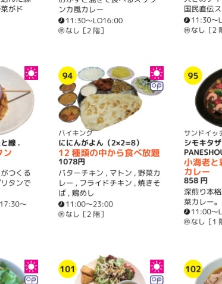

2020 [4月](2020-04.md)  [5月](2020-05.md) [6月](2020-06.md) [7月](2020-07.md) [8月](2020-08.md) [9月](2020-09.md) 今月

## 10/20 火

  * __体重__ が 1.1kg 増えた。
    * そんなに？排出量でたまたまだといいけど。
    * カツが2枚で400g、タラが225g。あとは油と衣とキャベツ。水分。
  * __呼吸器系__ の症状は治まったが、 __顔がポー__ っとする。
    * 熱があるかと思って測ったら 35.6 でいつもより低いくらい。
  * __キノコ__ は無理。ゴメンね、キノコたち。
  *  ほうれん草2本、パクチー1本、タイム4本をスポンジへ。
    * ほうれん草は昨日でも良かったと思うけど、もう少し待っても良かったかも。
      * この2本だけ元気に伸びたけど、他は反応がない。発芽率低目？
    * パクチーはもう1本双葉が出ているけど、まだ種をかぶっているのでもう少し待つ。
      * 根っこだけ出てるのはあといくつかある。
        * 食品のコリアンダーシードはまだ発芽していない。
    * タイムは昨日は元気そうに見えたけど、水を追加したら溺れてた。余計なことをした。
      * 大丈夫だろうか。救い上げる意味も含めて大きい順にスポンジへ移動したけど。
    * 風が心配だけど、ルッコラと春菊の成長が遅い気がするのでベランダに出した。
  * __ツムツムスタジアム__ 、さわやかがコンボを稼いでいることが分かった。
    * コンボミッションの時は、やり方を少し変えないと。
      * 相棒の数だけコンボが入ってるっぽいので、相棒が沢山いるときに発動させるべき。
        * できれば相棒が発動してスキルが貯まっていない時。
        * そして、さわやか発動直後は相棒が少ないので、ロングチェーンを探す。
  * また DNS サフィックスが guest になった :cry:
    * ハイバネーションして帰宅するんだけど、そのせい？
  * Amazon に注文していたポータブルバッテリと充電器が届いた。
    * こないだの小型PCを動かす準備ができた。
      * やる気出ないけど。
  * __ランチ__ は `牛角` で2500円のランチ食べ放題。
    * 1800円のもあるんだけど、今日はサンチュを食べたかった。
      * 次はサンチュいらないな。キャベツもキムチとモヤシと牛カルビとデジカルビをお代わりし続けるのが良い。
      * 早割り1980円を食べに行ったんだけど、もっと安いのがあった。但し、早割りは60品、1800のランチは36品。
    * 肉8皿、サンチュ20枚、キャベツ2皿、モヤシ4皿、キムチ3皿、温玉キムチ1皿。
    * もうちょっとキムチやナムルの味付けが薄かったら、もうちょっと食べられたと思う。
    *  ソフトドリンクにはストロー。 __仕組みでミスを防ぐ工夫__ は素晴らしい。どこが始めたのか知らないけど。
  * アプリのバージョンのコード名に、Androidがお菓子の名前にしているように果物の名前を付けようという話になった。
    * 数百円で Kindle の植物図鑑を買ってみた。 https://www.amazon.co.jp/gp/product/B07WQ1YL4T/
      * Zucchini が載ってない。Appleも無い。
    * Vegetable Encyclopedia で探してみた。安いKindle版は無いみたいだ。
  * X 始まりの野菜は中国語ピンインなら沢山ありそう。
  * 16:00 くらいには体調が普通になった気がしたが、17:00 には少し良くない気がする。鼻詰まりと、少しボーっとする。
    * 17:40 喉がチリチリする気がする。
  * 20:30 明日が心配だけど、走れば走れそうな気がする。
    * どっちがマシだろうか。
  * Windows が更新のために再起動したいというから帰る前にやった。
    * guest じゃない DNS サフィックスを貰えた。
    * 今日はハイバネーションじゃなくてスリープで帰ってみよう。
      * それで上手く行けば、ハイバネーションを止めてディープスリープかな。

## 10/19 月

  * また起きれなかった。
  * 体脂肪率が12.9%と初めて見る数字になった。
    * 何かの間違いっぽい気はするが、体重が大して変わらないのに腕時計のベルトが緩くなっているので、脂肪が落ちているとは思う。
  * さつま揚げの魚は今日の夜でも衛生的に平気だろうか。
  * ほうれん草の双葉が開いて、そろそろスポンジに移すべきだが、夜にする。
  * 加圧インナーが2枚職場に届いた。
    * 1枚目は良かった。他はどうだろうか。
  * __ランチ__ は `かつ吉` で鶏むねカツとメンチカツ。
    * キャベツのお代わりが遅い。
      * 何度もお代わりするつもりだったけど、お代わり2皿を1回で、都合4つ分。待つのも嫌だし、体調が悪いからここでやめとく。
        * この程度でお腹が減らないと助かる。
    * 大葉の混ぜご飯が美味しい。
  * `イルフューメ` に行きたかったがお肉が売り切れ終了だとか。
  *  `一輪` が無くなってた。
  * 体調が悪い気がする。良くある程度ではあるが鼻水が出る。明日どうなっているか。
  * 歩いて帰るか悩む。
    * 21:00過ぎには雨が止むらしいが、体調悪くて早く帰りたい。
      * 靴も晴れ用なので、早い時間なら電車がいい。
      * キノコを炒めてさつま揚げも作らないと。
  * 鼻水のインターバルが短くなってきた。良くない雰囲気だ。熱はまだなさそうだ。
    * 在宅勤務の可能性を考えて push して帰ろう。
      * というか、ここで数日休むと、最適化を最初のリリースに入れる余裕が減っちゃう。困る。打ち合わせが必要なのも多い。
  * 早めに電車で帰った。
  * さつま揚げとキノコをやらないといけない。
  * 生魚の方が猶予がないのでさつま揚げから。
    * ドリップがまた沢山出たが、悪い匂いはしない。
    * あまり良くないが衛生的な不安を減らしたいので水洗いして布巾で拭う。
    *  いかにも解凍しました的な張りのないブヨブヨの身。ハンドブレンダーに掛けるために適当なサイズにする。
    *  ハンドブレンダーで身をほぐすのは楽しい。
      * ただ、このハンドブレンダーのスイッチがちょっと使いにくい。やや硬いし、反応する部分が想像より小さい。
    *    タンパク質なんだから塩して練れば簡単にまとまると思ってたけど、ボロボロ。
      * 水っぽいのか、もっと細胞を壊す必要があるのか、魚種の問題なのか、卵とかのつなぎを入れるのか。
    * 魚に塩して炒めると美味しいということが分かった。（みんな知ってる）
      * グレープシードオイルのせいかも知れないけど、たまにタイムや山椒の香りがする。
        * 箸やスプーンの問題かも。
  * __キノコ__ は無理。

## 10/18 日

  * 体重激減。良く分からん。
  * __ランチ__ はカップヌードル豚骨。
    * 流石 __カップヌードルブランド__ で出すだけある。
      * ラー油の山椒は豚骨を消してる感じがするので、ない方がいいと思う。
  *    横に伸びて不格好だった `コブミカン` の木に真っすぐ上に向かう枝が生えてきた。
  * 飲み屋に眼鏡を忘れて取りに行った。15:00 にお店の人に来てもらって受け取った。有難い。
    *  右がその店に寄贈したカレーの木。左のがウチの。
      * 同時に注文した2本だけど育ち方が全然違う。
    *  そのプランターの右側は __スコーピオン__。ついに実が。
  * キャベツの千切りに合わせる __キノコ__ を買ってきた。
    * 食事の約束の時間が近いので、結局作らない。
      * 夜できるか、朝起きられるか。
        * まあ、普通に考えて月曜の夜かな。
    * トマト缶を買ってくれば良かった。
    *  ソロ目！
  *  先週買ったピーマンが赤くなってた。
  * 借りてる部屋が値下げしてくれるそうで、契約書を書き直さないといけないんだけど、また来週。
    * 今度こそ忘れずに昼に行かないと。
  * 久しぶりに全く走る気がなくて __サンダル__ で外出。
  *  東中野の富士そばの跡地にできた __立ち食いそば屋が閉店__ してた。
  *  新しい __中華料理屋__ がオープンセールで __全メニュー半額__ だとか。
    * 期間が書いてないがいつまでなんだろう。
      * 半額なら行ってみたいがダイエットとの兼ね合いが。
        * どこかに差し入れするか。
  *   寄贈した __ハラペーニョ__ を見てきた。元気でよろしい。
  * 夕食は `たねすけ`。
    * 外から見たら全く美味しそうだと思わなかったが、近所のバーで評判がいい。

## 10/17 土

  *  解凍した魚のドリップが凄い。
  * ランチはカッヌードル漁師風ペペロンチーノ。
    * 流石カップヌードルブランドで出すだけある。
      * チョイ辛シーフード。シーフードカップヌードル自体好きだし。
      * にんにくは最後の方しかピンとこなかった。
  * プライムデーに買った GronG とかいうところの加圧シャツが丁度いい。もう少しお腹がキツめだといいけど。
  *   
 ルッコラと春菊はスポンジへ。パクチーは根っこばかりでなかなか芽が出ない。スペアミントの双葉が小さくてかわいい。
    *  上2列がルッコラ、下が春菊。
  * __下北沢カレーフェス__。
    *  先週は `うしとら` のビールをテイクアウトして飲みながら買い歩きをしたけど、今週は `スジガネ` のコーヒーを飲みながら。
    * 先週は有名店のベーシックなのを選んだが、今週は変わり種を。
      * `路地裏サムライ` でイカ墨カレー。イカ墨の主張は強くない。
      * `ARENA下北沢` で古代ケルトカレー。たまねぎたっぷりの甘味とカルダモン。
      * `肉力屋` のは売り切れ。
      * `たこやここ` でカレーをかけたたこ焼き。先週のよりカレーもタコも味が濃い。
      * `ホーキ星` でチキンカレー。チキンがでかい。
      * `cinq` でラムキーマカレー。思ったよりスパイスカレー。
    * __雨靴__ 大活躍。
    * 帰りはタクシー。

## 10/16 金

  * 起きたら13:00だった。
    * Slackで14:30目標で行くと言ったが動けずに15:45になってしまった。
  * __ランチ__ は自宅でカップ麺QTTA肉増量とキノコとハラペーニョピクルス。
    * __キノコ__ は見た目ほど多くは感じなかった。簡単に食べ切った。
    * 後で思えば少ない。豆腐と卵と冷凍野菜を使ってしまうべきだった。
  *  窓際に1日おいておいたら、かなり進捗した。
    * ルッコラと春菊のところはまるで楽園のようだ。
  *  リモート中に買った __冷凍の魚__。
    * 今週の土日に使うと決意して冷蔵庫へ移動。
    * さつま揚げを作るつもりで買ってきた。
      * 魚のすり身は案外高い。売ってる練り物より安く作るのは困難。練り物の値段は小売りの鮮魚と変わらない。
        * 安く買える可能性があるとしたらサバくらいか。
        * で、今回のは十分に安そう。298円だったか。
  * 寝坊している間にPCの設定を直してもらった。
    * おかげで社内のファイルサーバにもアクセスできるようになった。普段はgithubとGoogle Driveで事足りるからあまり見ないんだけど。
    * __Synergy__ が面倒なく動くようになって嬉しい。
  * __VS Code の設定__ を PC と Mac で共有するために、 __Dropbox__ で設定ファイルのフォルダを共有して、VSCode のフォルダからシンボリックリンクで参照している。
    * PC で Ctrl+PageUp/Down でファイルのタブを切り替えてるんだけど、久しぶりにまじめに仕事した Mac で使えない。
      * `keybindings.json` を見てみると、Ctrl+PageUp/Down の設定がない。そりゃ使えないわけだ。
      * というか、PC で設定した覚えがあるんだけど、それはドコに記録されているんだ？
    * 設定した。CtrlにするかCmdにするか悩んでCmdにしておいた。
  * 21:00。腹減って仕方ないというわけではないが、塩気のあるお肉を食べたい。焼き鳥食べたい。
    * コンビニで唐揚げくんでも買うか。
    * 豆で我慢するか。
  *  22:20 __晩御飯__。 結局コンビニでサラダとサラダシーチキンと焼き鳥買ってきた。
    * 焼き鳥は、カウンターフーズがおしまいになってる中でそれだけ売れ残ってた。
      * 4本あるうちの2本買ってきた。食べ終わってみると、4本とも買ってくれば良かった。
  * プライムデーの買い物が職場に届いていた。
    * 面倒で触らない気もする。
      * FFCC も触ってないし。
  * また push 忘れた。

## 10/15 木

  * 無理すれば起き上がれそうだったが、昨晩はダラダラして寝るのが遅くなったので、日中の活動を考えて睡眠時間を確保することにして遅く起きた。
  * 体重が増えた。
    * 昨日はお腹の皮が痛いくらい食べた。
      * なか卯のも量が多かったが、キノコも500gくらい食べた可能性がある。
    * もっと排出割合の高い食事にしていきたい。
      * 昨日のがすでに全部吸収されたということもないだろうけど、出るものについては僕個人については1日経たずに出てるように思う。
        * 腸の中で追い越していくということはないだろうから、昨日食べたものが出てきたら、その前の分は腸にはないだろう。
  * 昨晩よりも __発芽__ は更に元気。
    * 室内 __温度は20°C__ くらいだろうか。
      * いかにも丁度良さそうな温度だ。
        * 中にはこれから暑くなると思い込んで出てきた連中もいるだろう。
        * 実際には __寒くなる__ というのに。
    * 絶好調のパックのもう片方も元気。
      * __スペアミント__ が一晩でさらに元気に伸びてる。
      *  __タイム__ も発芽。
    *  ということで、パクチー以外の2パックは窓際へ。3パック目はスポンジに移した徒長したルッコラ。
      * 窓際では __日照量__ が足りないが、ベランダに出すと __風でひっくり返る__ かも知れない。
        * 何か固定方法を準備するまでは、発芽は窓際。スポンジ移植から __ペットボトル__ に移したらベランダ。
    *  __パクチー__ は2粒発芽。両方買った種の方。
      * まだ根っこだけなので、暗室にしておく。前回発芽までは暗室じゃなかったから、窓際でも良かったかも知れないが、一部が双葉が開いて、一部が上に伸び始めて、一部が根っこだけ、という状態で窓際に移して様子を見たい。
  * __コーヒー__ は `ポールバセット` のハロウィンブレンド。
    * 豆小さい。
    * 酸味強い。豆の香り、発酵臭。
    * 多分これで挽き方も温度も時間も正解の味だと思うが、試しにもう少し温度高めに出してみよう。
  * __ランチ__ は `イェネガ` で薬膳ラーメン。
    * 薬膳感は良く分からなかった。
    * 骨付きの鶏を煮込んだものが入っていて、骨が面倒。
    * しかし味は素晴らしい。
      * 少し甘いかも知れない。
      * 鶏の出汁が良く出ている。
        * 途中で水を飲んでも変な感じが残らないので、化学調味料的なものが入っていたとしても適量以内。
    * ランチは10種類くらいあって、今日が3種類目だけど、他のも食べたいと、また思った。
    * ほとんどのメニューは1000円で量は大したことない。僕はサラダ食べるからいいけど。
  * 野菜が足りないのでヒカリエの地下で袋詰めの __ルッコラ__ を買い、 __キノコ__ と共に食べた。
    * キノコは無事になくなった。
      * ということは明日は __サラダバー__ か __食べ放題__ のお店だ。
        * `イルフューメ` か、 `牛角` 早割か。
      * 来週は作る気になるだろうか。今のところアイデア無し。
    * 心配して真空容器を用意した __オリーブオイル__ も無くなった。
      * え！10営業日で無くなったの！22ml/Day 程度だね。そんなものだ。
      * それで __新しいの__ を買ってきた。
        *  早摘みタイプと熟成タイプだそうだ。
  * 今日のランチはアチコチ空振りした。
    *  `宮下公園` のフードコートでテイクアウトしようと思っていたんだけど、行きたかった店は並んでたのでパスした。
      * そんなに列が長かったワケでもないんだけど、なんとなく。
        * 女子高生だらけだった。
      * フードコートの座席自体、満席ではないが結構埋まっていた。
    *  `東京たらこスパゲッティ` の店外並びが復活していた。
    *   `ブルーボトルコーヒー` の自販機を見つけた。初めて見た。
      * 小さな缶が 640円という __強気価格__。
      * もう1台あって、ソッチではカップなどが売っていた。
    * スリランカカレーが美味しかった `ハガレ` が __生ハム食べ放題__ の看板を出していたが 14:30 からだった。
    * 気になってはいた `goo Italiano` と `Moja` のランチメニューの看板を見たが、ピンとこなかった。
    * イェネガはいつでもいいかと思っていたが、他にピンとくる店を思いつかなかった。
  * ランチの帰りに、以前改装してたお店が __ワインの角打ち__ なる看板を出しているのを発見。
    *  
    * ランチメニューは無いようだ。
  *  `串だおれ` がランチを再開していた。
    * __タレカツ丼__ はいいと思う。
      * が、行く日は来るだろうか。夜のメニューも頼めたら。
        * うーん、でも __特盛__ をもう一回食べておきたい気もする。ご飯半分。
  * 火曜辺りから、割と __簡単に満腹__ を感じる。
    * それとは逆に今日は12:00前から空腹だった。
    * ラーメンだけでまあまあお腹が張っていたからサラダをどうしようかと思ったけど、夕方お腹がすくのが怖くて食べることにした。
      * 量を減らしても大丈夫なら、すでに食べたことがあるようなものを無理に食べる必要はない。
        * 食べたいものがあるなら、わざわざ我慢する必要もない。
  * 知り合いの誕生日で、何か買っていこうと思い、僕自身がとても美味しいと感じた `モンロワール` のラヴィアンショコラを買っていこうかと思った。
    * 特に、割らない1枚を買ったら見た目に驚くだろうと思って。
      * でも、1種類だけだとそれほど見栄えがしないかも知れない。何枚も買っていくのは、値段的にも大変だし、量的にも多過ぎると思う。
        * バラの詰め合わせは、ちょっと楽しさが伝わらないと思う。それは店頭で見た人が買うべきだ。
    * ということで、ピエールエルメのホールケーキにした。
  * 職場のデスクトップ PC のIPアドレスの検索が上手く行かない話だけど、設定の問題じゃないか。
    * DHCP のマシンに、MACアドレスか何かが登録されてないのではないか。
      * ipconfig で接続固有のサフィックスが `guest.` で始まる。
      * nslookup で他のマシンから検索すると `intra.` で始まるマシン名のアドレスを返してきて、それは不一致を起こしてもおかしくないよね。
  * __Amazon Prime Day__ でモバイルバッテリーで動く PC を注文したわけだけど、USB-C PD のモバイルバッテリーも必要だった。
    * 調べてみたけど、 185W50000mAh なんてデカいのがあるのか。
      * https://www.amazon.co.jp/dp/B07YFYZK5G/
      * コッチは 300W60000mAh だって https://www.amazon.co.jp/dp/B0819ZNLYV/
    * バッテリーに充電するのに別に充電器が必要だそうで、合わせて注文した。100W26800mAh 7399円。
      * https://www.amazon.co.jp/gp/product/B08BYQZTGB/
      * https://www.amazon.co.jp/gp/product/B07ZD2DD2M/
    * Type C ケーブルが足りないかも知れない。
  * 洗ったキノコの容器からまだアジの匂いがする。
    * 900mlの容器に対してたったの1缶なのに強烈なパンチを感じさせるだけある。
  * 今日は歩かずに電車で東中野。

## 10/14 水

  * 8:00にセットして5回目のアラーム、4回のスヌーズで起きた。まあまあ辛いが悪くない。
    * これが7時スタートになるといい。
  * 体重は減った。少し安心。
  * __コーヒー__。
    * グアテマラ、ピンとこない。
      * 昔と好みが変わったのかな。
    * こないだ下北沢の `スジガネ` で __コーヒー豆__ 買ってきたけど、 `ポールバセット` で __ハロウィンブレンド__買ったの忘れてた。
  * __なか卯の焼き鳥__ を予約した。百均で買い物して行きたいので13:30。
  * スリープから復帰したときに __Synergy__ が繋がりにくいことがある。
    * 今日は、USB LAN がメディアが差さってないないと言い張っていた。
      * アレコレ抜き差ししていたら復活したけど、待てば認識するのか、ハイバネーションを挟むとなかなか上手く行かないのか。
  * __ランチ__ は `なか卯` で焼き鳥12本900円と唐揚げ10個400円と `東急本店` でキャベツの千切りと自前キノコ炒め。
    * https://www.nakau.co.jp/jp/menu/detail/in/203
    * https://www.nakau.co.jp/jp/menu/detail/in/204
    *  3本入りが4パック。
      * うーん。もっとなんとかならないのか。
      * 移動中に焼き鳥の肉汁がこぼれて袋の中が __オツユだらけ__ なんだけど。
        * 包装の仕様としておかしいし、袋詰めの仕方とか、口頭での注意とか、色々欠けてる。
          * 従業員の問題というよりはオペレーションマニュアルやそれ以前の問題。
        * そのこぼれたオツユが __マスク__ について、マスクが夜になってもチキンの匂い。
      * 右が唐揚げ。
    * 値段からしてかなり少ないと思っていたんだけど、多分大抵のスーパーで買うよりも __価格重量比__ がかなり良い。
      * 思ったよりもずっと苦戦した。かなり __満腹__。 `もうやん` の時ほどではないが。
        *  なんとか無くなって良かった。
    * 唐揚げは美味しい。
      * 袋の中で時間をおいてしんなりしてるかと思ったら、カリッとしてる。
      * 揚げ過ぎだが、歯応えがいい。
    * 焼き鳥は3種類。つくね、もも、むね。
      * むねで1種類というのは驚いた。
      * __むね__ はあんまり美味しくないが、たまに燻されたようなところがあって、そこがたまたま胡椒が沢山かかっていて美味しかった。
        * もしかしたら、焼きたてなら美味しいかも知れない。アジがぼやけているのは時間を置いたからという可能性がある。
          * 胡椒はもっと気前よく振った方がいいが。
      * __もも__ は少し臭い。ブライン液に漬けるとかを考えた方がいいと思うが採算が合わないか？
      * __つくね__ はぼんやりした味だと思ったが、たまにある生姜がたっぷりの部分は美味しい。
        * 生姜のところに塩が多いような気もする。
    * 総じて、主に __量の問題で__ 、300円とか400円の追加のサイドメニューとしては __優秀__ だと思う。
    * 多過ぎて苦戦したのは __キノコ__ を半分食べたからでもある。
      * 昨日1/4食べて、明日1/4食べるなら、今日は2/4ということになる。
        * 作り過ぎた分を金曜の朝に食べてから出社すると、丁度片付く。
          * 自宅の残りはかなりありそうだけど。
      * __土日__ は昼にカップ麺を処理したいし、夜は __下北沢カレーフェス__ だったり、食事の予定があったり。
        * カップ麺はコンビニで珍しいのを見ると買っちゃう。
  * キャベツの千切りは東急本店でも227円だった。ヒカリエだけ高い。
  *  昼休みに `ひもの屋` の前を通りかかると、 `サワー飲み放題90分500円 の表示が！
    * [09/13](2020-09.md#09%2F13%20%E6%97%A5) の `キンミヤ蛇口のある海鮮居酒屋とらや` は30分399円よりもずっと安い。
  *  昼休みに買い物に行って、百均で __小物入れ__ を買ってきた。
    * 小さ過ぎた。ほとんど役に立たない。
  * `成城石井` のシングルオリジン __チョコレート__ 2枚目。
    * Dark Uganda 80% だそうな。
    * 箱の開け方が分かった。っていうか、糊が弱すぎる。前のは開け方がおかしいというより勝手にばらけた。
    * やっぱりちょっとザラつく。多分狙ってるんだろう。カカオ感だと誤解するように。
  * 21:00 でまだ腹が減らない。
    * 素晴らしい暴食。
    * だけど、帰りのランニングに備えてプロテインバー補給。
  * __Amazon Prime Day__
    * 前から欲しかった __小型PC__ を買った。
      * https://www.amazon.co.jp/gp/product/B089VJ4GB1/
      * 使い勝手が悪くなった QNAP の代わりに NAS にしたい。 Linux を入れて RAID1 の HDD ケースを繋いで。
        * 買ってもどうせセットアップしない気がするから今度でいいとも思ったけど、USB 給電のがあれば買おうと思っていた。
      * できれば2万円以内と思っていたが、Core i3 だったので、いくらかはみ出したけど購入。
        * モバイルバッテリーをUPS代わりにしたいので。
          * 自動シャットダウンできれば最高だが、数時間ならもつんじゃないの？大抵の停電は回復するだろう。
    * ついでに、安いコンプレッションシャツを3枚。
  * 昨日気付いた __渋谷駅の新しい出口__ を使ってみた。
    * __宮益坂方面__ の B2 B3 B4 へ繋がる。
      * B3 B4 はヒカリエの方から行った方が近い。
    * 新しい出口は B2 へ行くのにちょうど良い。
      * B2 はビックカメラの前に出る。宮下公園方面。
  * 結構頑張って走ったつもりだったけど、8kmh をいくらか上回った程度だった。自分の思ってるより歩いている。
    * 最初の1㎞は繁華街なのでどうしても遅い。
      * それを抜いて計算してみると8.58kmh。
        * 言う程速くない💦やっぱり結構歩いてる。
    * :running: 5.73km
  * いろいろと調子よく __発芽__。
    *  __ルッコラ__ はすでに徒長かも。 __春菊__ は発芽率はいいが双葉はまだ開いてない。左上の __ほうれん草__ が少し発芽。
      * ルッコラはまだ双葉が開いてないんだけど徒長するのか。
      *  長すぎる奴を先にスポンジに移す。他のはキッチンペーパーのまま窓際へ。
    *  __スペアミント__ 発芽。数年前にチャレンジしたときは発芽自体しなかったような。
    *  __小松菜__。 発芽しつつあるようなないような。
    * __暗闇で徒長__ するのは切ない。
      * __窓際で発芽__ させて、ダメな種類だけ暗室の方がいいかも。
      * 多分、以前は平たい容器で発芽させていて、ラップをかけると芽が伸びるのを妨げる形になったから、それで __水が蒸発__ しない暗室でやってたのではないか。
        * 今の容器ならラップして窓際で構わない。

## 10/13 火

  * 少し辛かったけど順調と言える程度に起きられた。火曜は比較的に成績がいい。
  * 体重減らなかった。
    * 量は大したことがないと思うんだけど。
      * 朝にカレーとワカモレをを食べたのは余分。
  *   昨日の夜に炒めたキノコと、生のピーマンとほうれん草を和えた。
    * 火が通らないように一晩おいてから。
    * 衛生のことを考えて、蓋をして沸騰させてから放置。
  *  まあまあ作り過ぎたが、目標の5割は超えなかった。もう少し狙い通りにしたいが、許容範囲内だろう。
  * __ステンシル__ 用の色付きスポンジを持ってきた。
  * __ランチ__ は宮下公園の `シャンウェイ` でテイクアウト。スペアリブ、唐揚げ、豚足。ヒカリエでキャベツの千切り280g。持参したキノコの炒め物。
    * https://tabelog.com/tokyo/A1303/A130301/13248932/
    * どれも一口目はピンとこなかったけど、食べ終わってみれば満足。
    * 唐揚げは小さくて硬いと思ったが、パリッとした皮と、硬めの肉の歯ごたえがなかなかいい。
    * 豚足はふわふわ。それ自体は別に、という感じだが、ソースがヒカリエで買ったキャベツの千切りに良く合う。
    * キノコは先週のと比べればずっと美味しい。まあ、まずくないというレベル。アジのトマト煮が悔やまれる。
      * ほうれん草とピーマンは悪くはないが、思ったほどのアクセントになってない。
        * 次があれば、キノコと香味野菜だけでいいかも。
      * __塩レモン__ が入っているので、ベースは間違いない。
  *  デンプンセットしかないと嘆いていた宮下公園のフードコートだけど、 __おつまみポキ__ とかあった。
    * `パンダエクスプレス` もデンプンの代わりにベジタブルミックスが選べるようだ。まあ、トウモロコシや玉ねぎやトマトや人参などの糖質多めの野菜の可能性はあるが。
  *  宮下公園に `うしとら` が入っていた。しかも 23:00 までらしい。
    * テイクアウトして __帰りに飲もう__。
    * 帰りに寄れる __ビアバー__ は、`ミッケラー` `Good Beer Faucet` `ガウズ` `OSLO 0L` `アルドゲート` `ウォータリングホール` 辺りか。`グリフォン` と `ベルゴ` は逆方向なんだよな。あ、ストリームに `Craft Beer Tap` もあるか。
    * そこにうしとらが加わるワケだが、書き上げてみると __結構ある__ な。
  * 作り過ぎたキノコはいつか処分しなければならないが、今週はあと3日しかない。
    * ちょっと誰かにあげるクオリティではない。
    * 自分で食べるとしたら、相当な量を食べる必要がある。
      * うまいことに、昨日ので体重が維持だと、今日は増える可能性がある。
        * キノコがっつりの選択肢は悪くないかも知れない。
        * まあ、明日体重が減ってたらテンション落ちるだろうけど。
    * キャベツとキノコと何かだけで済ませるとしたら何がいいだろうか。
      * `なか卯` の焼き鳥12本900円を試してみたい。
        * ネットニュースで見て、ネット予約ページを見たら宇田川町店では注文できなかった。
  * 帰りに宮下公園に寄ったが、かなり混んでいた。平日だがもはや恋人たちにはコロナは関係ない。
    * ボルダリングコーナーで、登りながら掃除している人がいた。
      * このコーナーは優良であり、金を出してそれをやりたがる人もいるだろう。
  * 宮下公園の `うしとら` でクラフトビールを持ち帰り。
    * 容器代300円。
  * ビール飲みながら歩いたら、ほとんど走る気になれなかった。
    * また、宮下公園から代々木公園を抜けるまでの1.5km程度が記録から漏れている。
    * :walking: 4.23km
  * 中野坂上のフードトラックは今日はいなかった。
  *  ルッコラに続き、春菊が元気に発芽。
    * クレソンも欲しいな。
  * 多過ぎキノコのことを考えながら帰ったら夜中に腹が減った。
    * キノコ食べたい。
    * 夜中にモノを食べると良くないという通説は本当だろうか。
      * 個人的には、胃にモノがある状態で起床すると気分が悪い、というか、空っぽで起きると爽快なので、その理由で夜に食べないようにしているが。
        * 本当はお酒もない方がいい。
          * 水分は大抵朝には胃には無くなっているが、腸でも気分が違うように思う。ただの水とは違う。
          * たまに、起きてもまた胃に酒があって吐く。
    * 我慢できた。

## 10/12 月

  * 起きられなかった。
  * 体重が増加傾向かも知れない。
    * 昨日は量的には大して食べてないと思うんだけど。カーボムがカロリー高そうなくらいか。
  * キノコを炒めなかった。
  * 飲み過ぎで持ち帰った記憶がないが、土曜の __下北沢__ のカレーが冷蔵庫に入っていた。
    * ご飯はレジスタントスターチになっていた。
      * カレーだけ食べてご飯はほとんど捨てた。
    * さっぱり意味が分からないが、 __ワカモレ__ も同じ袋に入っていて、それも食べた。
  * __ランチ__ は `焼魚食堂` でサバ西京焼きにアジフライ追加。
    * https://tabelog.com/tokyo/A1303/A130301/13162785/
    * 今日はやたらと白米が美味しく感じた。
    * 帰りに大久保の `釣りあじ食堂` に行きたかったからランチはサラダだけにするつもりだったのに、忘れて食べに出てしまった。
      * https://tabelog.com/tokyo/A1304/A130404/13214284/
  * 野菜が足りないのでクリスプのサラダを追加。
  * ダイソーで __ステンシル__ 用の色付きスポンジを買ったのに家に置いてきた。
  * __カップケーキ__ の https://www.meg-snow.com/recipe/detail/10931.html のレシピはオーブンだった。
  * 土曜に会った人たちに連絡して、 __ワカモレ__ の出自は判明した。
  * 次の木曜に友達の誕生日があって、最近忙しいからプレゼントの割り勘だけ参加して、会はパスするつもりだったんだけど、開始が遅いから、それなら行ける。
  *  渋谷駅の __宮益改札__ の工事の壁が外れて、 __新しい出入り口__ が出現した。
  * 昨日 __買い忘れ__ たほうれん草を買って帰る。
    * ついでに防カビ剤不使用のNZレモンとピーマンも。
      * ピーマンは昨日買ってた💦買い過ぎ。
    * そしてセロリを忘れる。
      * 昨日の日記の時点では、忘れたことも忘れていたようだ。
        * ほうれん草とピーマンは生で、セロリは煮込むつもりだった。
  *  青梅街道の住友ビル辺りに __ミートパイ__ と看板を出したフードトラックが。思い出したら今度買っていこう。
  * :walking: 6.15km。テンション低くてかなり歩いた。
  * 時間が遅かったが、 __キノコ__ を炒める。
    * ちょっと引くくらいの量。
      * 水分が少な過ぎると調理に時間がかかるので、ビビって多めに日本酒を入れたら多過ぎて、煮詰めるのに時間がかかり過ぎた。
      * 火を通す前の、 __山盛りキノコ__ の写真を撮るべきだった。一番面白いところだった。
    * __トマト缶__ が無かった。不覚。
      * 代わりにアジア食材店で買ったアジのトマト煮を入れる。
        * 風味が強過ぎてバランスが悪くなった。こういう使い方をするには美味しすぎる。
          * トータル美味しいんだけど、もっと __輪郭のはっきりした美味しさ__ を目指したい。
    * オレガノはいい感じに決まったと思う。
    *  だいぶ減った。
    *  白ネギ投入。
      * ネギは2本買ってきて、1本はみじん切りにして冷凍庫。
        * キノコの減り方を見て、2本は入れ過ぎだなと。ネギは糖質多いし。
  * 白ワインが冷蔵庫に少し残ってるのではないかと思って漁っていたら、覚えのない __リビジョン__ が。
    * 多分土曜の帰りにビアバーで買ってきたんだと思うが、開けてほとんど飲まずに __ドアポケット__ に入っていて面食らう。
      * 炒めながら飲む。
        * 炭酸も香りもソコソコ残ってる。
    * __パクチーの塩揉み__ らしきものも出てきた。
      * 結構前からある気がするけど、真面目に思い出す気が起きない。
        * 僕が自分で作ったであろう見た目。
      * 香りがマイルド。あまり臭くなく、ゴマっぽいコク。
        * まずくはないけど、わざわざは食べないし、モリモリ食べられる味でもない。
      * どうしよう。味変してなんとかするか。生姜とレモンか。
      * もしかして、これもキャベツの千切りと合わせて食べるために作ったのかな？
  * ずっと忘れていた __紅生姜__ のために生姜を買ってきて __梅酢__ に漬けた。
    * __赤紫蘇__ がない。
      * ハダニめ。
  * 生姜と言えば、キノコに割と思い切った量の生姜を入れたはずだけど、全然存在感がない。
    * こういうところだよ、 __料理が下手__ っていうのは。
    * それだけキノコの量が多かったということだ。
  * あんなにツムツムにはまっていたのに、昨日今日は全く遊ぶ気にならなかった。
  *  早くも __ルッコラが発芽__。

## 10/11 日

  *  スーパーで種を追加購入して、さらに __発芽チャレンジ__。
    *  __こうなった__。
  * 平日の __サラダ__ のために __キノコ__ を炒めようと買ってきたが、 __放置__ してしまった。
    * 買うつもりだったホウレンソウを忘れていたので、月曜でいいかな。
  * 阿佐ヶ谷に 18:00 に待ち合わせして、走っていくつもりだったが __湿度が高__ くてほとんど歩いてしまった。
    * 家を出たのも遅くて、 __結構遅刻__ した。
    * 雨は大したことないと思っていたが、晴れ用の靴で __水たまり__ に着地してしまった。
    * :walking: 8.53km。

## 10/10 土

  *  葉唐辛子にまた花が咲いた。
  * 今年のベランダ菜園は不調だった。昨日検索して冬の葉物を試す気になったので、水耕栽培の発芽チャレンジ。
    *  時期がおかしい種類もあるけど、元気そうなのは育ててみる。
    *  パクチーの種と、スパイス屋さんで買ったコリアンダーシード。
  * 下北沢カレーフェスに行ってきた。
    * 家を出るのが19:00になってしまった。
    * ついでにダイソーに寄って工作用の薄い色付きスポンジを買った。ウレタンだと思っていたのはスポンジだった。その方が切れやすそう。
      * 種もいくつか買ってこようと思ったけど、売り切ればかりだった。
    *  購入した店は以下。
      * カレーの惑星 https://tabelog.com/tokyo/A1318/A131802/13194397/
      * 三日月カリィ侍 https://tabelog.com/tokyo/A1318/A131802/13216581/
        * スープカレー屋さんだと思ってたのに、赤ワインで煮たラムカレーは粘土の高いタイプだった。
        * 輪郭がクッキリした味で美味しい。
      * 犬拳堂 https://tabelog.com/tokyo/A1318/A131802/13191569/
      * マジックスパイス https://tabelog.com/tokyo/A1318/A131802/13004603/
        * 初めて食べたが、流石有名店。
      * うぶたこ https://tabelog.com/tokyo/A1318/A131802/13188280/
        * スープたこ焼きスタンドだそうで、それ自体面白そうだけど、グリーンカレーたこ焼きというのがあって、面白いから買ってきた。
          * グリーンカレーは完全にたこ焼きに負けていた。
    * 買い歩きの最中に見つけたコーヒー豆屋さん `筋金珈琲焙煎所` で豆を買ってきた。
      * https://tabelog.com/tokyo/A1318/A131802/13213957/
      * やたら強気なコーヒー屋。
      * 豆はまだ使っていないが、ついでに買ったコーヒーゼリーは言うだけある流石の濃厚さ。
    * 雨用の靴が活躍。
    * :walking: 7.29km。到着までは7kmhを超えていたが、買い歩きの距離も入っているので。
    * 帰りはタクシー。

## 10/09 金

  * 朝がかなり辛かったけど、小便に起きたらそのまま起きられた。
    * ここのところの __朝の眠さ__ は、気合で何とかなるレベルらしい。
    * 感覚的には、眠いとか疲れてるじゃなくて、体の成分の異常を感じるレベルなんだけど。
  * 67.8kg という、中々見ない数字になっていた。8/3以来だ。
    * 糖分たっぷりだったから？
    * 基礎代謝はここ2週間くらいでガンガン上がっている。信用していいのか知らないが、走れるようになってから。
  * 乾燥した __パクチー__ は死んだようだ。
  *  載せたつもりだったが、サーキュレータでお茶パックに入れたハバネロを乾燥してます、の図。
  * __コーヒー__ はまだ細か過ぎる。というか逆だった💦 5→7 にした。
  * 職場の SourceTree から外部Diffで WinMerge を実行しようとしても立ち上がらず、自宅のPCの設定をスクリーンショットして職場に送っておいた。
    * 全く一緒だった。
    * 試してみたがやっぱり立ち上がらず、と思ったら、しばらくして、いくつも試した分のウィンドウが。
      * アンチウィルスソフトのせいかもね。
  * ゲーム中に入る __寸劇__ のことを、英語ではなんて言うんだろう。
    * 寸劇で検索すると skit というのが出たが、これは笑える小話とか風刺とか、コメディ的な雰囲気らしい。
    * 演劇に広げると、theatrical, dramatic, histrionic 辺りが出る。
      * InGameDramatics はアリな気がするけど、ストーリーパートが別にあるゲームだと混同しそう。
    * 入力が効かないとか、幕間的な意味合いを盛り込んだ方がいいだろうか。
    * QTE(Quick Time Event) が向こうで通じるのだから、何とかイベントでいいんだとは思うけど。
    * instructions, directions, 
    * 同僚によると `Cutscene` がいいらしい。
      * `videogame cutscenes` を動画検索すると、十分に通用しているようだ。
        * 英語版の Wikipedia の項目が日本からの翻訳っぽくて、ちょっと疑わしかったが、YouTube では沢山出てくる。
  * __ランチ__ は `山本のハンバーグ` で山本のハンバーグダブルに唐揚げトッピング。
    * https://tabelog.com/tokyo/A1303/A130301/13050761/
    * コロナ前は __行列店__ だった。最近は知らないが。今日は雨だったので、行列店に行こうと思って山本に。
    * かなり美味しいと思う。行列になるわけだ。まあ、僕がハンバーグに思い入れがないので、1人でリピートすることはない。
      * 歯応えが強め。 __挽肉の粒感__ がある。それでも崩れない。
      * 肉の旨味が強い。
      * 緩めのデミグラスソースもかなり __肉の出汁__ が濃い。肉にも、別にとった出汁が入っているのではないか。
    * 熱したボウル状の陶器の器で出てくる。ソースがグツグツいってる。
      * 冷めにくいのはいいことなんだけど、熱過ぎると味を感じにくい。どんなものだろう。
    * +680円でダブルにできるという。
      * 元のメニューによらず一定額だから、ベーシックなハンバーグが増えるのだと思ったら、山本のハンバーグだった。
        * 山本のはブルーチーズが中に入っている。値段は5割増しくらい。
          * 値段的にはお得なのだが、ベーシックな方も食べてみたかったりする。
    * 唐揚げは、少し脱水して、また漬け込みの効果で、プリプリして食感がいい。少し塩辛い。
    * テーブルに食べるラー油がある。結構おいしい。
      * あまり辛くない。
      * フライドオニオンの他は、五香粉とエビと松の実かな。
    * トッピングに目玉焼きがあったが、メニュー写真に見えたので頼まなかった。そうしたら、目玉焼きに見えたのは茹で卵だった。
    * 提供はかなり遅い。15分と言われたが、30分に近かった。行列する理由の一部だろう。
  * 職場を出た時は `アジアンランチ` に行くつもりだったが、売り切れだった。12:50なのに。雨だから少な目？いつも早く売り切れる？来週見てみる？
  *  暖簾を裏表逆に掛けるような和食の店に行く気にはなれない。真ん中のを上に掛けるのもそうだ。
  * ヒカリエの地下でキャベツの千切りを買って、職場で __野菜摂取__。
    * __まずいサラダ__ ともこれでお別れ。
      * 塩レモンのカケラや黒コショウの粒が口に入った時には幸せなのだが。
    * 汁気とオリーブオイルで、キャベツは美味しく食べられる。
    * もし週末にまた作る気になったら、キノコをメインとした炒め物的なものにしよう。
  * `ポールバセット` でコーヒー豆を買ってきた。ハロウィンブレンドだそうな。
  * `ツムツムスタジアム` で、コインが貯まりにくいという意見が多かったから上方修正するという。
    * 神対応とか言われたくて最初から予定していたならいいんだけど。
    * リアルマネーで買える資源が少ないというクレームは、要するに無課金の人達と思われ、品格に欠けると言わざるを得ない。
    * 個人的にはこの程度のペースで問題ない。むしろ、元祖ツムツムと比べれば進展が早い。
  * トイレ後の手洗いで、指先を濡らす程度の人がいるけど、それは雑菌に水分を与えて培養しているのと変わらないように思える。
  * __下北沢カレーフェス__ に行きたい。
    * 明日の土曜に行きたい。
      * 起きれるだろうか。
    * 通し営業の店の一覧が欲しいが、自分で探すしかない。テイクアウトに至っては一覧から見れず、個別ページで調べるしかない。
    * そもそも __台風？__
      * Uber Eats で頼むか。（鬼）
    *  お店一覧の PDF を見ているとこんな店が。 __何を言っているんだ？__
    * 走れる程度の雨なら、16:00 に家を出て 17:00 辺りからお店を巡って、帰りは __タクシー__ にしよう。
  * 自身が __カレー__ を出すとしたらどういうのにするだろうか。
    * 迷うのは __ニンニク__ を入れるかどうか。入れた方が絶対美味しい。
      * __ガーリックオイルを別添__ するのはどうか。
        * ガーリックオイルを作るのに、 __焦がす__ と良くない。
        * 手間の問題も考えて、 __真空調理__ にできるといい。
        * 加熱して参加しにくいオイルということで、 __不飽和脂肪酸__ がいい。
        * __メイラード反応__ が起きないと、美味しくないかも知れない。
          * 瓶詰のニンニクとバターを、沸騰した __お湯で煮る__ のと、 __圧力鍋__ でも煮て、美味しくなるか試してみよう。
          * __80°C長時間__ で味を見てみてもいい。
          * __アクリルアミド__ は 120°C辺りから発生するらしいから、できれば圧力鍋ではなく沸騰した鍋で十分おいしくなるといい。
  * 新しい __ピクミン__ が出るのか。
    * 一個もやったことないけど。
  * __小松菜__ や __春菊__ がこれからだ。 __水耕栽培__ できるだろうか。 __ルッコラ__ や __イタリアンパセリ__ も秋から栽培できるらしい。
  *  六本木通りが渋滞。
  * 走って帰るつもりで職場を出たが、雨でやる気が無くなって電車で帰った。
    * 10756歩。

## 10/08 木

  * 起き上がれなかった。
    * 血中の成分の問題なのか、低血圧かなにかなのか。
  * 雨用の靴を正しく使用する日が来た。
  * __コーヒー__ の挽き方を粗くするのを忘れてた。
    * 勢いよく3回に分けて注いでみた。
      * ちょっと __濃い__ かな？鼻に抜けるのはいい香りだが、舌で味を感じ辛い。
    * 忘れないうちに、6 → 5に変更。
  * 雨だから __並ぶ店__ に行こうと思ったが、その時になると __思い出せない__。
    * 普段は並んでるから眼中に入らない。
    * `タラスパ` とか `もうやん` とか思い出すけど、もっとどこかあったはず。
    * こないだ空振りだった `ティーヌン` 行ってくるか。ビュッフェだし。
  * 構内図を見ると、 __代々木上原__ は銀座線でも副都心線でも改札内乗り換えなのか。
  * 職場の椅子が `アーロンチェア` で、普通に考えたら感謝すべきことだとは分かっているんだけど、 __ひじ掛けが邪魔__ 。外せるように作って欲しい。
  * __ランチ__ は `ティーヌン` でタイスキ定食。
    * 表参道から改札を出るときに、遠い方から出てしまった。ホームからのエスカレーターを降りて直接目視できるところが正解。
    * おかずがビュッフェで __食べ放題__。
      * レッドカレーは鶏肉が沢山。美味しいしタンパク質！
      * ニンニクの芽と豚肉の炒め物は、ニンニクの芽にちょっと火を通し過ぎで柔らか過ぎる。とはいえ甘味が出ていて味は素晴らしいし、繊維質とタンパク質！
      * サラダは野菜沢山！エビや貝が入っているけど、むしろキャベツだけでいい。玉ねぎとか糖質ブースト。
      * チキンスープの具が見た目で良く分からなかったが、波型のカットされたジャガイモだった。スープの味は落ち着いていて美味しい！
    * 何を食べても甘い。南国の味か。レストランよりは屋台の味では。
    * 安くて美味しい！
      * また NSS で働きたい！というか表参道で働きたい！サラダバー沢山地帯！
        * それでも、電車でランチに行く便利を考えると SSS の方がやっぱりいいかも。表参道もすぐだし。
    * インスタのストーリーに載せたら、__同好の女子__ 2人。
  * 昨日今日と、仕事中に足の裏の汗が気になる。
    * 昨日から雨が降っているということはあるが、仕事に集中してて、あまり姿勢を変えず、歩き回る回数も減ってる。
      * 歩き回る回数は、どれだけハーブティーを飲んだかで分かる。
      * 朝から順に、コーヒー、一番茶、二番茶、ハーブティ1, 2, 3の順に飲む。
        * 今日は 22:00 でハーブティが1つ目だ。手を動かしっぱなしだからだし、それだけ歩く回数も減ってる。
  * 走って帰ろうとして、風が強いから日和ってNHK放送センター前からバスに乗ろうかとしたけど、15分待って途中までしか行かない最終便だったので、やっぱり歩いて帰った。
    * 人通りが少ないところではマスクを腕にかけている。
      * そのマスクのヒモが雨に濡れて、AppleWatch の接触判定にかかっていた。
      * 途中でワークアウトが終了されていた。
    * 大して寒くないのに息が白い。まだこんな時期なのに。
    * :walking: 4.58km
  * 膝周辺の腱が少しピリピリする。
    * たまたまここのところいいペースで走ってる。リモート明けからやってなかった膝サポーターをすべきだろうか。
  * 青スコーピオン、赤スコーピオン。後1か月か2か月くらいか。

## 10/07 水

  * 電車が遅延。まあ、そのお陰でちょうどいい時間に乗れたけど。
    * 昨日も遅延と言ってなかったか。
      * __通勤ラッシュ__ はおおよそ復活と言っていいのでは。コロナ前よりはいくらかマシだけど。
  * __コーヒー__ はグアテマラ100%になった。
    * ピンとこない。
      * 淹れてる様子を見ると、細か過ぎるかも知れない。
  * __プロテインバー__ のネット価格をGoogle先生に聞くと、Amazonのが15gで141円。
    * `マツキヨ` プライベートブランドの方が少しだけ安い。当面それでいいかな。マツキヨの美味しくないけど。
  * 涼しくなってきたし、そろそろ恵比寿も攻めよう。
    * `恵比寿らんまん食堂` は __変わり種レモンサワー__ を楽しむために夜に行った方がいいか。
      * https://tabelog.com/tokyo/A1303/A130302/13114113/
    * ゲゲ。楽しみにしてたのに。
      * [【休業のお知らせ】]( http://hugodesnoyer.jp/2020/07/03/%e3%80%90%e4%bc%91%e6%a5%ad%e3%81%ae%e3%81%8a%e7%9f%a5%e3%82%89%e3%81%9b%e3%80%91/)
      * https://tabelog.com/tokyo/A1303/A130303/13188971/
      * __フランスの肉屋__ がステーキやシャルキュトリーを食べさせる店らしい。
    * __ビュッフェ__ の `ブルーパパイア` は恵比寿の友人と近いうちに行こうという話になっている。
    * 知り合いの妹がやってる間借りカレーの `お昼のサンピーヌ` も顔を出しておく？
  * __ランチ__ は __デカ盛り__ のお店 `鶏梵梵` でチキンカツカレーの大、ご飯半分。
    * https://tabelog.com/tokyo/A1303/A130302/13150508/
    *   胸肉3枚分のカツ。
    * ここは前にも行ったことがあって、その時はカツカレー黒を頼んだ。
      * 黒はホワジャオが沢山入っている。
    * 今回は黒じゃないカツカレーを頼んだ。
      * トマトが美味しいし、全体に味が馴染んでいる。
    * どちらもベースは玉ねぎと挽肉で、業務用のルーは使っていない。カレー粉は分からない。
      * ホールのスパイスが入っていて、たまにカルダモンを噛む。
    * カツじゃないチキンカレーを頼めば良かった。
      * 煮込んだものだろうか、それともグリルだろうか、はたまた蒸し鶏だろうか。
  *  `Bitter Valley Grill` が復活していた。
    * コロナ前はサラダバーだったそうだが、お代わりはできなくなったようだ。
      * 一度行ったことがあるが、その時はサラダバーじゃなかったと思う。
      * 僕が行った時は 200g 1680円だったので、200円安くなっている。
  *  `イルフューメ` はサラダバーからお代わり自由スタイルになったようだ。
    * ここのポークソテーは、歯応え十分なのにサックリ噛み切れる、素晴らしい仕上がり。まるでベーコンのような、凝縮した旨味と、燻された香ばしい匂い。
  *  昼も夜もピンときてなかった `渋谷三丁目酒場` だけど、ランチのついでに夜のメニューの一部も頼めるようで、キャベツサラダやホルモン炒めは魅力的。
  * ランチの帰りに `ライフ` に寄る。
    * キャベツ150g 98円、大根130g 100円。 東急のキャベツ280g 227円よりもいいかもね。
      * ただし、袋が2つになると、食べるときに食器が別に欲しい。プラスチックのボウル。
    * [09/18](2020-09.md#09%2F18%20%E9%87%91) にSSSのコンビニで紙皿が買えなかった事件を思い出して、割り箸と紙皿を買ってきた。
  * 職場で __野菜__ を補充。
    * 生ブロッコリ、全然食える。生というか浅漬けくらいだけど。
    * 自作サラダの __汁は美味い__。
      * 実質、塩レモンとレモン汁と塩だから当たり前だけど。
  * 以前の __ハーブティ__ の最後の1袋。
    * 今までぬるめのお湯で出していたが、初めて指示通りに熱湯で。
      * やはりピンとこないが、今までよりはずっと美味しい。使い方を読まなくてゴメンなさい。
  * え？ 泡立てなくても __膨らむ__ の？ カップケーキ。
    * http://www.cakepia.info/recipe/print.html?ID=1409
    * https://cookpad.com/recipe/4329203
    * https://www.meg-snow.com/recipe/detail/10931.html
    * 基本は、全卵:砂糖:薄力粉=3:2:2。砂糖と薄力粉は増やしていい。バターや水分を足してもいい。
      * https://www.jstage.jst.go.jp/article/nbukiyou/12/0/12_KJ00007921739/_pdf
      * ↑はスポンジだけど、容量が小さければ __レンチン__ で膨らむのかな？
  * __ハーブティ__ のローズヒップはお湯を少し多めにしたら美味しかった。
  * 渋谷川の `アジアンランチ` は金曜か。
    * なら、 __残りのサラダ__ は金曜にして、明日は __サラダバー__ の店に行こうか。
      * `牛角` などの焼肉食べ放題か、今日見てきたイルフューメか、どこかトンカツ屋。
  * なんとなく __走るつもり__ でいて、 __プロテインバー__ を食べてしまったが、 __降水__ 量2mmの予報。
    * こういう時に __雨の靴__ で来ていない。
  * 明日も明後日もずっと雨と Yahoo! 天気は主張。
  * :runnning: 5.62km。
    * 割と頑張って走った。時速8.65km! 傘を差しながら。
  * [09/13](2020-09.md#09%2F13%20%E6%97%A5) の食用クミンシードとセロリシードは一旦諦める。
    * クミンシードは腐っていた。歯垢の匂いにクミンが混ざった感じ。
    * セロリシードはいい匂い。抗菌効果があるのかも。

## 10/06 火

  * ちょっと前から、パクチーがもう一株発芽したんだけど、こないだ3連続でそこから腐らせたのでどうすべきか自信がない。
    * 少なくとも双葉が見えるまではキッチンペーパーで育てる？
      * 失敗したのは殻がかぶったままだった気がする。
      * という意味では、明るい場所に移してしまったし、伸びる余地のためにラップを取ったが、それまでは暗いところで構わないのかな。
        * すると、もう少し深い容器で発芽させないと。
        * いや、暗室(通電してない冷蔵庫)内でラップしないのが正解だったのかも。
  * __火曜は 14:00__ から打ち合わせがあるから、ランチに時間をかけられない。または早く出る必要がある。
    * __ステンシル素材__ を探しに行きたいんだけど。
    * 100均方面だと `焼肉ライク` の450g1540円か `マンディスキューブステーキ` か。
  * __コーヒー__ はエチオピアゲイシャの残りに __グアテマラ__。
    * 1/4くらいしかないのに深煎りっぽい感じがかなり出てる。
  * __ステンシル__ 素材探し。
    * `ハンズ` で __アクリル板__ を買ってきた。
      * 0.3mm で結構厚みがあるし、反射素材だし、今回も穴は開かない気がする。
    * `DAISO` にも `Can Do` にも、ちょうど良い素材が無かった。（画用紙以外）
      * 近所のDAISOには工作用らしき色付きウレタンがあったはず。
  * __ランチ__ は `焼肉ライク` でお肉450gのメガ盛りパウンダーセット。
    * https://yakiniku-like.com/2020/09/29/megamori/
    * 牛150g豚150gホルモン150g。
      * 豚にみそだれが美味しい。
    * 量もコスパも素晴らしいが、例えば `ビストロブラウン` と比べて何か満たされない。
      * `焚火家` も満足感がイマイチだった。元々焼肉自体に思い入れがない。
      * `富士家` は良かった。こないだの `もうやん` も良かった。
        * フードファイトの覚悟が必要なのか。それとも、葉っぱとキムチとモヤシが重要だったということか。
      * それと、分厚い肉の方が嬉しい。
    * キムチがお代わり自由だけど、職場のサラダがあるのでパス。器が小さいから何度もお代わりするのも面倒だ。
  * 予定通り野菜が足りないので、職場で __サラダ__。
    * 昨日残したキャベツが冷蔵庫の中で __シャーベット__。
    * __オリーブオイル__ がフルーティ。と思ったら辛い！
      * 喉の奥でだけ感じる辛みが、まともなオリーブオイルの証なのだそうだ。
      * フードショーで買った、プーリアの。
        * プーリアは有名な産地。イタリアのかかとの辺りで、航空写真で見ると本当にオリーブ畑だらけ。
    * サラダが __美味しくない__ のはタイムが強過ぎるのかも知れない。
      * エノキ以外は __苦い__ ものばかりだから、取り合わせが良くないのかも知れない。
        * 苦いもの大好きだからと言って、苦いものを集めればいいわけではない。
        * __ピーマン__ の存在感がゼロ。
      * 案外、ひっくり返して底の方を食べたら美味しいってことはないか？と思ったが、そんなことは無かった。
    * コレ、3回で食べるのは無理だわ。目盛りが無くなってるけど、目盛りがある範囲で900mlだから、1kg以上ある。
  * PC 版 __Slack クライアント__ で、アクションアイコンにフォーカスすると拡大表示されるようになってる。
    * 最近の変更は僕にはいい感じ。
  * 新しい __ハーブティ__ 、ジンジャーレモン。
    * 給水機の温度高くない方で淹れたが、 __熱湯__ で出せと書いてあった💦
    * イマイチだと思っていた、あと1個になってしまったペパーミントティーも 100°C だそうだ。
      * 美味しく淹れてあげられなくてゴメンなさい。
    * まあまあ辛い。ジンジャーがしっかり効いている。
    * 木の香り。主にターメリックによると思う。
  * 💦 のように直接絵文字を入力するか :sweat_drops: のようにするか悩む。
    * ユニコードだと検索するときに入力が面倒。
  * `成城石井` のプライベートブランド __チョコレート__。シングルオリジンだそうだ。
    * 71% のダークエクアドル。
      * ちょっとザラつくけど、 __ビター感__ もあるし、割と甘くておいしい。
    * 結構大きいと思ったら100gか。
      * 何回で食べようか。3枚もある。切れ目は2x5。一回20gは丁度いいが、無くなるまでに3枚で15回もかかる。
    * 厚紙パッケージだけど、一度開けると箱として使えない。
  * もう一つの新しい __ハーブティー__、ローズヒップ&ハイビスカス。
    * コーヒーサーバに __電子レンジでお湯__ を沸かしてそこで出した。250mlらしいし。
    * 麦っぽい味。変わり種麦茶。
    * 酸っぱい。
    * ちょっと __濃かった__ かも。
  * 走って帰るつもりで __プロテインバー__ を食べたけど、帰りが遅くなった。
    * 0:00 過ぎに到着だとしても走るべきか？
    * 電車で帰った。
      * 昨日ちゃんと走ったし、今日は回復の日。
  * __パクチー__ は干からび気味だった。
    * __暗室__ に入れたが、復活するだろうか。

## 10/05 月

  * 起き上がれなかった。
  * __ランチ__ は昨日から決めていた `エリックサウスマサラダイナー` でチキンビリヤニと追加カレーとビーフケバブとソーセージ。
    * https://tabelog.com/tokyo/A1303/A130301/13220984/
    * とても美味しい。
    * 以前食べた時よりも感動が大きい。アチコチでカレーを食べたことで少しは味が分かるようになったのかも。
    * インドカレーってよりスパイスカレーみたい。
      * 公式サイトによるとモダンインディアンだそうだ。
    * 炭水化物でお腹を膨らませたくないが、ビリヤニは 300g からだった。
      * 数字を見るとかなり大きいが、全然足りない。美味しい。もっと食べたい。
    * 好きなカレー屋ランキングで `SPICE POST` とトップ交代かも。
      * __また行く__。アレもコレも食べたい。全部食べたい。
  * ヒカリエで __キャベツの千切り__ を買って、日曜に作った __サラダ__ と食べる。
    * 千切りは 280g の大袋が無かった。100g の小袋を2つ買った。
      * エリックで沢山食べたこともあり、片方しか食べなかった。
        * 自分のサラダが __美味しくない__ ことも、食が進まなかった理由。
    * どこがどうとは説明できないが、サラダは美味しくない。
      * まず塩辛い。レモン汁も入れ過ぎ。
      * 昨日は美味しかったのに。
      *  900ml 容器にギュウギュウ詰め。
        * 3回か4回で食べたい。
          * つまり、今週はサラダバーには行かない。
    * オリーブオイル使うの忘れた。
  * :running: 5.83km

## 10/04 日

  * 13：00起床。
  * 下北沢カレーフェスに行くつもりで17:00に家を出ようとしたら、スマホの充電を忘れてて電源が切れていた。
    * ライムの木を買うためには 19:00 前に代々木上原を通過しなければならない。
      * ちょっと無理かな💦また来週。
  * 充電を待つ間、平日ランチ後のサラダを作るために買い物に。
    * キャベツの千切りを買う前提で、それ以外の食材をドレッシングに漬けておき、一緒に食べる。
      * 塩レモン、レモン汁、タイム、黒コショウをメインとした味付け。
        * 色々入れたくなる衝動を頑張って抑える。ニンニクとか生姜とか。
      * サラダ菜、セロリ、ピーマン、ブロッコリ房生、エノキとブロッコリ茎の炒め物。
      * 味見した時点では素人が作ったにしては美味しい。
    * 紅しょうがの生姜を補充すればよかった。
  * カレー持ち寄り会は結局 Uber Eats を頼むことに。
    * `般゜若`（ぱんにゃ）でイカ墨練りこみの黒いカツカレーと下北沢フェス限定ビリビリビリヤニを注文。
      * フェス限定しか見てなかった💦 ビリヤニと知ってたら他のカレーを選んだ。
      * 評判が良くて期待してたが、良く分からなかった。
    * 他に2人が持ち寄ってくれた。
      * 一つは代々木八幡の `365日` というパン屋さんのカレーパン。
        * 匂いからして玉ねぎが凄い。
        * カレー感はほどほどだけど、流石の美味しさ。
      * もう一つは `エリックサウス` 高円寺店のビリヤニ。
        * 素晴らしい。ハーブが良く効いているがバランスがとても良い。渋谷で食べたビリヤニより塩気が強く、外食の味。
        * 明日のランチは渋谷のエリックサウスにしよう。
  * 3660歩。

## 10/03 土

  *  ベランダの柵に括り付けたバジルが元気なくなって、日照の問題かな？ということで、2リッターペットボトルに移し替えた。
    * 括り付けたのは風で倒れるからなので、倒れにくいように容量を大きくした。
    * 写真上側のが2リッター。その間にあるのが1リッター。
    * 手前のは摘芯したのがまた伸びてるのと、葉が落ちたのが復活したもの。
  * 西新宿の `にぎりて` という、熟成寿司のお店で __持ち帰り__ の予約をしようとしたら、持ち帰り自体やってないそうだ。残念。
    * 食べログには、コロナ対策のテイクアウトの記述が残っていた。
    * 熟成寿司のお店で、津本式という血抜き方法を施すと、__長期熟成__ に耐えられる魚肉になると主張している。一度行きたい。
  * `ツムツムスタジアム` 面白い。
    * 最初は __5色__ でプレイするのがツラかったが、慣れたら大丈夫。
      * 昔はこんな気分でやっていたのだろう。
    * 今のところ、無課金でも案外戦える。
  * [7/27](2020-07.md#07%2F27%20%E6%9C%8) の __レモン胡椒__ と __山椒胡椒__ を味見してみた。
    * 可もなく不可もなく。
    * 一緒にしただけ。相乗効果は無い。
  * ダラダラしてて家を出るのが遅くなった。18:41。
  * ライムの木を買うつもりで、予定地は代々木上原。花屋は19:00までなので、また明日。
    * 代々木上原に `梅蘭` という中華料理屋があって、焼きそばの写真が面白い。1件はそこで、もう1軒選びたい。
      * 食べログを見ていて、 `はたがやレバー` というお店に興味を持つ。
        * __低温調理レバー__ だそうな。アチコチで見るが、もう一度食べたいと思ったことは無い。
          * 店名にするくらいだから自信があるのだろう、ということで、ついでに寄ってきた。持ち帰りは無し。
          * まあ別に、という感じ。
        *   そこの1階に `はたがや牛タンテール` というお店があって、 __牛タン吸い放題__ と書いてある。
          * https://gamu108.gorp.jp/
          * 吸い放題って何？食べ放題でいいの？お代わりできるらしい。
          * ポスターを見てると、入店を断られてる客がいて、`いつも予約で一杯になる` と言われている。
            * このコロナのご時世に凄いね。
            * 一度行きたい。誰か誘う人が必要だな。
    * もう1軒の持ち帰りは `トヨダ チーズステーキ`。こちらの方が近いので、上原の帰りに寄る。
      * https://tabelog.com/tokyo/A1318/A131807/13224256/
      * 頼み過ぎた。多過ぎる。
      * 注文が出来上がるのを待つ間、幡ヶ谷駅の周りを1周散歩。
        *  `いわしや` だって。一度行ってみたい。
    *  梅蘭の焼きそば。思ったより柔らかい。香ばしくていい。
      * https://tabelog.com/tokyo/A1318/A131811/13128071/
  * :walking: 13.08km。行きは時速7km超えたが、トータル6kmhを割った。8kmh超えた区間は無かった。

## 10/02 金

  * 目は覚めるが起き上がれない。
  * __コーヒー__ 美味しい。
    * やっと全てがマッチした。
      * 豆が変わっても大丈夫だといいけど。
  * __ドレッシング__ がないので、サラダを買って帰らずに済むところで食べたい。
    * つまり、野菜を沢山食べられるところであり、デンプン食べずに済むところ。
    * 職場の持ち寄り飲み会に向けて、 `表参道ネスパス` で日本酒でも仕入れてこようか。
      * すると `クレヨンハウス` か `バッカス` かな。
        * ソッチに行くなら、友人に紹介された `グレートバーガー` や `原宿餃子楼` に行ってみたいが、野菜が足りない。
      * `ネスパス` まで往復すると Google map によれば、3.4km 程度になりそう。
        * 朝が遅かったから、そんなに長く昼休みを取りたくない。
          * 買い物してたら 1.5h にはなるし、プラス30分はちょっと。
        * 電車で行こうか。行きは副都心線、帰りは銀座線とか。
    * 地図を見ていて、そういや `ティーヌン` が __ビュッフェ__ だったな。ビュッフェやってるか見てこよう。
      * 空振したら `CAY` が __サラダバー__ やってるか見てみよう。その次は `マレーアジアンクイジーン` かな。 `マルマーレ` は行ったし、ああ、 `もうやん` がある。
  * __ランチ__ は `もうやん` 。
    * ティーヌンは __ビュッフェ__ もやっていたが満席だった。
    * CAY とマレーは __サラダバー__ じゃなくなっていた。
    * __食べ過ぎた__ 😖
      * くしゃみも怖い。ついでに出そうで。
    * 隣の客が食べ終わってるのにずっとスマホ見てて、いい根性してるな、と思っていたら、僕が帰る頃にお代わりに行った。
      * __プロ__ だった。
  * __銀座線__ ホームのアクセスが素晴らしく、17Fエレベータホールから表参道で電車を降りるまで10分だった。
    * 素晴らしい。
    * 電車賃を別にすれば、ランチで表参道に行くのは十分にアリだ。
  * 10月に祝日がないんだ！
    * [07/02](2020-07.md#07%2F02%20%E6%9C%A8) の日記に、 `オリンピックに対してかなり興味が薄く、7/24がスポーツの日という休日だということを今知った。` と書いたが、 __体育の日__ が __スポーツの日__ になって、それが移動してたのか。
    * 体育じゃダメなのかね。
      * eスポーツがらみの話で、 `海外ではマインドスポーツもスポーツだ` という言説を見ることがあるが、海外でもそれが一般的かというと疑問だ。
        * chess.com の見解。 https://www.chess.com/article/view/is-chess-a-sport
          * なんかちょっと前と変わってるな。オチのネタは一緒だが、画像が動画になってる。
        * 一般人には、これがある程度自然な理解ではないか。
          * だからこそ、単にスポーツではなく、頭に e を付けるし、マインドを付ける。
    * それで、22日も __営業日__ があるんだけど、4時間残業するだけで180h到達なんですけど。
  * 職場の持ち寄り飲み。
    * 昼に `ネスパス` で買ってきたつまみと日本酒を寄贈。
      * ストックのつもりだったが、当日に消費することになるとは。
  * 飲みながら __レーザーカッター__。
    * __ステンシル__ を作りたい。スプレーでアチコチにロゴを描ける。
    * __色付きクリアファイル__ をカットしようとしたが、ほとんど削れない。うっすらと後が残っているだけ。
      * 次は __色付きウレタン__ みたいなので試そう。
  * 重い処理をさせている間にお酒を飲んで、帰りにチェックだけしようと思っていたら __コンパイルエラー__ でが出てた。
    * 修正してマージするつもりだったが、最後の社員が帰るので一緒に帰った。
      * 修正済みだったのでマージだけすべきだったが、せずに帰ってしまった。酔ってたせいだろう。
  * 日記を push し忘れた。
  *  鳩に餌って問題じゃない。
  *  渋谷駅の桜が丘方面へ渡る __歩道橋__ がきれいになった。
  * :walking: 6.06km

## 10/01 木

  * 目は覚めるが起き上がれない。
  * ペットボトルで育ててる __バジル__ が倒れるので柵に縛り付けたが、葉の色が薄くなった。
    * 半日陰でもいいとされるバジルなのに、日照少な過ぎ？
    * 2Lペットボトルに入れ替えたら倒れないかな？
      * というか、コレに限らず大体容器が小さ過ぎるかも。
  * __電車が混雑__ で遅延した。
    * 11:00 なのに。
    * リモートは定着しなかったね。
  * __コーヒー__ の挽き方を1つ細かくして 6 にした。
    * 良く膨らんだし、湯を注いでいる間の感じはかなりいい。
    * 酸味強過ぎず、発酵臭は良く感じるようになった。多分これが正解の味？
    * 高額なチョコレートみたいな香りがする。気取った味だ。
  * `宮下公園` のフードコートに行ってみたいと思ったが、 __デンプン__ 系の食事しかないようだ。ポキのアタマとかテイクアウトできるといいのに。
    * フードコートでもなく1Fの横丁でもない `青山シャンウェイ` ってお店が単品料理のテイクアウトをやっているようだ。
      * https://tabelog.com/tokyo/A1303/A130301/13248932/
    * お、`エッグスラット` 入ってるのか。まあ、ランチには行かないな。オフィス持ち寄り飲み会の差し入れとかかな。
      * いや、温かいうちに食べないと良くないか。
    * そのうち1Fの横丁でも、テイクアウト漁りに行きたい。
  * 飴とハーブティーを切らしてたから、今日はマークシティ方面にしよう。
    * ドレッシングを使うために持ち帰りにしたい。
      * いい店あったかな？マークシティにいい店あるかな？
  * FFCC は、何かまた新しいソシャゲが出たのかと思ったら、本当にあのFFCCのリマスターだったのか。
    * 多分やらないけど、お布施しとくか。
  * __ランチ__ は `マークシティ` で解凍帆立とキャベツ千切り、ヒカリエで鶏もも照り焼き、カレイ味噌漬け焼き、コンニャク。
    * 帆立が少しシャリシャリしてる。
    * 帆立に、ドレッシングをかけたキャベツが良く合う。
  * 色々買い出し。
    * `キャピタル` でまた別の __コーヒー豆__。グアテマラ。
    * プーリア州の __オリーブオイル__。
    * `成城石井` のプライベートブランドのシングルオリジンビター __チョコレート__ 3種。
    * __ハーブティ__ 1種類しか買ってこなかった。
      * 2種類か3種類置いておきたいが、最後の1種類ももう切れる。
        * だから追加が必要な上に、ミントの同系統だった。
    * マークシティで __飴__ を買い忘れて、ヒカリエで購入。
    * こういう買い物について、ブランドも書いたり写真を載せといたりすると、後で参考になったり懐かしく思い出したりするものだろうか。
  * マークシティに移動した `フードショー` は、やはり面積が減って使い勝手も悪くなった。
    * __総菜__ が圧倒的にショボくなった。
    * `カルディ` に __飴やハーブティ__ があり、それは良かった。
    * `キャピタル` が復活したかと思ったら、 __ハーブティ__ のあった `ルピシア` が消えた。
  * 無事に __ドレッシング__ を使い切った。
    * __非常に優秀__ だったので、手を加えると、何をしても及ばないのでは。
      * でも同じのばかりではつまらない。まあ、 __塩レモン__ が尽きるまでなら飽きないだろうし、再び漬け込んでる間は別のを作ることになるが。
    * 今回我慢した、唐辛子やタイムやカルダモンなどの、どれをどうしよう。
    * __オリーブオイル__ は別にちょっといいのを買ってきたので、今回のドレッシングほど油を入れるべきではない。
      * とはいえ、芳香族は脂溶性のものが多いので、油無しというワケにもいかない。
      * 水分と油分をどの程度にするか迷う。
        * いっそ __フリカケ的__ にするのも一つ。
        * __ジュース__ っぽくするのも一つ。
      * __ジェノベーゼ風__ も一度試そう。使い道に困ってるし。
      * __生姜__ もいいな。
      * __タッパー__ はもう少し小さいのでいいな。
        * というか、今回のは __パッキン__ の間に油が入り込んで上手く洗うのが大変。
  * お __茶__ 美味しい。
    *  [09/06](2020-09.md#09%2F06%20%E6%97%A5) に2つ注文した `嬉野` のいい方。
    * 佐賀県だそうな。
    * いとこが結婚したときの引き出物に入ってた。式に出てないから、別にもらったんだけど。
      * そして旦那は九州だけど佐賀じゃなかったような。
    * それで初めて飲んで、美味しくて驚いた。
    * 釜炒り茶なのだそうだ。
      * 昔のお茶は全部 __釜炒り__ だったけど、今はほとんど蒸して仕上げるのだそうだ。
    * 昔 `クロレラ` という健康食品があった。今でもあるかも知れないが。
      * 安い __深蒸し__ 茶はクロレラ味しかしない。
      * 多分葉緑素の味そのものなんだろう。
    * 嬉野も __村上__ も、クロレラ味が控え目なのがいい。
    * それと、高級茶の __アミノ酸__ の味もいらない。
  * 何のためのスクラムか。
    * アジャイルの究極の姿はXPじゃないのか？そこは共有できないのか、そもそも認識しているのか。
    * スクラムはアジャイルの中ではウォーターフォール寄りだ。
    * 予見可能性を重視しないなら、スクラムを離れるべきかもしれない。
    * または、スプリントが長過ぎるのかも知れない。
  * :running: 4.99km。
    * 計測開始を忘れていて、宇田川交番辺りまでが入っていないので時速が高めに出ている。
