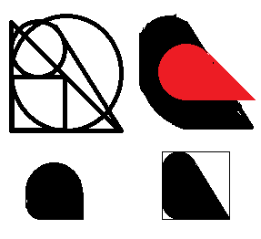

[目次](README.md)  
[2022](README.md#2022) [1月](2022-01.md) [2月](2022-02.md) [今月](2022-02.md)  
[2021](README.md#2021) [1月](2021-01.md) [2月](2021-02.md) [3月](2021-03.md) [4月](2021-04.md) [5月](2021-05.md) [6月](2021-06.md) [7月](2021-07.md) [8月](2021-08.md) [9月](2021-09.md) [10月](2021-10.md) [11月](2021-11.md) [12月](2021-12.md)  
[2020](README.md#2020)  

2022年3月
=========

## 03/14 月

- 8:30の目覚ましで9:30起床。当然眠い。
- あ、タクシーと交際費を __帳簿に付けるのを忘れた__ 。
  - 国税サイトでの申告書の修正が面倒だから、もういいか。控除はトータルで1000円かそこらだし。
- __FX__ の取引枚数は4枚。そうだとは思ってたんだけど。
  - これで __申告書の作成は終わった__ 。後は印刷して提出。
    - 昨日早く寝て、朝に作成すれば、今日提出できた。
      - 寝ようとしても、寝付けたかどうかは分からないけど。
  - 短期間で利益が沢山乗っていて、利益確定する誘惑に駆られる。
    - じゃあ次はいつエントリーできるんだ、ということで我慢する。
- `OCN MVNO` の領収書を半分くらいダウンロードし忘れたかと思ったが、あった。
- 昨日見つけた __コーヒー__ のバッグを淹れる。
  - ちょっと甘い気がするけど、このコップで何か飲んだっけ？
    - 普段はドリップコーヒー用のコップは別の専用の保温のを使ってるけど、今日は量が少ないから汎用マグカップで。
- 少なくて物足りなかったので、いつもの __コーヒー__ を淹れた。
- __PCR検査は陰性__ だったそうだ。
- 風邪の症状は、ちょっと痰と鼻水が多いかな、というくらい。
  - おおよそ、飲み過ぎの日と同じくらい。
- __電子帳簿保存法__ の解説を見ると、僕の帳簿の付け方と領収書の保存方法で大丈夫そうだ。
  - https://www.nta.go.jp/law/joho-zeikaishaku/sonota/jirei/pdf/0021006-031_03.pdf
  - 売り上げが1000万に到達すると、領収書のファイル名の付け方を、探しやすいように規則的にしないといけないそうだ。
  - 毎年、Yahooウォレットなどの __領収書を印刷__ して保存していたが、来年からは不要になるようだ。
    - 申請しておけば今年も不要で青色控除も増えたんだけど。
- __園芸__
  - __ハラペーニョ__ も越冬したようだ。芽が出てきた気がする。
    - __水耕栽培__ の品種は、韓国唐辛子を除いて越冬らしい。品種に依るのか、水耕栽培は温度を維持しやすいのか。
  - 鉢植えの品種で生きてそうなのは、今のところ __スコッチボンネットイエロー__ だけだが、 __ナーガモリッチ__ もワンチャンありそう。
    - 新芽が出てるような気もするし、去年の新芽が枯れてるだけかも知れない。
  - プランターの __トリニダードスコーピオン__ は期待してたんだけど、今のところ乾いていく一方のように見える。三月一杯で新芽が出なければダメだったということだろう。
    - プランターで土の量が多いから、設備的には一番寒さに強そうなんだけど。
    - 剪定が強過ぎたのか、水やりを控え過ぎたのか、単に寒過ぎたのか。
      - カレーリーフもいつからか弱ったから、水が少なかったかも知れない。
      - 全然 __土の表面が乾かない__ から控えたんだけど、そこまでカラカラの話じゃないのかも知れない。
  - 放置した唐辛子の実が白くなっているが、大体、日の当たる方が白くなっているようだ。
  - 今年復活したとしても、スコーピオンはいずれ抜く。その時に、 __カレーリーフ__ の根にあまりダメージを与えないようにしたい。どうしたらいいのだろうか。
  - 室内の __ライムの木__ の新芽のいいにおいがする。
    - 先週は風邪で気付いていなかったんだろう。
  - 液体肥料を薄めるのに使う __スポイト__ に亀裂が入っていて、昨日テープで補修した。
    - 無事に使えるようになった。
  - 室内に入れた鉢から __アブラムシ__ が出たんだから、そろそろ暖かくなって、 __ベランダ__ の作物からも卵が孵りそう。
- お腹が空かない。昼休みに __お昼ご飯を食べなかった__ 。
- __レトルト家電__ ！そんなものが！
- コンビニで __確定申告書をネットプリント__ 。
- 外に出たら、風が強くて思ったよりも寒い。
  - ウォーキングがてら新大久保までノグリを買いに行こうと思っていたが、心が折れた。
- 1時間ほど仮眠。
- __晩飯__ は大根と、 __背脂ニンニク__ で炒めた野菜炒めと、カップ麺の `龍の家` 。
  - 話題の背脂ニンニクの瓶は、野菜炒めをアーリオオーリオにできるほど強烈ではなかった。
  - カップ麺と野菜炒めを混ぜたら、スープのニンニクが強くなるくらいには威力があった。
- 「NATO東方不拡大に関するロシアの懸念に配慮すべきだ」という意見がある。
  - 十分な配慮をしてればどこにも侵攻しなかった、とは思えない。
    - チェチェン、ジョージア、シリアで何をしたか。
    - オレンジ革命の時のユシチェンコは本当にロシアが毒を盛ったのではないのか。
    - クリミア併合はヤヌコーヴィチが失脚したからではないのか。
  - 今回の侵攻が、その懸念の上に決断されたことはその通りだろう。
  - 問題は、プーチンが暴発するとは、ほとんど誰も思っていなかったことだ。
    - あの貧弱な国力で、そんな大掛かりな侵略を試みるワケがないと思っていた。
    - ナメていたし、ほとんど無視していた。
  - 暴発する可能性があると思っていたら、準備できることは色々あったし、真面目に交渉する振りをして、侵攻を数年遅らせることも出来たかも知れない。
  - 「ロシアに一定の譲歩をせよ」ということであれば反対だが、交渉の前提として「ロシアの考え方自体を理解せよ」ということなら納得だ。
- たまたま、ウクライナのオレンジ革命の時の親欧米派候補のユシチェンコが、突然肌がボロボロになった映像を見て、強く印象に残っていた。
  - ポロニウム毒殺事件の記憶もあり、ロシアが毒を盛ったと受け取った。
  - その後、また親ロシアの大統領が失脚したときに、クリミアを併合した。
  - チェチェンやジョージアのことは見ないようにしていたが、たまたまウクライナのことは、この程度には流れが分かる。

## 03/13 日

- 9:00起床。
- 円錐フィルターで __コーヒー__ を淹れた。ちょっと味気ない。体調？お湯の温度は高過ぎたかも知れない。
  - 昨日買ってきた甘いものと一緒に頂く。
    - コレと甘い菓子パンと買ってきたが、菓子パンが甘過ぎた。
- __郵便__ 屋さんが、こないだ注文した古本を届けてくれた。
  - Amazon では __置き配__ と指定したんだけど、ゆうパックには置き配はないの？
  - 調べたら、郵便局に行ってお願いすると、置き配してくれるそうだ。
    - 荷物単位でも指定できるらしいんだけどね。発送する業者がやってくれるといいんだけど。
- YouTubeの [【超有料級】この動画1本で英文法基礎を完全攻略](https://www.youtube.com/watch?v=YJo7hpWe_Js) というのを見た。
  - 文法要素としては知ってることばかりだけど、 __なるほどと思うことが沢山__ 。
    - __長文__ を読む時に、どこからどこまでがどんな __区切り__ なのか分からない。
    - __逆引き的__ に、どの文法要素がどこに当てはまる可能性がある、というように考えることができる説明が有難い。
  - __英文法をシステム的__ に教えるのを見たことがない。
    - 文法要素の羅列だけでは覚えられないし、いつどのルールを使うのか判断するのが大変。
    - この動画でも、見た中では一番システム的だが、(復習してまとめてみないと分からないけど)まだ遠いように思える。
  - それで __チートシート__ を漁ったことがあるんだけど、気力が足りなくて、ちょっと見ただけで終わってる。
- [02/14 月](2022-02.md#0214-月) に無くなった __箸__ が出てきた。
  - ちょっと驚くが、ありえなくはない、というようなところ。
    - 酔っぱらいは怖い。
  - 洗ったが、アルコール消毒でもちょっと不安なので、ハイターに浸け置きする。
- 近所の __レンタルサイクル__ を調べて登録した。
  - いくらか遠くにランチを食べに行く時に使いたい。
  - まあでも、時短要請が終われば、外食は夜だけで満足かも知れない。
- `Quell: Memento+` 全クリア。
  - 最後の方は面白かったが、難しい面の比率が少ない。
  - 少しだけ、ネットでパーフェクトの解法を見てしまった。
- `バーミヤン` の外壁に「火鍋」と書いた紙が沢山貼ってある。
  - 内容が分からないのでHPを見に行ったら、 __しゃぶしゃぶ食べ放題__ のスープに火鍋のスープがあるらしい。
  - バーミヤンのしゃぶしゃぶを食べたことがあるが、当時は一人鍋がある店が少なく、糖質制限食としては安く沢山食べられて良かった。
  - それに追加料金を払うと、 __サイドメニューも食べ放題__ になるそうだ。
    - よだれ鶏とサラダを食べ続けて2100円というのは安いのではないか。しゃぶしゃぶはついででいい。
- __ランチ__ は近所の中華でユーリンジーと肉野菜炒め。
  - 10年以上ぶりだと思うが、味が全然違う。
  - まあ、人が違うんだろうね。系列店もあるしね。
- 帰りに `スタバ` でさくらラテとさくらドーナツをテイクアウト。
  - おやつしながら確定申告。
- __確定申告__ してるが、去年の3月終わり頃から9月終わり頃まで __通帳が記入されてない__ 。
  - __電気代__ の請求書と領収書がポストに入らなくなってる。
    - 引き落とし口座で料金は分かるが、領収書を取っておく必要があることになってる。
      - `東京電力` のサイトで領収書がダウンロードできた。
        - ダウンロードしたファイル名が、発行した日付になっていて、 __いつの領収書なのか分からない__ 。ヒドい。
  - 去年の前半の __ガス代__ が高い。1月2月が特に。何をするとガス代が増えるんだ？浴室乾燥？
    - 電気代はちゃんとエアコン使いそうな時期に高い。
  - __光熱費__ を経費申告するのに、去年までは __領収書__ から入力していたので、無くした月は計上しなかったし、手間としても __面倒__ だった。
    - 今年は __引き落とし口座の履歴__ をネットバンキングで見ながら入力して、楽で良かった。
  - `OCN MVNO` の契約を新しくしたが、古い契約の方の領収書のダウンロードが7月までだった。
    - 前の契約書は捨てちゃったかな？
      - クレジットカードの請求で計上してしまおうか。税務調査が入ったら認められないかも知れないけど、数千円の経費で、修正額は数百円だ。
    - 12月分は料金がかかってないらしい？
      - 請求がないだけだった。
  - __経費のレシートが全く無くて驚いた__。
    - 必要なものは全部Amazonで買っていた。
      - 職場から近くの量販店に行くことも、夜中にドンキホーテに行くとかも無かったのか。
    - 同業の交流会もやっていなかった。
    - 電車代だけ。タクシーは無い。
      - 電車の利用明細の1月2月が欠けていた。
    - __財布に挟んだままだった__ 。
      - 交流会が1件、タクシーが2件。
- あまり捗らず、ごみを捨てに行くついでに __通帳の記帳__ をして `ローソン` でキャラメルマキアートと甘いモノを買ってきた。
  - キャラメルシロップを先に入れてしまった。ミルクフォームの上に垂らすのだと思う。
- `Amazon Prime Music` を聞いていて、やたらと固まると思ってたら、空き容量がないそうだ。
  - 仕事中に音楽を聴くための、初代iPhone SE。
  - 適当に色々消したが、辞書と音楽が大きいので、消せるのは小さいモノばかり。
- 帳簿は終わって、あとは申告書。
  - __FX__ の申告をするのに、証券会社にログインしようとしたら、日曜夜中で6:00までメンテナンス中。そうでした。
- 上着のポケットを漁っていて、去年の誕生日に貰った、ハンドソープとコーヒーバッグが出てきた。
- __電子帳簿保存法__ というのがあって、事前に「電子帳簿でやります」と申告して許可を貰わないと、青色申告控除の65万円は全額計上できず、55万円しか計上できないそうだ。
- 申告書もほとんど済ませて5:00睡眠。
  - 早く寝れば良かったが、眠くなかったから仕方ない。
  - 夜にコーヒー飲んだからね。
- 無理すれば14日の月曜朝に提出できるが、無理するタイミングでもないだろう。普通に定時のある職場なのだから。

## 03/12 土

- 目覚ましなしで10:00起床。
- 味覚は全快。鼻水もいくらか減った。微熱、少し倦怠感。
- 過去ずっと、一度風邪を引くと5日は発熱で辛かったが、前回と今回は治りが早い。
  - ただの風邪とインフルエンザの違いとかかな？
    - 最近のはただの風邪で、風邪の割にはツラい、つまり歳を取ってインフルエンザじゃなくてもツラく感じるようになったとか。
- 午前診療に間に合うかと、近所の内科に __コロナ検査__ をお願いしようと電話したら、予約で一杯だった。
- __東京都発熱相談センター__ に電話したら、近所の病院を紹介してくれた。
  - 最初の病院で診察予約は取れた。
- 近所の医者で __PCR検査__ を受けてきた。
  - 電話したときは混んでるという話だったが、そうでもなかった。
- 帰りに近所のカフェでコーヒーと餡バタートーストを __テイクアウト__ 。コーヒー豆も買った。
- __ランチ__ はそれ。
- 帰ってきたら __PCが立ち上がらない__ 。
  - 何度か再起動してたら突然復活。
  - Win10インストール用のUSBをセットアップしようとしてたら復活した。
    - そもそも現状は、昔のHDDにMBRがあって、SSDにインストールしたWin10を起動している、というイヤンな状況。
    - 色んなソフトのセットアップし直しはだるいが、一度やっておいた方がいいのは事実。
      - やる気が起きたら、確定申告の後で。
- __味覚障害__ が直ったのは、牡蠣を食べたからかも知れない。
  - コロナじゃなくて __亜鉛不足__ ？
- __園芸__
  -  __イチゴ__ の植え替え。
  -  __野イチゴ__ にも花が付いてる。
  -  棒切れの __梅__ に __芽__ が付いてる。コレは __南高梅__ 。 __白加賀__ にも付いてる気がするが、気のせいかも知れない。
  - 写真がうまく撮れなかったが、ベランダの __ライムの木__ にも __新芽__ や __蕾__ が付き始めた。
    - 冬に付いて咲かなかった蕾も大きくなり始めた。冬に咲いた花の小さな実も、少し膨らんだような気がしないでもない。
  -  室内の __カレーの木__ が生きてそうだけど、また、新芽じゃなくて蕾を付けそう。
- スマホからインスタに写真を上げてからPCで文章を編集しようとしたら、PCから出来ない。
- `Quell: Memento+` は終盤に面白い面が出てきた。
- PCをハイバネーションするのが怖い。
- PCをハイバネーションして出かけてきたら、やっぱり立ち上がらなかった。
  - 何度もリセットしてたら、その内に立ち上がった。
  - ランダム？暖機？
- コンビニで、栄養ドリンクと菓子パンと甘いものを買ってきた。
- __晩飯__ は大根と、昨日の残りのキャンベルスープをドリアにしたものと、菓子パン。
  - なかなか、こんがりグツグツという感じにならない。
    - 冷たいチーズを乗せたせいで、温度上昇が遅いのだろう。
    - 乾いてパリパリだけど、こんがりという感じではない。
      - なのに焦げてるところがある。
    - ダメね。

## 03/11 金

- 8:00の目覚ましで9:40に起床。
- 風がなく、陽が差して、ベランダが暖かい。
  - 11°C、最低気温も6°Cらしい。
- 味も香りも、少し復活したかも？
- ノートンの課金圧力がうるさい。
- 風邪薬とトイレットペーパーと昼ご飯を買いに外出。
  - 暖かい。Appleの天気サービスによると17°C。
- __ランチ__ は大根と、スーパーの弁当と総菜パンとおはぎモンブラン。
  - 大根美味しい。
    - 今回はちょっと辛みが強く、ホワジャオを入れたくなる味。
  - 温玉入り弁当を温めるのは悲しいことだ。
  - おはぎモンブランの __背徳感__ が凄い。
- __八王子__ にも __東中野__ という地名があるそうだ。
- Amazonの __欲しいものリスト__ を見てて、 __古本__ で安くなってるものは買ってしまうことにした。
  - 商品価格合計1932円で配送料が3754円。
  - それと、古くてこれ以上下がらなそうで、Kindle版がそこそこ安いのも2冊。
  - [第三帝国の神殿にて〈上〉ナチス軍需相の証言](https://www.amazon.co.jp/dp/4122038693/) という本も、値段が安いので買おうかと思ったら下巻が高い。
    - みんな上巻で挫折したらしい。
  料理本も安いのがあったけど、食欲がないせいかスルーした。
- 仕事が終わって、お腹が空いてるか、何か食べたいか考えていたが、眠くなったので寝たら、45分で起きた。
- キャンベル缶スープだけだと寂しいから、コンビニに買い出し。
  - ついでにスーパーに寄って、お酢とチーズを買ってきた。
  - 何か買い忘れたと思ったら栄養ドリンクだった。
- __晩飯__ はキャンベルのマッシュルームスープと、タマゴサンドとななちきと菓子パン。
- そういや一昨日は花粉症を疑ってたんだよな。
- 涙が出てる時でも __目薬が気持ちいい__ のは、温度だろうか、塩分だろうか。

## 03/10 木

- 目覚ましを掛け忘れて7:30に起床。
- 完全に風邪。
  - 熱はまだない。
- 目方が増えた。昨日は晩飯も食べたから当然だけど。
- ほうじ茶を1リットル沸かす。これは風邪を引くといつも。
- __園芸__
  - __ライムの木__ の札を巻いた針金が食い込んでいたので外した。他のも緩めた。
    - ついでに、昨日見つけた新芽も折ってしまった。
  - __カレーの木__ に新芽があるような気がするが、元々あったのを見落としていただけかも知れない。
    - 果たしてまだ生きているのかどうか。
- コンビニへ行って、レッドブルと栄養剤とビタミンCの清涼飲料水と桜餅を買ってきた。
  - レッドブルはカフェインとカロリー。栄養剤はビタミンBとアミノ酸。
  - 桜餅は桜の花びらの塩漬けが乗っている。葉っぱの塩漬けが好きなので、少し残念。
    - 桜餅にはほうじ茶じゃなくて煎茶だな。
- Instagramの #homemadecheese をフォローしてるんだけど、プロの手作りばかりになった。
- __ランチ__ は鶏肉とネギと卵の炒め物。
  - __味がしない__ かも知れない？
    - 今度こそタダの風邪じゃないかも？
    - 単に鼻が悪いだけ、ということだといいんだけど。
    - 今朝は大丈夫だったのに。
- __オンラインゲーム__ でロシアユーザー排除の動きがあるとか無いとか。
  - __ロシア人による反戦運動__ などを後押しするとかだと嬉しいけど。
- 朝は平熱だったが、昼を過ぎて微熱。
- ほうじ茶をもう1リットル沸かした。
  - 全然足りない。
  - 渋みを感じないから？薄過ぎた？
- カロリーを摂取しておこうとUberで注文したが、味が分からないんだから、ありものやコンビニで済ませば良かった。
  - パックご飯とキャンベルスープなんていいじゃないか。
- __晩飯__ はフレンチ出身のラーメン屋 `ただいま変身中` の牡蠣担々麺と牡蠣豆乳ラーメンと牡蠣ご飯2つ。
  - 牡蠣ご飯は1つ頼むともう1つの。
  - 味はする気がする。香りはかなり少ない。
- 2019/08が使用期限の風邪薬を飲んでみる。
  - カプセルがペタペタしてる。
- ウチに出たコバエがクロバネキノコバエというらしいのだが、幼虫の期間が20日もあるらしい。
  - 頑張って成虫にアルコールを噴霧している。
  - 卵が無くなり、かつ産ませなければ勝ちだからだ。
  - 20日も続けないといけないのか。
- コバエがアルコールに弱いらしい。
  - ハダニみたいに水の霧吹きで良ければいいのに。
  - それと、蒸発した気体のアルコールはダメらしい。でなければ、かなりの濃度が必要らしい。
    - 直撃だとすぐに動かなくなるんだけど。
- 核共有、沈黙の艦隊、架空戦記、ダウンフォール作戦、パープルハート章。
- Googleに、良く使うか、プライバシーを尊重してると感じるか、と聞かれた。
  - この手のアンケートは面倒なことが多いけど、たった4問で、待たされることもなく、アンケートはこうあって欲しいものだ。
- 満腹してお腹が苦しいし、風邪も辛いので21:00に寝る。
- 0:00に起きる。
- 5:00に寝る。

## 03/09 水

- 8:00の目覚ましで9:30起床。
- 目方が増えた。野菜とケバブしか食べてないんだけど。
- ミルサーの匂いは落ちた。
- __園芸__
  - 室内の __ライムの木__ にまた蕾が出てきた。前回の実はほとんど全滅なんだけど、今度はやれるの？
    - 気付いてなかったが、 __新芽__ 、 __若葉__ も出てきてる。
  - コバエが沢山。新しい卵が孵化したらしい。
  - バジルとかやるなら、そろそろ __種蒔き時期__ だ。
- __コーヒー__ をウェーブフィルターで淹れた。
  - 豆を昨日よりは細かめにして、ちょっと鼻の調子が悪いけど、昨日よりはバランスがいい。
- 鼻水が止まらない。
  - 軽い花粉症？聞いてるよりは辛くないから、違う気もする。
- 作り置きの __大根__ は、まだ漬かりは浅いがイイ感じになりそうだ。やっぱり少し甘いけど。
  - 生の大根から水分が出てきたので、漬かりのムラを気にしなければ、麺つゆはもっと少なくてもよさそうだ。
- __ランチ__ はみぞれ鍋。大根を煮て、大根おろしをかける。
  - 味付けは中国の大豆味噌。
  - 昨日大根を漬けた時に、今日の分を分けておいたのだが、少な過ぎた。
    - 漬物が無くなったら、また挑戦したい。
  - 鶏モモ肉は1羽分使うつもりだったが、多過ぎたので半分にした。
  - 他には、ネギ1本、しめじ少し、モヤシ半袋、キャベツの外葉1枚。
  - 1人前作るのは、火加減の調整が難しい。
    - 何度も作ったことがあるが、その時は3リットルくらいの鍋で一杯に作っていた。
- __眼圧__ が高くてツラい。
- 「ポケットからキュン」というのがあって、「チュン(中)」だったらどうだろうかと思った。
  - 麻雀牌1枚で売ってないか調べたらあったけど、人気牌は売り切れだった。
    - 3Dプリンタで作ったらどんなものだろうか。
  - 検索したらやってる人が沢山いて、Tシャツも売ってた。
  - スズメの書き方。
    - https://ichi-up.net/2019/30
    - 凄い。
  <!-- cSpell:ignore suzume -->
  -  幾何学的な組み合わせで、スズメの輪郭を描きたい。
    - Blenderとかでスクリプトで表現したい。
- 「チャパグリ」のためにドンキホーテまで歩こうかと思っていたが、ちょっと頭痛がする気がしてきた。
  - 栄養は沢山摂ってるし、暖かくしてるのに、何が体のダメージになっているんだろうか。
- __晩飯__ はレトルトのボルシチと納豆ご飯と塩卵。
  - お腹空いてないけど、風邪気味だしカロリー摂取した方がいいかな、と。
- `ペヤング獄激辛Final` というのが出るそうな。
  - Endの後にFinalが出てるんだから、次もあるだろう。NextとかFutureとか？
- __ウクライナが中立化__ もありうると言い出したらしい。
  - どうやったら __プーチンに信じさせ__ られるだろうか。
    - 「ミンスク合意と同じになる」と思うのではないか。
    - 「停戦合意でロシアが撤退したら、欧米の援助で軍備強化する」と疑うのではないか。
  - 逆から見て、ロシアは __撤退後も軍事的圧力__ を維持するだろう。
    - ロシア軍がウクライナの空港を自由に使用できる、くらいは押し付けるのではないか。
  - そもそもウクライナのNATO加盟は、プーチンやゼレンスキーが現役の間に完了する話じゃないけど。
- 大規模接種会場の __ワクチンの予約状況__ を調べてみたら、余裕がある。
  - 毎日、最初と最後の回が人気だが、それでも売り切れは無い。
  - どうするかな。打った方が、社会への貢献という意味では良いんだけど。
- 少し眠かったので22:00過ぎに就寝。

## 03/08 火

- 8:00の目覚ましで9:30起床。強烈に眠い。夜更かししたっけ？
- 内藤唐辛子の鉢をベランダに出したらコバエが減った気がする。
  - なお、ベランダはコバエだらけ。
    - 土に卵を産む生き物だから、もう仕方ないだろう。
    - 受粉の手伝いとかしてくれればいいのに。
- __コーヒー__ をウェーブフィルターで淹れた。
  - プレス用の粗挽きで淹れてしまった。最近ウェーブフィルターで淹れた時にイマイチだったのはそのせいかも。
  - スッキリして美味しいけど、ちょっと薄かったかな。
- __ランチ__ は作り置きキャベツと大根と、Uber Eatsで注文したケバブサンドとケバブサラダ。
  - お腹空いてないけど、金曜に貰った300円割引のクーポンを使いたかったので。
    - しかも、1つ頼むと1つ無料のケバブサンド。食べ過ぎ。
    - サラダはサンドの中身。単に3つ食べただけ。
      - まあ、クーポン使うのに1200円必要なところ、サンドが1190円なので、何か追加する必要はあった。
      - ソースを選べたら良かったのに。
  - 作り置きは食べ終わった。
    - 作り置きするにも自炊するにも、メイン食材が無いのでキャベツと大根を買ってくる。
- Uber Eatsで気になる店があって、ゴーストレストランなんだけど、そのうち3軒がカレー。自信があるのかな？
  - クーポンがもう1つあるから、気が向いたら注文する。
- スーパーに買い物。
  - __オリーブオイル__ は `デルモンテ` の密封容器のを買っていたが、自炊するようになって消化スピードが速くなったので、ちょっといいのを買ってきた。
  - あとは、鶏モモ肉、キャベツ、大根、シメジ、ネギ、シーフードミックス、炭酸水、白ワイン。
    - ネギが3本でしか売ってなかった。
      - 1本はみじん切りにして冷凍。
      - 後は、ネギメインくらいの料理で消化しないと。
- モモ肉は下味をつけて冷蔵庫へ。
- 下味に使う __白コショウ__ を補充。
  - いつも、ホールを挽いて使っている。
  - 乾煎りしてみた。余熱無しのオーブントースターで120°C5分。
    - こんなものかな。
- __スパイスの乾煎り__ が、どの程度の温度なのか分からない。
  - 水分が飛ぶまで、というのだけど、どうやって分かるの？色覚が健常だと分かるの？
  - 油で __テンパリング__ するんなら不要なのでは？
    - __ガラムマサラ__ を作るときに乾煎りするのは理解できる。
    - もしかして、テンパリングしたのを __ミルサー__ にかけて、ガラムマサラじゃなくて __カレーペースト__ を作れるかもしれない。
- __大根__ は1/3は明日の昼にみぞれ鍋にしたい。
  -  残りを麺つゆの `ビミサン` と酢と唐辛子で漬ける。
    - 酢を入れたのは、甘かったから。
    - 唐辛子は今度は砕いて入れた。
    - 今回は全く干さない。大根から水が出ると思うんだけど、どんなものだろうか。
      - 干さないと、漬け汁が沢山必要だった。
- みぞれ鍋をするのに、日本酒で煮たい。
  - アルコールを飛ばすために、今日の内に煮切っておく。
  - ついでに昆布も煮る。
  - アラーム付き温度計で80°Cまで、弱火で加熱。
-  [02/01 火](2022-02.md#0201-%E7%81%AB) に書いた、容器が割れた __激辛唐辛子の酢漬け__ をミルサーにかけた。
  - 白バルサミコを追加しようとしたが無かったので穀物酢で。
  - ミルサーにかけたら __コツコツと音がする__ 。
    - ガラスが入っているようだ。
  - 危ないので __廃棄__ 。
    - 容器は燃えないゴミ、液体はトイレ。下水は大丈夫だろうか。
- 洗っても洗っても、ミルサーから唐辛子の匂いが落ちない。
  - 一晩浸け置きしてみる。
- アプリの割引情報のアプリ `AppAgg` で値引きになってたゲームを3つダウンロードした。
  - `Poker Pop` は面白いけど上手になる前に飽きそう。こういうゲームを思いつきたい。
    - と思っている間に、多分、油断しない限り死ななくなった。
  - `Quell Memento+` は絵がキレイで丁寧なつくりのパズル。難しいステージが面白くなるかどうか少し不安。
  - `Kindom: New Lands` は250円。他のは無料。何かミスったらしくて、お金が足りずにチュートリアルを完了できなかった。
- __侮辱罪厳罰化__ だって。
  - 度が過ぎる侮辱は、侮辱罪よりもストーキングの適用が良いのではないだろうか。
- 「ビットコイナーは正しかった」だって。
  - https://www.coindeskjapan.com/141975/
  - 既存の金融制度は、何かの権力が、誰かを締め出すことができる。中立でない。
- 今日は盛り沢山だったが、それより確定申告すべきだった。
- ゲームやってて5:00就寝。

## 03/07 月

- 目覚ましなしで5:00に起きて、1時間ダラダラしてまた寝る。
- 8:00の目覚ましで9:30に起き上がる。
- __キューバミント__ が調子悪そうだが、もうダメだろうか？
  - 昨日の植え替えの時に、植え替える時点で水が足りなくて干乾び気味だった。
  - 植え替える時に、途中でポキポキ折れた。
    - 水が無いと茎がシャンとしない。
<!-- cSpell:words MRSO -->
- 大規模接種会場の予約サイトを見に行ったら `MRSO Inc. ALL RIGHTS RESERVED.` とある。
  - 厚労省とか自衛隊の権利は大丈夫なの？
- python の `if __name__ == '__main__':` はモジュールの時に使うのか。
- __ランチ__ は `一蘭` の乾麺と、作り置きキャベツとモヤシをレンチンしたものと、大根。
  - 乾麺は2人前入っていたのを全部食べたのでスープが1人前余った。
  - 辛い粉は明太子味がするので誰もが入れた方がいいが、結構辛い。
  - 大根に入っている唐辛子をまた噛んだ。辛い。
- C/C++スタイルのconstが好きな僕は、全ての変数がconstの「自前SSO」な言語を作ったらどうだろうか。
  - メンバは？
- 突然の __コロナ__ 感染者数減。前週比半56%、前日比58% 。
  - ノイズなのか、良い兆候なのか。
  - ここのところ下げ止まっている、と思っていたところに激減の知らせ。
- 知り合いのバーの開店祝いに行ってきた。
  - `重川` という白ワインを飲んできた。
    - 「おも」かわと読むそうだ。
    - 「しげ」は音読み？訓読み？
<!-- cSpell:words SMBC -->
- `日興SMBC証券` が __株価操縦__ で逮捕だそうだ。
  - 買い支えたから株価操縦って、どこでもやってるし、そんなので逮捕したらみんな海外に逃げるよ、と思っていたが、Yahoo!のコメントによると、部署を横断してやったかららしい。
- `ストリチナヤ` という __ウォッカ__ があってロシア語で「首都」という意味なのだが、今は __ロシアで生産していない__ そうだ。
  - https://www.cnn.co.jp/business/35184525.html
  - `スミノフ` もロシア産じゃないそうだし、僕はロシアのウォッカを一つも知らないかも知れない。
- ロシアのスポーツ選手が締め出されている。
  - 本人が悪いワケじゃないので同情する。
  - が、この措置は、ロシア国民の反戦感情を醸成するもので、大義名分がある。

## 03/06 日

- `ダイソー` で鉢底石とハーブの土と納豆チップルを買ってきた。
- __園芸__
  -  __ハーブ__ を植え替えた。
  - __白加賀__ という __梅__ だけポットだったので、それも植え替えた。
    - 滅茶苦茶に水ハケが悪くなった。大丈夫だろうか。
  - 来週は __イチゴ__ を植え替えたい。気温次第。
- 外は __寒い__ 。11°Cというが本当かね。
  - __風が強い__ せいではある。
- __晩飯__ は大久保の `煎餅菓子みみ` で煎餅菓子？と串揚げ5本。
  - 多分煎餅菓子だと思うんだけど、塩味の __クレープに色々包んだ__ もの。僕はベーコンと目玉焼きを注文。
    - 中国人の知り合いがインスタで教えてくれたところによると、 __中国では朝ご飯__ だそうだ。
  - 串揚げは、火加減がマチマチで不満。
    - ここだけで済ませるつもりだったが、口がとても不満足なので、どこかで何か __美味しいものを食べたい__ 。
- `アンビカ` が営業してた。昨日は遅過ぎて閉店後だったのだろう。
  - スターアニスパウダーがあったが、イスラム横丁よりもさらに高い。
- 昨日遅くて買い物できなかった `アジアンスーパーストア` で、お菓子とかカップ麺とか魚の缶詰とか買った。
  - 知り合いが海老が好きだというのを最近聞いたので、海老の食品を色々買う。
    - サンバルというのを海老の調味料だと思っていたけど、サンバルは辛い調味料らしい。たまたま見たのが、海老風味のサンバルだったらしい。
    - 今日は海老味噌的なのがあまり無かった。
      - 海老ペーストはいくつもあるんだけど、オキアミの塩漬けに思える。ちょっとコア過ぎる。
    - 海老のお菓子を沢山買った。
      - 海老の頭のお菓子が見つからないと思ったらレジ脇にあった。今回はパス。
  - 自分用には、蟹ペーストと甘いお菓子。
  - 総菜が色々あるけど、テイクアウトにしては少し高い。美味しそうだけど。
- 新大久保の `シャンパンマニア` という飲み屋で一杯。
  - 韓国横丁という10件の店が入っている建物。
    - 適当に座って、どこの料理も頼めるようなところかと思ったら、集まってるだけだった。先に店を選ぶスタイル。
  - 大抵の韓国料理屋さんは量が多いんだよね。
  - ということで、一皿の量が少なそうなお店を選んだ。
- 大久保の `ドンキホーテ` でお菓子とラーメンとお酒を買う。
- 晩飯に、昨日買ってきた袋焼きそばを食べようかと思っていたがやめた。
  - 昨日買ってきた袋焼きそばは、韓国映画 `パラサイト` で食べていたものだと思っていて、インスタに上げようと思っていたけど、検索したら違った。
    - `チャパゲティ` だと思っていたけど、「チャパグリ」と言って、チャパゲティと `ノグリ` のブレンドだそうだ。
  - 具を入れてたかどうか調べようと思ったら、モノが違った。
  - 近いうちにノグリを買ってこよう。
- なかなか使わない、山椒のハチミツ漬けを使ってしまいたい。
  - ライムの実を切って、山椒ウォッカの水割りに入れる。
  - 悪くない。
-  ライムは熟し過ぎると、黄色くなって、酸味が減るという。こういうこと？

## 03/05 土

- __大根__ の唐辛子は辛かった。辛味が漬け汁に行ってない。
  - 次は、干さずに角切りを `ビミサン` に漬けてみたらどうだろうか。ちょっと長めに。
- 近所のバーに持ち込むために、中華料理店2軒でテイクアウト。
  - 同じメニューを食べ比べる感じにしたかったが、似たメニューはチャーハン。
    - 片方はシットリして、いかにも町中華。もう片方はパラっとして味付けが濃い。
- エスニック食材を色々買おうと思って、東新宿の `アジアンスーパーストア` を目指したが遅すぎた。22:30閉店。
- `ドンキホーテ` で辛味調味料とか、辛い袋焼きそばとかを買う。
  - 焼きそばは自宅用。調味料はプレゼント用。
  -  
- __スターアニス__ のパウダーがないか、大久保の `アンビカ` を目指したがやってない。
  - __イスラム横丁__ でいつも使う `ジャンナット` に売ってた。前回はたまたま？
    - `S&B` の倍くらいする。
- `Amazon Prim Reading` のチェック。
  - すぐに読めそうなのは目を通す。
    - `小学生の絵画 とっておきレッスン` が思ったより高度だった。
      - その上に、子供が面白がりそうな工夫が素晴らしい。
      - 最初に画材や色の説明が続き、この順番で読むと飽きそうだな、と思った。

## 03/04 金

- 8:00の目覚ましで9:30起床。
- __コーヒー__ は今日からグアテマラ。フレンチプレスでやや薄めに淹れた。美味しい。
  <!-- cSpell:words repr -->
- pythonの `repr()` はread, eval, print, loopじゃないのか、と思ったが、それは `REPL` で最後が `L` だった。
- [01/22 土](2022-01.md#0122-%E5%9C%9F) に買った __ハーブ__ は室内で育てている。
  - __ローズマリー__ 以外の __タイム__ と __キューバミント__ が徒長してる。
    - 暖かくなってから買うべきだったらしい。
    - どれも日照が少なくても大丈夫な品種だと思っていたけど、ごめんね。
- __ランチ__ は大久保の人気カレー店 `半月` の2種相掛けと、野菜炒め。
  - 野菜炒めは具沢山オムレツを作るつもりだった。
    - 卵とじというにも卵が少ない。別にそぼろを作って合わせるべきだったかも。あとは目玉焼き乗せとか。
    - 週末なので、野菜を使い切りたい。
    - 玉ねぎ半分は多いかな？と思ったけど、当然多い。
    - あとしめじも半分以上。
  - 半月はUber Eatsで。こないだやってるのを知って、機会をうかがってた。
- Uberが配達遅延で300円引きのクーポンを2つくれた。
  - 3/18までねえ。
  - 今回の注文で300円返金してくれると有難いんだけど、それは大変か。
- __大根__ は美味しく漬かっていた。
  - 出汁醤油でなく麺つゆなので、少し甘い。
    - お酢を入れたらどうかな。もっと甘く感じるかな。
  - 乾燥唐辛子を丸のままいくつか入れたが、辛味を感じなかった。
    - せめて手で割いて入れるべきだったか。
- 甘いものが飲みたくなって __チャイ__ を淹れた。
  - スパイスの入れ過ぎを心配してたのに、むしろ少な過ぎた。煮出し時間が短か過ぎた？
- 買ってきたクラフトビールをリモート懇親会で飲む。
  - TDH HAZY DIPAは流石の飲み応え。
  - 2本飲んでどちらも強めだったので、セッションIPAを先にしたら良かった。
- 懇親会で昔のゲームの話題が出た。
  - `ピカチュウげんきでちゅう` の話題が出て、検索したら当時の公式サイトがまだある。
    - 一番下に並ぶボタンの輪郭の処理の拙さに、時代を感じる。
    - ソースを見ると、手書きのようだ。
- 「 __170cm人権問題__ 」について、人権について真面目に語る人たちがいる。
  - 誰にでも平等に人権があるなんて当然で、そうでなければあの発言はなかった。
  - どれだけヒドい悪口を言えるか、という __露悪趣味__ で見栄を張る発言だ。
- ロシア制裁で化石燃料が不足するので __原発__ が必要だという人たちがいる。
  - __使用済み燃料__ の問題が片付けば、僕も賛成だけどね。

## 03/03 木

- 目覚ましを掛け忘れて寝坊。10:35起床、11:00始業。
- 内藤唐辛子をベランダに出したらコバエが結構減ったと思う。
  - __カレーの木__ にはそこそこいるけど、昨日よりは少ない？
- __コーヒー__ の豆の挽き方を粗くしようと思っていて忘れてた。
  - ちょっと調子悪くて細かく風味が分からないけど、甘みを感じる。
  - 豆を使い切って、やや少なめなせいか、昨日までより複雑な感じがする。
- 取引先から貸与されているPCを再起動したら、 `Synergy` のキーボードが効かなくなった。
  - なんとなくCAPS LOCKをトグルしたら動くようになった。
    - 使わないからいいけど、CAPS ONだと入力できないというのは。
      - バグなら簡単に見つかるだろうから、どこかに設定があるのか。SynergyなのかWinなのか。
- 論理的な考え方というのは、集合論的な考え方。
  - ある集合には何が入って何が入らないのかを明確にすること。境界条件を明確にすること。物事を峻別すること。
- githubのリカバリーコードを保存してないことを思い出して見に行ったら、 `LastPass`, `1Password`, `Keeper` をお勧めしてた。
- パスワードマネージャでログイン情報を含む秘密情報を共有しようとすると、メンバーが退社したときにパスワードを変更しないといけないのか。面倒だな。僕には関係ないけど。
- __ランチ__ は2019年が賞味期限のカップ焼きそばと野菜炒め。
  - 小さな __フライパン__ しかないのに __具材を入れ過ぎ__ て大変だった。
    - 具材をひっくり返すのが大変で水を入れたら水っぽくなった。
    - __オールスパイス__ を入れたつもりが __クローブ__ だった。
      - しかも、手元が暗くて入れ過ぎた。
  - 昨日のランチョンミートの残り半分でスパムエッグ的なものを作ろうと思っていたけど、キャベツが多過ぎて止めた。
- __大根__ を漬けた。
  - 今回はかなりフレッシュ。一晩しか干してない。
  - `ビミサン` という、関東では珍しい麺つゆで漬ける。
    - 3倍濃縮なんだけど、そのまま漬けた。
    - 大根の水分が結構あると思うんだけど、塩辛過ぎるだろうか？
      - 大根のカットが大きめだし、麺つゆも少な目なので、丁度良く漬かりそうな気もするけど。
- iOSとWatchOSがバージョンアップで色々変わって慣れない。
- __蔓延防止措置は21日まで延期__ 。
  - そりゃそうだろうけど __憂鬱__ だ。
- 寝坊したので終業は20:00。
- __晩飯__ は抜こうかと思ったけど、やっぱりお腹が減ってスパムエッグとシャウエッセンと作り置きキャベツ。
- 「スパムエッグ」で検索したら i-mode みたいなサイトが出てきた。
  - https://www.spam-jp.com/index.html%3Fp=98.html
  - 他のページは大丈夫。
    - いや、レシピへの直リンクは古いバージョンだった。
  - 現在の公式サイトにスパムエッグが無いのが解せない。
    - 違った。レシピ検索が機能してない。トップへ行く。
- ネットニュースの記事で、 __ロシアは北朝鮮のような隔離された経済__ になってしまうのではないかという論考が。
  - 凄い。素晴らしい。僕では到達できない。
  - プーチンはここでもソ連回帰か。望んでかどうかは別として。
- __FX__ 、 __原油高で資源国は値上がり？__ 
  - 南アランド円ZAR/JPYはかなり安く売ってしまったようだ。買い戻した。
  - ユーロ豪ドルEUR/AUDを1枚売った。
    - 一直線に落ちるところでポジるのは肝が冷えるが。
  - 他はピンと来ない。
    - 余力的にも、ZAR/JPYが落ちたら追加するくらいか。
- カイガラムシは、いないのか見つからないのか。
- ファイルを分類していて、 __ネットバンクで取引明細のダウンロード__ ができることを思い出した。
  - というか、見ても思い出せなくて、今再びもう一回知った、というのが正しい。
  - 通帳記入忘れちゃうんだよね。
  - __毎月メールで送って__ くれたら楽でいいのに。
    - iOSのリマインダーに登録した。
    - ずっと前からやっておけば良かった。
      - 抜けてる期間の確定申告が面倒だ。
      - そういう意味だと、 __もう片方の口座__ もそうしたいが、ネットバンキングの __パスワードが分からない__ 。
        - アプリは使えるんだけど。
        - うーん、アプリで3年分見れれば十分かな？
        - パスワード初期化できるようだったのでクリックしたが、認証方法の変更に対応しなかったせいで出来ないようだ。
        - 店舗で手続きしてくるか。
  - パスワードを覚えている方の銀行を共有してない。
    - やらなきゃいけないのは分かってるんだけど、ミスすると怖い。それと、ログインURLが微妙で、登録するのに抵抗がある。
- ファイルを分類していたのは、こないだダウンロードした __python のチートシート__ の置き場を選ぶため。
  - 以前はどうしてたのか思い出せなかったが、ファイルサーバだった。
    - なんとなく、バージョン管理してた気がしていたが、それは嘘だった。
  - 家にある技術文書を前の職場に転送するためにDropboxを使っていた。
    - 単に外で読む使い方でも便利なので、Dropboxに統合しようかどうか。
      - ドキュメント以外のも入ってて、統合できるような分類になってなかった。
  - とりあえずチートシートはDropboxにしておこう。
- ファイルサーバを見てたら、やりたくて放置したことや、読みたくて放置していたものが沢山出てきて、人生が一度では足りない。
- __フライパン__ を買いに出かける。
  - ダラダラしてたら22:00近くになって、こないだ見に行った近所のスーパーが閉店だった。
  - 別の近所のスーパーで買ってきた。まあまあ平らじゃないかな。
    - ついでに何か美味しいものを買おうと思ったけど、もうすぐ週末なので日持ちのするものを、と思ってたら何にもピンと来なかった。
    - 円錐のペーパーフィルターを切らしたので探したが無かった。
      - どこで売ってるんだろうか。アテになるのは東急ハンズだけど。
- __寒い！__
  - 8°Cあるらしいんだけど信じられない。体感3°C。
  - ドン・キホーテにフライパンを見に行くのもあるし、新大久保でエスニック食材を物色しようと思っていたが、気が変わった。時間も遅いし。
- この週末くらいから暖かくなるかと思っていたけど、来週も __最低気温__ が5°Cを下回りがちらしい。
  - __園芸は再来週__ かな。
- こないだ新大久保を探して見つからなかった、パウダーの __スターアニス__ は通販なら見つかる。
  - `S&B` の袋のが250円/100gだそうだから、値段は __十分安い__ 。
  - __送料__ 出したくない。
  - S&Bの品揃えのいい店はどこだろうか。
  - インド産のもあるから、イスラム横丁で見つかってもいいんだけど。
    - `アンビカ` くらいは見に行ってみよう。

## 03/02 水

- 目覚ましなしで7:20起床。
- __園芸__
  - コバエは __カレーリーフ__ の鉢が巣だと思う。
    - コレと __内藤唐辛子__ は、諦めてベランダに出そうか。
    - コバエは他の鉢にも移動しただろうけど。
  - __スコーピオン__ はダメっぽいので、 __コブミカン__ と入れ替えよう。
    - プランターにカレーリーフとコブミカン、というのは、悪くない。
- 資源国は軟調のようだが、AUDとNZDは持ち直しているようだ。
  - 両方2月くらいからだから、その2国のファンダメンタルズか何かの話？
- 蔓延防止の延長、憂鬱だな。
- __コーヒー__ を円錐フィルターで淹れた。
  - 前回濃過ぎたのは、最後に捨てる分を考えてなかったからかも知れない。プレスもウェーブフィルターも捨てる必要が無いから。
  - お店の味にならないな。本当に同じ状態の豆かな？器を温めるとかの細かい手間の問題かな？
- [01/13 木](2022-01.md#lunch-0113) の昼に漬けた __塩卵__ を取り出した。
- __ランチ__ は紙パックのマッサマンカレーにキャベツ沢山とランチョンミートチキンとシーフードミックスを入れたもの。
  - ランチョンミートは業務スーパーで買ったもの。370gと結構大きい缶で、半分使って半分は冷蔵庫へ。
  - キャベツは作り置きがあるんだけど、余ってる方を先に使う。
    - もう1個作り置きするつもりで買ってきたんだけどやる気が出ない。
- ロードオブザリングを映画で見たのが子供の頃という人がいて驚いた。
  - すでにそれが普通か。
- Google から `Kei さん、お使いの Mac で Google アカウント設定を確認して、次のステップに進みましょう` というメールが来た。
  - それ、前職の端末。
  - ログアウトの仕方も含めて、教えてくれてありがとう。
- __大根__ をカットしてから干そうと思っていたけど、丁度良いサイズのザルが無かったので、いつもの8つ割り。
- 辛いものが好きで、ウチにはいくつもの __辛味調味料__ があるんだけど、 __物足りない__ のと __辛過ぎる__ のと __酸っぱ過ぎる__ のと __塩辛過ぎる__ のしかない。
- もう __かなり前に沢庵__ が漬かっているハズだけど、面倒で手を付けてない。おおよそ一か月前だ。
- 内藤唐辛子はベランダに出した。
  - カレーリーフは、実は生きてる可能性を考えて悩んで、まだ室内。暖かくなってから。
- 明日職場のリモート懇親会があり、近所の酒屋で __クラフトビール__ を買ってきた。
- `Sacrifice` はそろそろやることが無くなりそうだ。
  - 建物の位置を決める理由について、今更取り返しのつかない情報を知った。

## 03/01 火

- 8:00の目覚ましで9:50に起き上がる。
- ギリギリの起床なのでコーヒーは無し。
- __ランチ__ は近所の __焼肉__ 屋。自炊の気力が出ないし、肉が食べたい。
  - 新規開店の時に行ったら、ホルモンがかなり美味しく、その質を維持してるのかどうか、いつか行きたいと思っていた。
    - その前も同じ系列の別業態の焼肉屋だった。
      - 前の時、開店直後は美味しかったのに、すぐに肉の質が落ちた。
    - 渋谷の別の何軒かの焼肉屋の新規開店で、どこもホルモンが美味しかった。
    - 新規だからいい肉を使うのか、それとも最近はいい肉が手に入りやすくなったのか、試す意味もある。
    - 質は少し落ちていたけど、 __十分に美味しいホルモン__ だった。
      - 近いし広いし、考えるのが面倒な時や、安く知り合いと飲みたい時なんかに使うかも知れない。
- ついでにスーパーで買い物。
  - `シャウエッセン` の大袋にジッパーが付いた。
  - __作り置き用の大根__ を買ってきた。今度は切ってから干すのを試してみたい。
- __園芸__
  - カイガラムシらしき虫が __ライムの木__ に付いていた。
    - 2匹しか見当たらないが、そんなことあるの？
    - 外から2匹だけってちょっと難しそうだし、卵だったらもっといそうだけど。
  - 室内の __カレーの木__ は枯れた疑惑が出てきた。
    - ベランダのも、少し弱って見える。
    - 両方枯れたら、種を撒いてみる？
- __晩飯__ も何か外で食べようかと思っていたが、店を決めかねている間に21:30になったので止めた。
  - 蔓延防止措置のLO 20:00と定時19:00のコンボは厳しい。
  - シャウエッセンと作り置きキャベツとイワシの缶詰を食べた。
- プーチンが耄碌してる可能性を指摘する記事が増えてきた。無いとは言えないね。
