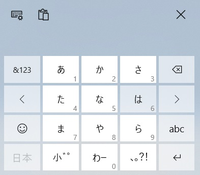

[2022](README.md#2022) [1月](2022-01.md) [2月](2022-02.md) [3月](2022-03.md) [4月](2022-04.md) [5月](2022-05.md) [6月](2022-06.md) [7月](2022-07.md) [8月](2022-08.md) [9月](2022-09.md) [今月](2022-10.md)  
[2021](README.md#2021) [1月](2021-01.md) [2月](2021-02.md) [3月](2021-03.md) [4月](2021-04.md) [5月](2021-05.md) [6月](2021-06.md) [7月](2021-07.md) [8月](2021-08.md) [9月](2021-09.md) [10月](2021-10.md) [11月](2021-11.md) [12月](2021-12.md)  
[2020](README.md#2020)  

2022年10月
=========

|Sun|Mon|Tue|Wen|Thu|Fri|Sat|
|---|---|---|---|---|---|---|
|[25](2022-09.md#0925-日)|[26](2022-09.md#0926-月)|[27](2022-09.md#0927-火)|[28](2022-09.md#0928-水)|[29](2022-09.md#0929-木)|[30](2022-09.md#0930-金)|[1](#1001-土)|
|[2](#1002-日)|[3](#1003-月)|[4](#1004-火)|[5](#1005-水)|[6](#1006-木)|[7](#1007-金)|[8](#1008-土)|
|[9](#1009-日)|[10](#1010-月)|[11](#1011-火)|[12](#1012-水)|[13](#1013-木)|[14](#1014-金)|[15](#1015-土)|
|[16](#1016-日)|[17](#1017-月)|[18](#1018-火)|[19](#1019-水)|[20](#1020-木)|[21](#1021-金)|[22](#1022-土)|
|[23](#1023-日)|[24](#1024-月)|[25](#1025-火)|[26](#1026-水)|[27](#1027-木)|[28](#1028-金)|[29](#1029-土)|
|[30](#1030-日)|[31](#1031-月)|[1](2022-11.md#1101-火)|[2](2022-11.md#1102-水)|[3](2022-11.md#1103-木)|[4](2022-11.md#1104-金)|[5](2022-11.md#1105-土)|

## 10/22 土

- __園芸__
  - 水やり少な目。
  - __セージ__ にカイガラムシがいてシャワーで流した。
  - __食用菊__ と __ヨモギ__ にアブラムシがいたのでシャワーで流した。
    - どちらもサイズの違う虫で、違うアブラムシのよう。
  - __ホーリーバジル__ にアブラムシとカイガラムシがいて、シャワーで流した。
    - カイガラムシは幹の毛が生えたところにいて、歯ブラシが通用しない。
    - 挿し木のは萎れた。
  - __梅__ の __豊後__ にイモムシ。
    - 幹と枝の斜交いのようにいた。割り箸で取り払った。
    - カイガラムシもいた。花芽の付け根。
  - カイガラムシだらけの __イチゴ__ 2鉢を根元から切って捨てた。
    - もし来年の春に芽を出すようだったら試しに育ててみるが、折角四季成りなのに、実が生ってもあんまり食べなかった。
  - 今シーズンは __唐辛子__ にはあまり虫が付かない。
  - __レモンドロップ__ を少し収穫した。
  - __オリーブ__ が横に横に良く伸びる。
  - 検索したら「 __カイガラムシは40°Cのお湯で卵も死ぬ__ 」らしい。
    - __ライム__ は去年はシャワーしてたが、今年はもう何度も風呂場へ移動させる気が起こらないくらい大きくなった。
      - 春になる前くらいに、一度お湯でシャワーしよう。
- __コーヒー__ を久しぶりに __マキネッタ__ で淹れて。
  - こんなに __時間がかかる__ んだっけ。お湯を沸かしてからにした方がいいな。
    - 牛乳をレンジで温めて泡立てて待っていたが、かなり待った。
  - 美味しい。
    - `ポールバセット` は浅煎りエスプレッソの店。流石。
- 味のしない豆菓子にラッサムパウダーをまぶした。
  - 塩気が足りない。
  - 味がしなくても慣れてきてたけど、カレーパウダーも使ってしまいたかった。
  - 豆の表面に油気が足りないので、粉が底に溜まってる。
- <details><summary>__リモートキーボードソフト__ の基本機能が出来た。</summary>

  - https://github.com/kei-oguro/remote-keyboard
  - pythonでhttpサーバを書いて、htmlページからgetすると、サーバ側でキーボードイベントを発生させる。
  - 文字列送信ならテキストボックスとボタンだけだけど、キーを並べたUIを作るのは面倒だ。
    - `<button>` タグで作ると挙動が面倒だから、Canvasに箱を描画する感じになるだろう。
  - ShiftやAltの対応も必要だ。
  - ダブルタップの対応。
    - https://qiita.com/ELIXIR/items/1d007313c09489738e26
    - ウチはShiftなどをダブルタップでロックしたいが、その時に拡大されるのも困る。
  - 開発中に適当なキーコードを送っていたせいか、単体のクリップボードコピーでDeepLが起動するようになってしまった。
    - 再起動してみるか。
      - 直った。良かった。パスワードマネージャでパスワードをコピーして起動した時には驚いた。
        - キーボードを監視してるんじゃなくて、クリップボードを監視しているワケだ。
        - とうことは、誰がクリップボードを監視して送信しているか分からないワケだ。うーん。
  </details>

## 10/21 金

- 8:00の目覚ましで10:15起床。
  - 目覚ましを9:00に掛け直したつもりが失敗したようだ。
- __園芸__
  - ライムと唐辛子の土が乾いていたので、今日は沢山水やりが必要かと思ったが、3本で済んだ。
  -  __ヨモギ__ に蕾が付いた。
  - カイガラムシはどのくらい寒くなったらいなくなるんだろうと思ったら、樹皮の下で越冬するって。
- Unityのメニューの '/' が含まれた文字列の扱い😫
  - https://answers.unity.com/questions/398495/can-genericmenu-item-content-display-.html
- __ランチ__ はキャベツカレーとキャベツの塩揉み梅味と割り干し大根中華風を煮たもの。
  - カレーは塩気が無いけど美味しい。
    - __牛乳が分離__ してるのが残念。ミルク煮は、水で煮て最後に牛乳を入れるのが基本のようだ。
  - 塩揉みはまとまりのない味。
  - __割り干し大根__ は干し方が足りずに辛味が残ってる。
    - その辛味と、生の大根の苦みが、ホワジャオと合わない。
    - こんなに __食べにくい料理__ は滅多にない。
    - 今からでも煮た方がいいかも。
      - __煮た__ 。
      - 何故か苦い。何に由来する苦みなんだろう。
      - 煮込み時間は15分だったが、もっと長くても良かった。
      - 最後の一口だけ美味しかった。
    - 漬け汁が多過ぎるかと思ったが足りなかった。
- __炊飯の科学__
  - http://www1.odn.ne.jp/ki1938/Kome/suihanNEW2017.pdf
    - 沸騰まで8分から15分。長いとベタベタして臭くなる。短いと吸水せずに糊化が少ない。
    - 98°Cを20分維持する。長いと食感が柔らかく悪くなる。
      - 蒸らしで維持する。
    - 他に知りたいこととしては、吸水し過ぎの場合と、吸水十分の判定方法かな。
  - https://www.osakagas.co.jp/company/efforts/rd/labo/images/labo8.pdf
    - 吸水は低温で行い、長過ぎると良くない。倍になるだけでハッキリ悪くなるらしい。
    - 適度に吸水すると1.2倍の体積になるそうだが、ビーカー内の高さだけで判定していいかな？
- 大根の __糠漬け__ をようやく取り出した。
  - カビが生えてて、バナナのようないい香りがする、と思ったが、コレが糠漬けでよく言及される「接着剤の匂い」か。
- __晩飯__ は残り半分の切り干し大根の煮もの。
  - 味はかなり馴染んでいた。大根に火が通ったかな。
  - 水溶き片栗粉でとろみを付けようとしたら入れ過ぎて餅に近いくらいになった。
- pythonのモジュールをインストールしようとしたら pip をアップグレードしろというので指示通りにしたら pip が壊れた。
  - システム全体にインストールしようとすると書き込み権限が無くて失敗したらしい。
  - `--user` を付けろだって。
- リモートキーボードソフトのサーバ側を作るのにpythonで書こうかと思ってて、 [キーボードエミュレートするライブラリが無いか検索したら `PyAutoGUI` というのが見つかった](https://stackoverflow.com/questions/13564851/how-to-generate-keyboard-events)
  - https://github.com/asweigart/pyautogui
  - 日本語を文字列で入力できなかった。
  - `pynput` という別のがあって、使ってみたら確定していない状態になった。
    - と思ったら、スクリーンショットを撮ろうとしたら確定済みで入力された。
    - なんか行けそうかもしれない。
      ```python
      from time import sleep
      from pynput.keyboard import Controller, Key
      from sys import argv

      keyboard = Controller()
      if __name__ == "__main__":
          with keyboard.pressed(Key.alt):
              keyboard.tap(Key.tab)
          sleep(1)
          keyboard.type(argv[1])
      ```
- 大久保通りの一部で、車道と歩道の段差がアスファルトで埋められていた。不思議。
- __東中野__ のビアバーと __中井__ の知り合いのバーで __晩酌__ 。

## 10/20 木

- 8:00の目覚ましで9:00起床。
- __コーヒー__ をプレスで淹れた。
  - 湯温86°C。沸騰してなかったらしい。
  - 美味しい。焦げではない、スナック菓子のような香ばしさがある。
- __園芸__
  - 久々にたっぷり水やり。でも2Lペットボトル3回なので、夏ほどじゃない。
  - 水やりの最中に蜂が入ってきた。
    - いつの間にかいなかった。
    - 見た目、アシナガバチじゃなかった。
- __FX__ 
  - そろそろ150円になりそうなので、 __為替介入__ に備えて146円に無期限の指値買い注文を入れた。
    - 次回の介入では、そこまで行かない気もするけど。
  - 150円を超えたところでは乱高下しそうなので、IFD注文とかしたいが、いくらにしたらいいのかは分からない。
  - __16:40に150円に到達__ して、乱高下は発生したが、0.6円程度しか下がっておらず、本日安値ですらない。
    - 手を出さずに良かった。
- __割り干し大根__ を中華風の味付けにした。
  - 紹興酒100mlのアルコールを飛ばして、黒酢を30ml、台湾の豆板醤を大匙山盛り1杯、ニンニクと生姜のすりおろしを少々、胡麻、ホワジャオ、胡椒。
  - パンチが足りないけど、馴染んだら美味しくなるだろうか。ごま油とかオイスターソースを足すべきだろうか。
- __ランチ__ は大根と野菜炒めとスクランブルエッグ。
  - 玉ねぎと胡瓜の使いかけがあって、ピーマンもあった。
    - マスタードオイルでマスタードとクミンをテンパリングして、みじん切りの生姜とニンニクと一緒にカレーリーフを素揚げして、玉ねぎを透明になるまで炒め、気の迷いで __アンチョビのピクルス__ で塩気を付け、胡瓜とピーマンとライムを入れて仕上げ。
    - 同じフライパンでスクランブルエッグを作って完了。
- タッチパッド付き無線キーボードが届いた。
  - 早速ペアリングしてみたらサクッと使えた。
    - PCに挿した場所と使う場所は、直接射線が通ってないが、反射で問題ないようだ。
  - `Chrome Remote Desktop` でマウスカーソルが出てない。タッチパッドで操作するのに使えない。
  - 思ったよりいくらか大きい。fnなどが片方にしかなくて、同時押しをするのに指を伸ばすだけでは足りない。
    - 同時押しだけじゃなくて、続けて押しても認識してくれればいいのに。(Shift系をトグルに)
  - 英語キーボードと認識されているようで、表示と入力が違う。Windowsの設定を探したが見つからない。デバイス毎に設定できるように作るものじゃないの？
  - iPadとペアリングしたら、と思って試したけど、認識しなかった。
  - 割といいけど惜しい。
  - 多分、iPhoneにリモートキーボードのソフトを入れるのが一番いいだろう。
- iOSの　`Chrome Remote Desktop` で、ピンチインアウトで画面の拡縮ができた。
  - PCで表示される小さいボタンも押せて素晴らしい。
  - <details><summary>iPadから接続して、Win10のソフトウェアキーボードを使ってみた。</summary>

    - 無線キーボードの下りからそれで書いてる。
    - 思ったよりもずっと使いやすい。
      - でも、iPad Proの幅が広くて親指を伸ばすのが大変。
      -  電話風のもあったけど、 Chrome Remote Desktop だとフリック入力するのに毎回長押ししないといけない。
        - `spacedesk` で画面の拡縮が出来るといい。
          - そういえば、本命は15.6インチの __Androidモバイルモニタ__ だった。そのサイズなら行けるかも。
        - spacedeskならフリック入力が使える。
          - 画面の小さいボタンを押すのが難しい問題は、無線タッチパッドと併用することで、結構いいかも。
          - Chromeのだと、何故か無線タッチパッドがPC側のマウスとして使えない。
          - 後は、spacedeskはChromeのよりも反応が遅いんだよね。Androidモニタ大丈夫かな。
      - セパレートのソフトウェアキーボードもあるんだけど、位置変更やサイズ変更が不自由。
        - クライアントで画面を拡大すると入力部分が画面外になる。
        - キーボードが全部収まるようにするとキーが小さ過ぎる。
        - それと、左右の間の空白部分が無駄。
           
    </details>

- `` タグだけど、 `alt` 属性はイチイチ書き直した方がいいな。
  - 写真のパス入力が面倒だから、スクリプトを書いて、bashのウィンドウにドラッグアンドドロップしてタグを作成してる。
  - 今回はパスの入力が楽だったから手書きした。
  - スクリプトの出力では、alt属性がファイル名そのままなんだけど、今回は手書きだから普通に書いた。
  - スクリプト出力の時も、alt属性に説明を書くべきだ。
    - というかファイル名に意味はあるのか？
    - いつの写真だという情報だけ。
- <details><summary>リモートキーボードソフトは、案外簡単に作れるかも知れない。</summary>

  - サーバ側はTCPでパケットを受けて `WM_CHAR` を `SendMessage()` するだけ。
  - クライアントはHTMLで書いてTCPで送信するだけ。
    - クライアントの日本語変換を行った後のを送信するのは、Unicodeの1文字ずつに分解するだけなのかな？
      - Win32 APIだとutf16かutf32で取るから、その変換をどっちでやるかという話が出る。
      - サロゲートペアは連続でSendMessage()するだけでいいのだろうか。
      - どうせサロゲートペアの対処が必要になるのだから、utf16でいいだろう。
      - Microsoftによると `Windows Vista 以降では、 WM_CHAR メッセージは UTF-16 サロゲート ペアを Unicode ウィンドウに送信できます。 IS_HIGH_SURROGATE、IS_LOW_SURROGATE、IS_SURROGATE_PAIRのマクロを使用して、必要に応じてこのようなケースを検出します。` だってさ。
      - `SendInput()` に `KEYEVENTF_UNICODE` を指定するんだってさ。
    - おっと、ブラウザの標準にsocket通信が入っていないらしい。
  </details>

- __おやつ__ に __カシューナッツ__ 。
- ある重大事件の __裁判記録が廃棄__ されていたらしい。
  - https://www.kobe-np.co.jp/news/sougou/202210/0015737186.shtml
  - そうか、安倍の前から日本の行政は隠蔽気質だったのか。
  - 科学的というのは、検証可能であることが必要だ。現代の学問はそうでなければならず、コレは文系でも同様だ。
  - その関連で検索していたら「 __民事判決情報のデータベース化__ 」という話題が見つかった。
    - https://www.moj.go.jp/hisho/kouhou/hisho08_00345.html
    - 未だにこの程度なのか。
    - 国会についてはすでに全部デジタル記録されているのに。
    - 判例データベースの存在を知っているから、当然すでに記録されていると思っていた。
      - https://www.courts.go.jp/app/hanrei_jp/search1
- そうなのか。
  - https://www.alic.go.jp/koho/kikaku03_000120.html
    ```
    カスタードプリンを作る際、砂糖の量を多くするに従って凝固力は減少します。
    砂糖の濃度が30％を超えるとゲル状になり、形が整わなくなります。
    「砂糖百科」より
    ```
- 砂糖を加熱した時の温度による性質の違い。
  - https://www.nissin-sugar.co.jp/sugarlab/cook/03/
    ```
    140度　タフィー
    冷めるとガリガリした結晶けっしょうになる。キャンディなどに使われる。
    ```
    ```
    165度　べっこうアメ
    お砂糖の成分が分解ぶんかいされて、うす茶色になる。冷めるとアメのようになり、元にはもどらない。
    ```
- __生姜飴__ に [再挑戦](2022-08.md#0819-candied-ginger) するときのために、 __飴として固まる砂糖と水の割合__ を検索してみたが、論文的なのは見つからなかった。
  - レシピでは4:1と3:1が見つかる。
    - 140°C以上にしなければならないワケで、この水は全て蒸発するハズなのかな？結合水を加熱したら、100°Cで分離して蒸発するのかな？
      - http://kinki.chemistry.or.jp/pre/a-87.html によると、 `水1リットルに塩であれば約30 g，砂糖であれば180 g溶かすと沸点が0.5 ℃上がる` そうであり、20%で0.5°Cということは4:1なら400%で110°Cになるのかな？
        - これ以上の温度に達したということは水分が存在しないと考えてよいのだろうか。
        - 割とそのもののページがあった。
          - https://ryourikagakunomori.jp/2021/03/04/%E7%A0%82%E7%B3%96%E6%B6%B2%E3%81%AE%E6%B2%B8%E7%82%B9/
          - 4:1なら80%で110°Cくらいか。同じ結論だ。
  - 酢を入れることで再結晶化を防ぐことが出来るらしい。レモン果汁を入れたら美味しくなりそうだ。
  - 前回のは __生姜の砂糖漬け__ なんだけど。
    - 辛いのを作りたかったんだけど、レシピを検索すると砂糖を入れて煮ることで、生姜の繊維を柔らかくし、甘みの味付けもするようだ。
    - その後、砂糖を再結晶化させる。
    - 生姜の水分を外に出すために、再結晶化のための加熱の前に砂糖漬けにしておくべきだろう。
      - 辛いのは、生の生姜の薄切りを砂糖漬けにして、それを再結晶化させて出来るのかな？
    - 再結晶化させたいときは酸を入れない方が良い。
- __東中野__ にできた `Hacker's Bar` へ行ってきた。
  - この場所には以前はワインバーがあって、そこが2月に移転して以来

## 10/19 水

- 8:00の目覚ましで8:30起床。
- 窓を開けて寝て、起きたら少し寒い。冷たい風が入ってくる。
- __コーヒー__ を93°Cで少しだけ豆を多めにしてペーパーフィルターで淹れた。
  - このくらいでちょうどいいな。
- __園芸__
  - 水やりは少し。
  - イチゴにカイガラムシがびっしりついているが気力が湧かない。
- __ランチ__ は
- 次の `iPad Pro` は17万円だって。13万円もどうかと思ったけど、次は買い換えないかも知れないな。
  - __WiFiで接続できるモバイルモニタ__ があれば、PCの画面を映すことで、ソファでWebを見たり本を読んだりできてiPad Proの代わりになるだろうと検索してみた。
    - <details><summary>すると、 __Androidを搭載したモニタ__ というのがあった。</summary>

      -  https://www.amazon.co.jp/dp/B099VY3NHV/
      -  15.6インチで3万円のAndroidタブレットって凄い。
      -  VNCとかリモートデスクトップで接続できる。
         -  が、Google Playには繋がらないらしい。サイドローディングでapkをインストールできるだろうか。
            -  Kindleはダメだって。
         -  まあ、Chromeのブラウザだけで行けるかも？
         -  それとも、PCに接続しなくてもAndroidのアプリだけで満足できるかも知れない。
            -  __Androidとして使う時、ストレージ容量__ が不安だ。
            -  USBメモリを挿せるそうだが、負荷がかかって壊しそうだ。SDカードを挿せるといいんだけど。
      -  へええ！Windowsに接続して、タッチパネルを使えるって。
         -  [`Hi, you can use wireless touchscreen function on windows laptop (not Macbook) by installing spacedesk.`](https://www.amazon.co.jp/ask/questions/Tx3IZ6RXHU20G9H/ref=ask_ql_ql_al_hza)
      </details>

    - 結局 __ポチった__ 。
      - [コッチの商品ページから](https://www.amazon.co.jp/dp/B08YK6QTHQ) だと、配送が遅い代わりに安い。
        - 11月上旬に来るって。
  - これだと3万円するけど、PCに接続するなら、モバイルモニタ自体は(バッテリーが無いけど)持っているので、Miracastアダプタと無線キーボード辺りを買えば、やすく試すことができる。
  - `spacedesk` というスマホアプリで、同じようなことを再現できそうだ。特に __Androidモニタ__ ではソレを使うつもり。
    - iOS用もあるので、iPad Proにインストールして使い勝手を試してみようと思って、 [タッチパッド付のワイヤレスキーボード](https://www.amazon.co.jp/dp/B0B765MBWN) を __ポチった__ 。
      - コレ、スマホを同じように使うアプリを作れるのではないだろうか。
        - [あった](https://apps.apple.com/jp/app/remote-mouse-%E3%83%97%E3%83%AD/id380450781) 。
- `spacedesk` でつないでみたが、iPadに画面が来ない。
  - いや、タスクバーと、コンテキストメニューだけコチラでも表示されるが、他はPCの表示が変わる。
  - iPad側が拡張画面だった。
  - 結構ちゃんと動くが、Windowsの使い勝手の問題で微妙。
    - iPad側(拡張画面)でブラウザを開こうと思ってもPC側(メインモニタ)に開く。
    - ミラーリングにしたら？という思うけど、そうするとアスペクト比の違いで使用できる範囲が小さくなる。
- `Chrome Remote Desktop` を使ってみた。
  - コチラはミラーリングのみで、アスペクト比の違いをスクロールすることで対応する。
  - spacedeskはタッチ操作を送信しているので、ブラウザのスクロールが指一本のスワイプで出来るが、コチラは2本指スワイプ。その点は向こうがいい。
  - そして、コチラは右下のメニューボタンからソフトウェアキーボードを出せるのが素晴らしい。
  - リモートで接続するときは解像度をクライアントに合わせたい。
    - アカウントを別に作ったら問題ないかと思って試してみた。
      - *nixにログインするみたいに別々のプロセスになると思っていたけど、PCで表示してる画面のミラーでしかない。
      - まあ、そんなところだよね。
- Androidのアプリがどの程度サクサク動くのか。
  - ブラウザ、Kindle、VLCが普通に動けばそれでいいんだけど。
    - Kindleはインストールできないそうで、ブラウザベースでどうなのか。
- 開発PCのファイル共有は切っていたと思っていたが、多分Win10にした時に有効にされていたようだ。
- NASの共有設定も見直して、メディアファイル以外のアクセスを厳しくした。
  - NASもOSを更新したら色々変わってしまった。
- __コロナ__ の新規感染者数も検査数も陽性率も入院患者数も上昇を始めた。
- スマホの __バンパー__ が背面も覆っているので、 [__スマホバンド__ を背面に貼るために買ったアレコレ](#1007-smart-phone-band-is-not-stick-to-back-face) が不要になった。
- __東中野__ の焼肉屋で会食。

## 10/18 火

- 8:00の目覚ましで9:00起床。
- 昨日が雨で、水やりは室内のと唐辛子とホップだけ。
- __コーヒー__ を豆少な目、湯温94°Cでペーパーフィルターで淹れた。
  - 薄くて良く分からない。
- もう一杯 __コーヒー__ をペーパーフィルターで淹れた。今度は沸騰直後のお湯で、さっきより少し細挽き。
  - 変数を2つ変えるものじゃないけど。
  - 酸味も苦みも良く出た。雑味も出たかな。香りは良く分からない。
- フィルターで淹れて、最後の捨てる部分を飲んでみた。
  - 焼き芋の皮の匂いが強く、なるほど、美味しい部分はもう残ってない。
- __FX__
  - ポンドルでだいぶ含み損がある。
    - 含み損自体は、売りでエントリーしたのがかなり下の方だったせい。
    - 底打ちしたかも知れない動きをしている。
    - まだ上値を切り上げていないが、実現したら考えないといけない。
  - ユーロ/スイスフランは上値を切り上げた。
    - スイスの中銀は金利を上げたんだけど、ユーロ方がの金利上昇見込みが高いのか。
    - それとも、スイスフランは取引量が少なくてドル高に影響されているだけなのか。
  - 調子の悪かった南アランドが調子いい。プラチナ価格が堅調なのだそうだ。
    - スワップ期待なので穏やかに推移してくれれば十分。
    - というか、また買い増すチャンスに恵まれなかった。このまま上がるなら、かなり行ったところで買い増したいが。今年の高値くらいは超えてから。
- 昨日ハナマサで買った食材で __作り置き__ を作る。
  - 大根の頭と胡瓜を __糠漬け__ に。
  - 大根の胴体を8つ割りで __割り干し大根__ に
  - キャベツが1玉あるのを、半玉はカレー風味のブレゼに、残りの半玉は梅ドレッシングで浅漬けに。
    - ブレゼはカレー味。塩気が全然足りなかったが、落ち着いたら美味しくなるかも。
      - カレーのコリアンダーシードを砕くのに、今までは手回しミルを使っていたが、試しに乳鉢とすりこ木でやってみたら調子が良い。これからコッチにするかも。
      - 胡椒を入れるべきだった。
      - 焦げないように牛乳を200ml使用した。
      - スパイスを炒める時点で唐辛子を入れるのを忘れていたので、 __激辛ラード__ を耳かきレベルで使ってみたが、激辛ではないものの、あれだけの量がちゃんと汗をかくくらい辛くなって凄い。
    - __梅干し__ を使ってみるために梅ドレッシングを作ってみた。
      - 梅を伸ばすのにだし汁が欲しくて、煮干しと鯖節をミルサーで粉末にして出汁をとった。
      - 香り付けの醤油が多過ぎて、幾分塩辛い。
      - 試しに入れてみたホワジャオが素晴らしい。
        - 梅と生姜を伸ばすだけで美味しく食べられそうな気がする。
      - 梅干しは結構美味しい。
        - 干してないからか、普通の梅干しよりもコクが少なく爽やか。
- __ランチ__ は胡瓜の糠漬けと、タッパーに入らなかったブレゼと、作り置きの味見と、余っただし汁でお吸い物。
  - 吸い物に大根を少し銀杏切りで入れたが、薄く切り過ぎて詰まらない。
  - 乾燥生姜を入れたが、ほとんど香りが出なかった。実に香りも味も残っていて、もっと長時間煮出すか戻してから使わないとダメっぽい。
- 桜井政博さんがYouTubeで「ゲーム性以外の面白さ」について説明しているのを同僚に教えて貰った。
  - https://www.youtube.com/watch?v=OALp2UAe6V4
  - コレは大事だね。
  - 僕は昔から「プリミティブな面白さ」という表現を使っていた。
    - 女の子のゴム縄の何が楽しいのか、というのが定番の例示。
- __おやつ__ に無味の豆菓子を食べたが、コレはこのままでは美味しくないんだけど、どうしようか。
- iPhone SE3の `バンパー` が届いた。
  - 初代SEの時のバンパーは周囲のぐるりだけだったが、今回のは背面にもカバーがあった。
  - 厚みが出るので予想外だが、それはそれでいいかな。
  - 398円の激安。

## 10/17 月

- 8:00の目覚ましで8:30起床。
- 水道メーター周りの改修で __断水__ 。
  - 顔を洗う水と、朝のコーヒーを買いに __お出かけ__ 。
  - 近所のコンビニには __常温の水__ がおいておらず、薬屋で購入。
  - `スタバ` でコールドブリューの大きいの。
    - PayPayのクーポンを使用。
- 帰宅したら工事は終わってた。
  - 水は買い置きとして保存。
- 水やりは無し。少しやってもいい感じだけど、今日は晴れない。
- __ランチ__ はキャベツの塩揉みとエチュベとつまみ食い。
  - [ハラル食材店の `ナスコ` で買った](#1002-nasco) インドの豆菓子風のが、味付けが無いプレーンだった。
- 大久保の近くの `淀橋市場` という青果市場に `伊勢屋食堂` という定食屋がある。
  - 朝5時からやってて、おかずを単品で頼めて、朝まで飲んで、移動して飲みに行くのにもいい。
  - 営業時間を調べようと検索したら、丁度今週金曜が市場の日だそうだ。
- __中国茶__ を色々飲んでみたい。
  - https://www.tenren.co.jp/tea/group.php
  - https://www.qingxianghualou.com/pages/chinese-tea-types
- 夕方、カシューナッツを食べたら止まらない。それほど美味しいというワケでもないんだけど。
- `Instagram` のお勧めが料理ばかりで、それで不満が無かったのだが、動物動画にイイネしたら動物ばかりになって、動画はいいんだけど料理が無くなったのは不満。
- 割と最近のいつだったか、ネットニュースがきっかけで、三浦大輔オフィシャルブログを見に行った。
  - https://ameblo.jp/daisuke18/
  - やたら改行だらけで読みにくいスタイルがそのままで懐かしかった。
  - ヨ・ロ・シ・ク！！
- 幡ヶ谷方面のクラフトビールのお店を巡るべく __歩いて__ __お出かけ__ 。
  - 忘れずに __雨用の靴__ 。
  - 最初の目的地の `FREEMAN食堂` は、地図を調べていて月曜定休だと気付いた。
    - その次は `FLOW` とか `山田ワイン` とか、幡ヶ谷には行ってみたいワインバーがいくつもあるので、それらを巡るつもりだったが、また今度どちらも行きたい。
  - ということで次の候補の `OUR DAYS BREWERY` で __晩酌__ 。
    - 幡ヶ谷だと思ってたが、完全に笹塚だった。
    - 自店舗で醸造している。
      - 免許に必要なだけ生産できるのか聞きたかったが忘れた。
  - 同じ笹塚の `Pintology` は定休日だった。
    - コロナが始まったころに検索した時は、初台から笹塚までにクラフトビールの店は `グレムリン` しかなかったが、増えて良かった。
  - 新中野の `mimpi manis` へ移動する途中に `スパイスカレーアミバ` という店があり、食事しに立ち寄る。
    - FREEMAN食堂で食べるつもりだったが無くなったので。
    - この名前が凄い。
      - 名前の由来を聞き忘れた。
  - mimpi manisは定休日だった。Googleや食べログによると定休日は火曜なんだけど、Facebookページでは月曜になっていた。
  - 新中野の `204 Neighborhood spot` も定休日だった。
  - `肉のハナマサ` でキャベツと大根と胡瓜とピーマンと牛乳を買って帰る。
  - 近所のバーで __一杯__ 。

## 10/16 日

- __園芸__
  - ベランダに出たら、大きなアシナガバチが仰向けに寝てて、急いで飛んでどこかに行った。
  - 水やりは軽め。ペットボトル2本。全開だと4本か5本。
  - 葉っぱの落ちた2本の __梅__ に花芽が付いてるから、実は生きてて春になったら花を咲かせるんじゃないかと希望を持っているが、生きてる __豊後__ と比べるとその花芽も小さい。
- __お出かけ__ 。
  - `PayPay` アプリで近所の店を見ていたら、 __チョコレート屋さん__ を見つけたので近くに行ってみた。
    - 事前に調べれば良かったけど、行ってみたらマンションの一室で、システムを調べるために検索してみたら、 __料理教室だった__ 。
  - __栗__ が欲しいので、東中野の八百屋に行ったが休みだった。日曜定休だっけ。
  - 東中野への移動中に `澤田珈琲` というパン屋でコーヒーを飲もうと思っていたが日曜定休だった。
  - `キャラバンサライ パオ` の2階にあるペルシャ料理の喫茶店 `ゴラーブ` でハーブティーを飲んだ。
  - ちょっと遠くまで歩くつもりなので `ITSUKI` でテイクアウト。飲みながら歩く。
  - 栗を探しに小滝橋交差点近くの `地産マルシェ` に行ったが売っていなかった。シーズン後半だから？
    - 新ショウガが置いてあった。春先だと思っていたけど、通年出荷してるのかな。
    - ちょっと高い店だと思っていたけど、物によってはスーパーより安いかも知れない。
  - `いなげや` に栗が置いてあった。少し高いと感じてスルー。
  - 東中野に戻って `キッチンコート` に栗があった。似たような値段だが、購入した。
  - `早川亭` でコーヒーをテイクアウト。歩きながら飲む。
- 一度家に帰って、 __東中野__ に __お出かけ__ 。
  - バーの店員さんの誕生日で呼ばれた。
  - 差し入れのために、近所の中華で色々テイクアウト。

## 10/15 土

- 水やりは少しだけ。
- __FX__
  - ドル円が148円台後半。ということは、昨日の指標発表が調子良かったということだ。
    - 1枚持ってるだけじゃ、この程度は大した事ない。
- __歩いて__ __お出かけ__ 。
  - __大久保__ の比較的新しい中華料理店の `撒椒小酒館` へ行こうとしたが並んでいた。
    - ランチで総菜がお代わり自由。
    - 新宿駅西口にも総菜お代わり自由の店があって、なかなか良かった。
  - __ランチ__ は大久保駅すぐの `魚蛙恋` というまた別の総菜お代わり自由の店で白身魚の水煮。
  - __新大久保__ の `ホイチャ` というタピオカ屋で、前から気になっていた __クロッフル__ というクロワッサン風の記事のワッフルを買って歩きながら食べる。
  - 代々木へ移動しようと思ったら __大久保公園__ でラーメンのイベントをやってるのを思い出した。
    - http://www.dai-tsukemen-haku.com/
    - 並びは長いが、座席は大して混んでない。
    - __TKM__ という卵かけ麺がたまたまその日に出店しているそうなので食べた。なるほど、ハマる人がいるのは分かる。
    - もう一軒、昆布水つけ麺というのを食べてみたが、昆布水だからどうだというのは分からなかった。美味しかったけど。そして、麺はもう少し茹でて欲しいかも。
  - __ゴールデン街__ の `テルマー湯` の前に、キッチンカーのコーヒー屋さんがあって気になっていた。
    - `サモエドコーヒー` と言うそうだ。
    - 豆のセレクトが楽しい。たまに行きたい。14:00..23:00だそうで、通りかかることはありそうだ。
      - 特に、ウォータリングホールの帰りには、信号を避けるために、高島屋の前で地下に入って吉本の脇で地上に出る。するとかなり近い。
  - 高島屋の近くの `だり半` という寿司居酒屋の前を通りかかった。
    - 土曜は寿司全品1貫100円のイベントをやっている。ウォータリングホールを先に目的地にしてたら、コッチでご飯を食べただろう。
  - __代々木__ の `ウォータリングホール` でクラフトビールを __一杯__ 。2杯だけどね。
  - 新宿野村ビルの `ポールバセット` で __コーヒーをテイクアウト__ して歩きながら飲む。
    - ドリップを注文したらポットからの提供だった。が、十分に美味しかった。

## 10/14 金

- 8:00の目覚ましで8:20に起床。
  - 起きられるリズムになったかと思ったら、あっという間に追い越した。
- __コーヒー__ を円錐フィルターで淹れた。
  - 鼻が詰まって香りが分からない。酸味は強い。
- 雨降りで水やりが不要だった。
  - 柵から遠い、部屋の方でも土が乾かないのが良く分からない。もう成長が止まって、水をあんまり吸い上げてない？
- __ポルボロン__ がボロッボロで、保存のためのビニール袋の中で押し固めたら、食べるのに便利なくらいには固まった。
  - 自家消費用なら、成型して焼く理由はない気がする。板で焼いてから崩して食べたらいい。
- 冷蔵庫に入れていた __ライム__ はどんどん黄色くなる。
  - すっかり黄色くなったライムは、ほとんどレモンの味と香りだ。
- __FX__ ドル円は昨日147円を超えたのか。
- __ランチ__ は大根と胡瓜の糠漬けとキャベツのエチュベ。
  - エチュベはフライパンでシャウエッセンと一緒に温めて、そこに目玉焼きを作った。
    - 目玉焼きはもう少し火を通したら良かった。
    - 生の部分が無いと嫌だが、固まってる部分がゼロだとつまらない。
- コマンドラインで NUnit を使う方法を調べていて、 `dotnet` コマンドで `.csproj` とテンプレートを作ることを知った。
  - https://qiita.com/ayase/items/afabf0d89f578a7a3f40 
  - `dotnet new console` のテンプレートを見て知ったのだが、 `.cs` ファイルに直接コードを書くと、スクリプト言語のように直接実行ファイルにコンパイルできる。
    - 暗黙に `private class Program` 内に定義される。外からアクセスできない。
      - リフレクションは試してない。
  - `dotnet new nunit` のテンプレートを見て知ったのだが、 `namespace space;` という書法で、 `{}` で囲まずに、ファイルのその指示以降をその namespace にできる。
- その `dotnet new` のテンプレートで、十分に簡素で、十分に使える状況を作れることが分かって良かった。
- __レモングラス__ で __ハーブティー__ を淹れた。
  - 茎が多くなる感じ。色は薄いが香りはある。
- __カシューナッツ__ をローストした。
  - 140°C20分は丁度良かったと思う。もう少し長くてもいいかな？
  - マスタードオイルでカレーリーフを素揚げし、クミンを入れて、南インド風の味付け。
    - パウダースパイスも入れるつもりだったが忘れた。
  - 塩味を付けるために、ローストしたナッツに塩水を掛け、それを炒めた。
    - 水分が飛ぶまでにクミンが焦げたし、マスタードとカレーリーフの香りは結構抜けた気がする。
    - [前回、ロースト前に塩水に漬けた時](#1011-roast-cashew-nuts) は、表面で結晶化して落ちてしまったので、タイミングを変えてみたが、上手く行ったとは言えない。
    - 前回の方がマシだったとは言えるがムラがあった。今回はムラが少なかったが、加熱時間が長くて味付けに不都合。
    - どうせムラが出るなら、味付けした後に振りかける方法で構わない気がする。
  - 油が多過ぎた。手が汚れる。
- __お出かけ__ 。
  - __東中野__ に新しく出来た `雑談` というクラフトビールのお店で __晩酌__ 。
    - 他の飲み屋の知り合いに会った。
  - 何軒かハシゴして帰宅。
- 最近、インスタのストーリーに夕焼けが良く出る。

## 10/13 木

- 8:00の目覚ましで7:50に起床。
  - 外が暗いと思ったけど、いい時間だった。
- __コーヒー__ をウェーブフィルターで湯温91°Cで淹れた。
  - フィルターの方が香りも分かりやすく、苦みも感じて美味しいんだけど、体調かな？
- 水やりはほとんど不要だった。夜は雨だったけど、昨日の昼は晴れてたと思うんだけど。
- __作り置き__ する。
  - キャベツ半玉を塩揉みして中華風の味付けに。
    - ちょっと薄いかと思って豆板醤を足したら濃くなり過ぎた。馴染ませてから味見したらよかった。
  - もう半玉のキャベツはエチュベに。バターとセージとアンチョビ。
- キャベツを買ったのは [先週の金曜](#1007-cabbege) か。
- __ポルボロン__ に再挑戦。
  - [前回](2022-08.md#0822-polvoron)と同様のレシピ。時間も分量も温度も。
    - 小麦粉の焼き色にムラがあるし、レシピページの写真よりも色が濃い気がするが。
    - 前回は油を減らしてもいいと書いたが、レシピページでは「生地がダレたら冷蔵庫で冷やす」と書いてあるので、もう少し油が多くてもいいかも知れない。
      - バターとラードの違いはあるけど。ホエイの分だけ、ラードは重量に対する脂肪分が多い。
      - バターは少し水分があるから、ラードとは分量を変える必要があるのは当然かもしれない。
      - 最初に焼いた時はグラニュー糖を使った。
        - ジャリジャリが残るのも楽しいのではないかと思ったから。
        - バターだったらグラニュー糖は溶けていたかも。
    - 塩を忘れた。
  - 生地を冷蔵庫に入れて、焼くのは昼か夜。
- お __茶__ は今日から極上おくみどり。
  - 湯温69°Cで淹れて、流石の美味しさ。
    - アミノ酸の押しつけがましさもないし、主張の少ない落ち着いた味だけど、ちゃんと美味しい。
    - 高いお茶は低めの湯温で多めの茶葉でゆっくり出すのが美味しいと思うけど、今回は茶葉の量も時間も普通にした。最初だし。
  - 2煎目は少し高めの湯温で短く。淹れた後に湯温を測ったら76°C。丁度いいかも。
  - 3煎目は熱湯で長時間。湯温は測ってない。ちゃんと味が出てる。渋くて美味しい。
- __ランチ__ はエチュベ少々と、移動販売の弁当やの海鮮丼と焼き魚。
  - 焼き魚に大葉が敷いてあると思ったら作りものだった。本当に大葉よりも安いのだろうか。
- __園芸__
  - 全然発芽しない赤紫蘇と青紫蘇を室内に入れてみた。
    - 暑過ぎたから発芽しない可能性を考えて、涼しくなって外に出したが、今度は気温が低すぎる可能性がある。
  - __ホーリーバジル__ は芽を出した。
    - 成長が遅い。挿し木で増やすべきなんだろうか。
    -  試しに挿し木してみた。左右2本。
  -  __ヨモギ__ のポットの雑草が大きくなってきたので抜いたら、一本は雑草じゃなくて、根っこから分かれた次の株だった。
    - 雑草に蕾が出てた。気付いてたら、抜くのは花が咲いてからにしたんだけど。
-   __昼休み__ に __ポルボロン__ を焼いた。
  -  この仕上がりだと、粉を焼いてから混ぜても同じなのではないか。
- __レモングラス__ で __ハーブティー__ 。
  - 使い切れないと思っていたが、そろそろ無くなりそうだ。
    - まあ、茎まで使えるのでそこそこもつけど。
  - 枯れた __タイム__ とかを使おうと思っていて忘れていた。
- 一昨日のcsv parserのテストを書いたらバグが見つかった。
  - 規格に合致したデータなら問題無いんだけど。
- csv parserと `UnityEngine.Vector3` のパーサを書いたが、tsvなら `,` がエスケープされずにもっと簡単だったのではないか。
- 毎月5冊の枠を全然使っていない `DeepL` のpdf翻訳だけど、xUnitの解説なんかの英語資料がポロっと落ちてないかな？
- __`GPU Gems` が無料公開__ されていた。
  - https://developer.nvidia.com/gpugems/gpugems
- https://github.com/EbookFoundation/free-programming-books で見つけた、オライリーの無料文書リスト。
  - https://www.oreilly.com/openbook/
- ああ、今朝は早く起きたのに日記をコミットしなかったのか。
- 友人に呼ばれて西新宿7丁目で飲んできた。

## 10/12 水

- 8:00の目覚ましで起床。
- __園芸__
  - アシナガバチはいたが、一通り水やりした。
  -  [完全に枯れたと思っていた __キューバミント__ ](2022-09.md#0913-damaged-mints) が生きてた。
    - 水もやらずに放置していたのに。
- __コーヒー__ を薄めにプレスで淹れた。
  - 薄めの方が香りが分かりやすくて美味しい。
- 気温が下がって、ヤカンの湯気が良く見えるようになって、沸騰具合が分かりやすくなった。
- 胡瓜を糠漬けにした。
  - いつも、ピーラーで皮を4か所剥いてから漬ける。
    - もったいないから、その皮を食べるんだけど、そのままだと食べにくい。
    - 漬け汁を作ってしばらく漬けると食べられる。
    - 今日は豆板醤、黒酢、ごま油、胡麻、ホワジャオ。思ったよりもちゃんと中華風になった。
    - ちょっと濃過ぎたけど。伸ばすのは水でいいのかな？
- Unityでテストを書くときの参考。
  - https://docs.nunit.org/articles/nunit/writing-tests/attributes.html
  - https://light11.hatenadiary.com/entry/2020/06/10/220149
- お __茶__ を淹れた。
- 少し前までカップ麺やポテチを良く食べていた印象だったが、日記を検索してみたらそうでもなかった。
  - ここ数日、その手のを欲しくならない。
  - 食べる時は毎日のように食べるが、食べない時は何か月も食べない。
    - ダイエットしてるし、基本は我慢する。たまに我慢できない時期がある。多分、飲み過ぎが続いた頃。
- __ランチ__ はサンバル。
  - インドの辛い豆スープ。ラッサムと一緒に買って来たパウダーを使う。
    - 豆を茹でると書いてあって、どの程度か分からないので、沸騰させて放置したが、全然足りない。食べられるけど。
    - [こないだ買って来た](#1004-asia-super-store) タマリンドのブロックで、タマリンドジュースを作ってみた。
      - 思ったより美味しい。
      - ぬるま湯に漬けて、ベトベトした実を手でしごく。まあまあ面倒。
    - キャベツの葉を外から3枚。
    - ダイストマトを使ったけど、入れ過ぎたかも知れない。トマトの主張が強過ぎた。
- 少し作り過ぎた。今日の昼はキャベツを使わないといけないから、野菜だけで軽くしようと思っていたハズなのに。
- キャベツで作り置きをすべきなんだけど、重い腰が上がらない。
- __レモングラス__ で __ハーブティー__ 。
  - 収穫しにベランダに出たら、手前の __ライム__ がカイガラムシだらけだったので、少し掃除。
    - 朝は気にならなかったと思うんだけど、見逃したのか、昼の内に増えたのか。
  - 久しぶりにレモングラスだけで飲んだが、乾燥フルーツを入れたものよりも美味しい。
- C#のGenericsにDuck Typingがあればいいのに。
  - 制約に「特定のメソッドを持つ」という指定をできるようにするだけでいいんだけど。
- Wikipediaで __テスト__ フレームワーク一覧からC++のを漁ってみた。
  - `Google` の。 https://github.com/google/googletest
  - オープンソース CppTest https://github.com/cpptest/cpptest
  - CppUnit は最終更新が2013だった。
    - と思ったらフォークがあるようだ。 https://freedesktop.org/wiki/Software/cppunit/ それでも2017。
- __塩卵__ は台湾風だけじゃなくてインド風というかチャイの香りにしても面白いかも？
- 「偽」と「似せ」は同じ読みだが関係はないのか？

## 10/11 火

- 8:00に目覚ましを掛けたが6:20起床。
- 水やりは、昨日雨が降って、しなくても良さそうだが、しても良さそう。
  - 小さいアシナガバチがいたので、躊躇。昼休みに見てみよう。
- 昔2chに投稿したcsv解釈のコードが見つからない。
  - 前の職場から2chのスレを検索できたと思うんだけど、検索ワードが見つからない。
  - そして、2chリーダーの投稿ログに残ってると思うんだけど無い。
  - ライブラリ作成みたいなスレだったと思うんだけど。
- <details><summary>結局書いた。</summary>

  - ```cs
    /// <summary>
    /// 文字列をcsvとしてカラムに分解する。
    /// 改行を含むカラムには対応しておらず、文字列カラムのエラーになる。
    /// 文字列カラムのエラーには例外を送出する。エスケープされていない " が発見された時と、カラムの終わりが " で無い場合。
    /// </summary>
    /// <param name="line">パースする１行</param>
    /// <returns>カラムのList<></returns>
    static List<string> SplitCsvLineToColumns(string line)
    {
        var columns = new List<string>();
        var p = 0;
        var start = p;
        var size = line.Length;
        while (true)
        {
            if (p < size && line[p] == '"')
            {
                while (++p < size)
                {
                    if (line[p] == '"')
                    {
                        ++p;
                        if (p >= size || line[p] == ',')    // end of string column
                        {
                            goto NormalBreak;
                        }
                        else if (line[p] == '"')
                        {
                            // skip escaped '"'.
                        }
                        else
                        {
                            throw new System.ArgumentException("Non escaped '\"' found in string column.");
                        }
                    }
                }
                throw new System.ArgumentException("The string column is not terminated. It ends with no '\"'.");
            }
            else
            {
                while (p < size && line[p] != ',') // loop for letters.
                {
                    ++p;
                }
            }

        NormalBreak:
            if (p >= size || line[p] == ',')
            {
                columns.Add(line[start..p]);
                start = p + 1;
            }
            if (p >= size)
            {
                break;
            }
            ++p;
        }
        return columns;
    }
    ```

    - 2chに投稿したC++版は10行程度で、かなり長くなった。
      - 改行のコーディング規約のせいも結構あるけど、
    - 2ch版は改行コードを含むセルに対応していたが、C#版は非対応。
      - 2ch版は行の終端を改行コードと文字列長で判断していたが、C#版は外で行に分解したものを渡している。
      - その代わり、クォートされる文字列セルのエスケープや終端などのエラーチェックが入った。
    - 2ch版は行の分解でメモリを消費しない。また、ファイルを展開した文字列中のポインタだけで扱えるので、セルに関しても先頭のポインタと文字数とか先頭と末尾のポインタとかで、セル単位に文字列を確保しないでセルの配列を構築できる。
    </details>

  - 2.5MBのcsvをパースするのにやたら時間がかかると思っていたら無限ループのバグを書いてた。
  - C++で書いたら20行程度。掲示板向けに改行を圧縮したら10行程度にはなりそう。
  - C# 版を `Span<char>` で書いたら効率的かと思ったけど、 `CS0306` のエラー。
    - ポインターはジェネリクスの型引数にしたらダメだって。
    - それと、Unity上では `using System` したくない。 `Object` が曖昧になりがちだから。
      - すると、 `string.AsSpan()` が見えない。
- 文字列をパースするプログラムを書いていて、テストケースを書いた。
  - こういう時は大体、テストケースみたいな手動のを書き捨てていた。
  - 他の人が書いてる時はコピペして書いたりしてたが、コピペ元が無い時は調べるのが面倒で、結果を目視確認してはコードを捨てていた。
- __ランチ__ はそぼろ納豆。お腹が減らなかった。
- <a id="1011-roast-cashew-nuts"></a>__カシューナッツ__ をロースト。
  - 塩味にするために塩水に漬けたのだが、 __塩卵__ の塩水を使った。
  - 150°Cで15分では水分が少し残っているし、熱くはなっているが、多分十分にはローストされていない。
  - 10分追加。水分は乾いたけど、ローストは少し足りない。
  - 更に10分追加。ロースト具合はイイ感じ。
  - まあまあ色が付いてる。もう少し低い温度で長くやってもいいかも。
  - 塩気にムラがある。塩辛いところは凄い。スパイスの香りはあんまりしない。塩水の方は、シナモンや八角の香りが凄いんだけど。
    - ローストしてから、砂糖漬けのように鍋で塩水と合わせて、水分を飛ばすのがいいかも知れない。
- __レモングラス__ の __ハーブティー__ 。 スライスの __ライム__ を浮かべる。
  - レモングラスを収穫に行ったら、やっぱりアシナガバチらしきのがいた。
- __FX__ は9/27から10/4にかけて20万円減ったのに、今朝には元に戻った。
  - 変動が大きいから、もうちょっと枚数を減らしてもいいかな？
    - 見ない期間が1か月とかあると、相当な含み損を抱えてもおかしくない。
    - 含み損80万円程度でロスカット。
- __歩いて__ __お出かけ__ 。 買い置きと差し入れの __買い物__ 。
  - 初台の `成城石井` で、卵と胡瓜と、 __歩きながら飲むピール__ を購入。ブリュードッグとグースIPA。
  - 初台の `ターリー屋` で、持ち帰り限定で「チーズキーマポテト」という中々グッと来る名前の料理がある。そして、チキンケバブが450円と安い。
- 近所のバーで __晩酌__ 。
  - チーズキーマは思ったよりジャンクな感じでは無かった。
  - `ヒマラヤカリー` のケバブがカレー味だったからターリー屋のもそうかと思ったが、ケバブ味だっ。
    - また、ヒマラヤのは火が通り過ぎだったが、ターリー屋のは丁度良かった。
    - 簡単に言うと、普通のケバブだった。

## 10/10 月 スポーツの日

- 3:30に起きて、頑張って寝ようとして1時間以上はかかったが、何とか寝付いた。
- 目覚まし無しで8:30起床。コレを固定できると嬉しい。
- __コーヒー__ をプレスで淹れた。
- __園芸__
  - 前日が雨だったので、水やりは室内の鉢だけ。
  - 小さい方のアシナガバチが、 __ライム__ の葉をペロペロしてた。
    - カイガラムシの蜜だけじゃなくて、ついでだからスス病のカビも取ってくれればいいのに。
- 月曜祝日で昼飯に時間を掛けられるので __お出掛け__ 。
  - 大久保通りに `TOKYO MYSTERY ROOM` という建物が出来ていた。脱出ゲームかな？
  - __ランチ__ は __新大久保__ の `プングムフレッシュ店` でサムギョプサルと韓国料理の __食べ放題__ 。
    - 90分、ビールと焼酎小瓶とサイドメニューの海老をつけて3997円で、お得な気がする。
  - 大久保祭りというのがやっていて、 __大久保通り__ の __小滝橋通り__ との交差点から __明治通り__ の交差点まで歩行者天国になっていた。
  - 前から気になっていた、クロワッサンワッフルの __クロッフル__ を買って帰るつもりだったが、お腹一杯だったし、少しだけど並んでいたのでやめた。
  - 気温は21°Cだが、湿度が高くて汗が蒸発しないので、歩いていると不快だ。風は涼しいのだけど。
  - 大久保通りの八百屋で、バナナ1箱700円。
  - 冷たい飲み物が欲しくて、 `スタバ` でフラペチーノを買う。
- 何故かSE3になってミュートスイッチを知らない内に入れてしまう。
  - SE2の時は、同じ位置なのに、そんなことはなかったが。
- __営業時間__ と __定休日__ が、扉に張り出してあるのに __シャッターが閉まってると見えない__ お店がある。
  - 逆じゃない？
- [radikoはPCでも聞けるのか](https://radiko.jp/) 。
  - 横浜は負けた。
- [スマホバンドが無くなったと書いたが](2022-09.md#0930-lost-smart-phone-bands) 、新しいのを仕舞った引き出しに入っていた。仕舞う時に気付かなかったの？
- __FX__ の含み益が7万まで戻った。
  - ボンド米ドルがまだ負けてる。
    - 値上がりした時に、枚数を増やしたかったんだけど、あんなに真っすぐ上がられると、どこでエントリーしたらいいか分からない。
      - 下の方でエントリーすると、値上がりが続いた時にロスカットの確率が増える。
    - まあ、分からないんだから、手を付けなかったのは正解だった。
- ```cs
  var strings = new List<string>();
  ```
  と
  ```cs
  List<string> strings = new();
  ```
  はどちらがいいんだ？
  - 後者が書けなかったときは自明だったけど。
  - 後者の方が短いし、newが長かった時に冒頭だけ見たら型が分かる。
  - 「varで済むところは全部var」ルールは今はどうなっているのだろう。
- 21:00くらいから眠かったが、少し仕事したら24:00になった。

## 10/09 日

- 朝から歌舞伎町に友達のお祝い。
- `どないや` のたこ焼きを差し入れ。
- __園芸__
  - 水やり控えめ。
  - また別の、蜂のような虫が飛んでた。青白っぽい色。不格好な飛び方。
- __歩いて__ __お出かけ__ 。
  - __晩飯__ は __初台__ の町中華の `永楽` 。
  - 初台の `Hub` でセッションIPAを飲む。
    - 体調が悪くて残して帰った。
- 他にもアチコチ行きたかったけれど、帰宅。
  - 眠いのと満腹だと思う。

## 10/08 土

- 昨日は雨降りだったので、水やりはいらなそう。
  - 一応見回ろうかと思ったけど、手前の __ライム__ に蜂がいたので。
    - いつものアシナガバチよりは小さかったけど、花に寄ってく感じではなかったので、ミツバチではなさそうだ。
- __ランチ__ はカップ麺。
  - 東洋水産の `正麺` のスタミナ中華そば。
    - 鍋で煮たが、流石のコシ。
    - とろみがある。そしてかなり塩辛い。こないだ食べた徳島ラーメンの `はるま` も塩辛かったが、そういうものなのかも知れない。
      - スタミナラーメンは奈良の名物のような気もするが。
- __チャイ__ を淹れた。
- __バナナチップス__ に挑戦。
  -   コンベクションオーブンで90°Cで風力最強で30分を4回。
  - 色が悪くなった。レモン果汁を塗ったりするべきだった。
  - 途中で100°C設定に上げて、合計2時間くらいかけたけど、ペトペトになる程度。
    - 少しは水分が抜けるが、8時間くらいはかかりそう。フードドライヤーが必要そうだ。
  - ひっくり返して更に30分。まあまあ小さくなった。
  -  出掛けるので、サーキュレーターの前に並べて風を当てることにする。
    - 普段は上だけど、網にこびりつきそう。
  - ここまでやって、レシピを検索してみると、油を塗ってオーブンで130°C以上で30分から60分らしい。

## 10/07 金

- 2:30起床。睡眠サイクル的には微妙だが、不眠というような就寝時間ではなくなっただけ良い。
- __FX__
  - 7万の含み損が無くなってる。
    - ドルの下げもそろそろだと思っていた。昨日エントリーできてれば大儲けだったが、ギャンブラーの誤謬的な根拠のないエントリーなので、しなくて正解だ。結果論で、「儲けてたのに」とか言い出すのは地獄への道。
- __大リーグのMVP__ で、本塁打62本のジャッジが優勢だそうだ。
  - 去年は大谷の満票だったが、投票までは __ゲレーロJr.__ が取るべきだという声もあった。
    - 去年のゲレーロは本塁打の他に、得点とOPSもトップだった。
    - 62本打って、三冠王も取っていたら、どうだっただろうか。少なくとも票がゼロということにはならないだろう。
- 牛乳を切らしたので、コンビニへ __お買い物__ 。
  - ついでに、カット野菜と野菜スティックが欲しい。
    - カット野菜は、こないだ __イスラム横丁__ で買ったスープを作りたい。
    - 野菜スティックも同様に、イスラム横丁で買ったハリッサペーストを使ってみたい。
  - 3軒回って、ようやく揃ってたのでそこで買って来た。
  - お菓子やインスタント麺も面白そうなものがあったが、今は在庫が多いので我慢する。どれを買ったか自信が無いし。
  - __13°C__ 。なかなか __寒い__ 。ウィンドブレーカーを来ていった。
- `シャウエッセン` も切らしているので、買い物は昼で良かった気がする。軽い運動にはなったけど。
- __朝食__ ？は野菜スティックとラッサムパウダーを使ったスープ。
  - ハリッサペーストは、塩気が無いし、少し苦くて、直接ディップとして使うのは難しい。
    - 塩気のあるものをディップするならいいかも知れない。
    - トマトとレモンを足すと、良さげなサルサになりそう。
  - <a id="1007-rassam"></a>ラッサムはほとんど具を入れないらしい。サンボルには入れるようだが、豆を煮込む料理らしいので、今日はパス。
    - __タマリンドジュースが甘い__ 。レシピに書いてあるが、こんなに甘いものの話ではないだろう。
      - タマリンドペーストを溶くのかも知れない。
      - タマリンドを煮込んだら、それにならないだろうか。試す時が来るのか分からないが。
        - こういう感じらしい。
        - https://currychakra.com/rasam/
    - ラッサムパウダーを舐めたが、コレは自宅のスパイスを調合して構わないと思う。
- `Amazon` で __Kindle本が50%オフセール__ だというので、適当に6冊買った。
- 韓国の新大統領の名前の読み方を覚えられる気がしない。
  - https://news.yahoo.co.jp/byline/yoshizakieijinho/20220314-00286242
- __コーヒー__ を濃い目にプレスで淹れた。
  - 酸味が強くて香りが良く分からない。薄めに入れた方がいいのか。
  - 豆を挽いてる時は、チョコやナッツの香りで素晴らしいんだけど。チョコの感じがハロウィンなのかな？
- __カシューナッツ__ の砂糖漬けを、パウダーのシナモンとクローブとカルダモンを入れて作ってみた。
  - ナッツのローストは160°C14分。もう少し、温度か時間を減らしても良さそう。
  - スパイスの感じが弱い。足りない？油が必要？バターで炒めても砂糖漬けになるかな？結晶かしなければキャラメリゼまで持って行く。
- __ミルクティー__ を淹れた。淹れ方はチャイと変わらないが、カシューナッツの味付けがチャイ風なので、ミルクティーにはドライフルーツを使った。
- カシューナッツ止まらない。
  - グラニュー糖のカロリーは 386.9kcal/100g だそうだ。50gでおにぎり一個だと、大したことないな。
- 窓を __閉めると暑いが、開けると寒い__ 。
  - 窓を開けてカーテンを閉じて、少しだけが息が入ってくるようにする。
- __昼休み__ に __買い物__ 。
  - 切らしている `シャウエッセン` の大袋を買いにスーパーへ。
    - <a id="1007-cabbege"></a>キャベツと玉ねぎが安かったので購入。日持ちするから、すぐに使わなくてもいいだろうと。
    - バナナが1本で売っていたので、 __バナナチップス__ を試そうと思って買って来た。
  - 別のスーパーへ `デルモンテ` のオリーブオイルを買いに行く。
    - 酸化防止容器に入っているし、味もクッキリしている。
      - 在宅勤務のうちは、酸化防止は気にしなくてもいいかも知れないとも思う。
    - ごま油もそろそろ無くなりそうなので購入。
      - 前回まで、かなり小さな瓶で買っていたが、まあまあのペースで減ってるので、 `かどや` の200mlの普通のにした。
  - その近くの総菜屋で何か買おうと思ったがピンと来なかった。
  - お茶屋さんで、極上さえみどりというのとオリジナルブレンド和敬というのを買った。
  - [近所の喫茶店](2022-08.md#0826-take-coffee-out) で __コーヒーをテイクアウト__ 。
    - 前回は「本日のコーヒー」を買ったがピンとこなかった。多分、ポットから出してる。
    - 今回はその場でドリップして貰うのを注文。
      - 浅煎り深煎りとあって、浅煎りにも2種類ある。
      - ブルンジのウォッシュドのをお願いし、美味しかった。
  - まあまあ時間の余裕があって良かった。
- __ランチ__ は胡瓜の糠漬けを1本と `シャウエッセン` 。
  - 何か買ってこようかと思ったんだけど、ピンとこなかった。
- <a id="1007-smart-phone-band-is-not-stick-to-back-face"></a>[スマホバンドの両面テープが剥がれる](#1002-smart-phone-band)。ビニールテープも長くはもたなかった。
  - SE2の時は剥がれなかったが、SE3では簡単に剥がれる。
    - ガラス面にはそもそもくっつきにくいらしい。
    - SE2は買ってしばらく経ってたから、細かい傷がついてくっついたのかも知れない。
    - それとも、SE3になってコーティングが変更になったのかも知れない。
  - Amazonのレビューの「透明テープを先に貼る」という助言に従って、梱包用テープ1つと、接着補助シート1つと、強力両面テープ1つをポチった。
    - 両面テープは、iPhone背面との接着面積が小さくなるので、あまり当てにしていない。
    - 接着補助シートが本命。それなりに広めに貼るつもり。
- `RIZAP` が `チョコザップ` というブランドで低価格なジムを始めたそうだ。
  - アプリで入会も予約もするそうで、落としてみた。
    - エラーが多いらしくて、アプリの評価がヒドい。
  - とりあえずログインはできた。
  - 遠くないところに2軒あるので、そのうち試してみようか。
  - 運動を目的とした運動は中々重い腰が上がらない。
    - オーディオブックを聞きながら、とかなら続くだろうか？と以前から思っているんだけど。
  - 見学とか1日入会とかあるといいんだけどな。
- __園芸__
  - 今年は __失敗が多い__ 。
    - __パクチー__ や __タイム__ は __暑さのせい__ じゃないかと思う。
    - __梅が根腐れ__ したようだが、暑くて弱っているところに、暑いからと水をあげ過ぎたのかも知れない。
    - そもそも今年は試した __品種が多い__ というのもある。
    - それとは別に、今年は液肥の __肥料を変更__ した。
      - これが原因の可能性も無くはない。
      - そもそも、土で育てている作物にも、全部同じ液肥をあげているというのも良くないかも知れない。
  - イチゴが、あまり水を吸い上げないが、結構元気だ。
    - しかし、半年育ててみたが、イチゴがなっていても食べようという気にはなかなかなれない。
    - 今年で終わりでいいかな。
- 夕方になったら、窓を細く開けてるだけでも寒いので、窓もカーテンも閉じた。
- __江古田__ のもつ焼き屋で __晩酌__ 。
- 帰りに __中井__ の知り合いのバーに寄った。

## 10/06 木

- 8:00の目覚ましで起床。睡眠サイクルが朝起きるようになった？
- 14°C。少し寒い。
- __朝食__ に、昨日の夜に買ったセブンイレブンの「ちとせ監修肉吸い」を食べた。
  - 関西らしく昆布出汁がメイン。
- __コーヒー__ を温度ちょっと低めの87°Cでプレスで淹れた。
  - 豆の入れ替えに手間取った。
  - 今日から `ポールバセット` のハロウィンブレンド。今日は前の余りとのブレンド。
    - 名前から、もっと深煎りだと思っていたが、やや浅煎り。
- 雨降りで、水やりはほとんどしなかった。
- __FX__ 
  - 昨日のポンドは、更に倍くらい下がったらしいが、その辺りまで戻して終わった。
  - 来年の春くらいまでは米ドルは上がり続けると思っていたが、もう天井なのかな？
- 久しぶりのお茶。
- __ランチ__ は東中野の花屋 `On Flowers` でサンドイッチとコーヒーをテイクアウト。
  - 歩いて10分。今日はまあまあ昼休みの時間に余裕があった。
- 眠くて19:30就寝。

## 10/05 水

- 6:00起床。もう少し寝たかった。
- __コーヒー__ をプレスで淹れた。
- まだ9:00で時間があるのでコーヒー豆を買いに行きたい。
  - 9:00からやってる店を検索したら、西新宿の野村ビルに `ポールバセット` が入っているのを発見。
    - 前にも見つけた気がするけど。
  - でも、もう朝のコーヒーを淹れてしまったから、別の日にしよう。テイクアウトしたいし。昼にするか。
- __そぼろ納豆__ を味見してみたら、中々美味しい。なるほど、故郷の味なら納得。でも、馴染みのない人がリピートする程ではない。
- __エアコン無し__ チャレンジ。
- __昼休み__ にコーヒー豆を買いに __お出かけ__ 。
  - 雨用の靴で __歩いて__ __新宿野村ビル__ B1Fの `ポールバセット` へ。
    - 豆2種類とジェラートと、 __コーヒーをテイクアウト__ 。
    - プレスで注文した。エチオピアのウォッシュド。
      - エスプレッソとロングブラックとハンドドリップとプレスがあるが、今まではロングブラックしか注文したことがなかった。
    - コーヒー美味しい。ジェラートは美味しいけど特別感があるとは感じない。
  - `サブウェイ` でテイクアウトして昼飯にするつもりだったけど、ジェラートを買ったから止めた。
  - 今日は雨降りで、傘で片手が埋まるので歩きながら食べるのが面倒。
    - ジェラートだけ先に食べてからコーヒーを飲んだ。
  - 帰りは電車にした。
    - 行きは青梅街道の逆側から地下道で行った。B2Fが目的地なら悪くない経路だと思う。
    - B1F行きなら横断歩道を渡った方が良さそう。
    - 帰りは地下通路で新宿駅に行って、そこから電車。
      - `ビアードパパ` とかが入っている、タクシー乗り場の脇の小田急エースの店舗がかなりの割合で移転してる。小田急新宿店の建て替えで壊すのかな。
  - 割とギリギリの帰宅。
- __FX__ 夕方から、昨日下げたドルが戻してる。
  - トータルで、今朝から5万近く含み損が減った。
  - ポンドは今朝から2万5千円くらい戻した。
    - どこかで追加しようと思ってたんだけど、どこで入ったらいいか分からない。
    - どうせ分からないんだから、それでいい。今日はたまたま。
- 昨日ダウンロードした単語ゲームを、もう全部クリアした。
  - ステージ少な過ぎる。
  - ステージ生成ツールを作るべき。
  - 出題ミスもたまにあるし、サポートツールを作る発想が必要だ。
- __江古田__ のもつ焼き屋で __晩酌__ 。
- ゴミを出すついでにコンビニでカップ麺とお菓子と総菜を買って来た。
- 窓を開けたまま寝る。

## 10/04 火

- 3:30起床。4時間程度の睡眠。
  - もう少し寝たい。が、夕方に眠くなるようになったのは、不眠症の改善というか、睡眠サイクルが変わったということで、朝まで眠れない状況よりは良い。
- __朝食__ は胡瓜の糠漬け1本。
- __園芸__
  - 6:00に水やりに行ったのに、もうアシナガバチがいた。
  - すぐにどこかへ行ったのでカイガラムシ掃除をしていたら戻ってきた。気が早いよ。
    - まあ、彼の目当てはカイガラムシの分泌物だと思われるので、僕は彼のご飯を取り上げているんだけど。
  - 昨日は暑かったのに、みんなあんまり水を吸い上げてない。
  - __梅__ に蕾らいしきものが付いていたのが、どこにいったか分からなくなった。
  - プランターの __カレーの木__ がかなり茂ってる。もう使い切れない。
  - 鉢植えのカレーの木は枯れそうだが、新芽も出ている。どうなるのか。
-   __そぼろ納豆__ リベンジ。
  - 切り干し大根は1日でカラカラ。
    - 1日でというか、サーキュレーターの強さを、日中だけ強くしたりする。まあまあ音がするので、20:00以降は最弱にする。
      - 昨日の日中だけで、ほぼ乾いていた。
  - お湯で戻した。
    - 戻し湯が甘くて美味しい。
  - ごま油で炒めて、戻し湯と酒とみりんと自家製めんつゆで煮込む。ちょっと煮詰まった味が出てしまった。
  - 今度こそ、多分正解。
  - 初回だけ、納豆が泡立たなくなった。大根の殺菌酵素が効いてたんだな。
- AppAgg で単語パズルをダウンロードした。
  - 複数解があるのに、1つしか受け入れない。ツールを作って、そういうステージは省いて欲しい。
- 毛布を洗濯した。
- こないだ __イスラム横丁__ で買って来た、サンバールとラッサムは、どちらも __タマリンドジュース__ で煮込むのだそうだ。
- __コーヒー__ をプレスで淹れた。
- 早めに仕事を始めたら、熱中して始業報告を忘れた。
- 自宅の固定回線の調子が悪い。
- ルータのパスワードが分からなくなった。
  - `Bitwarden` に登録しているのだが見つからない。
    - と思ったら、全てを表示してると思ってたらカテゴリ表示だった。
- __チャイ__ を煮出した。
  - ディルシードとミントの葉を入れてみた。
  - ミントは悪くない。ディルは微妙。
- __ランチ__ はスリランカ風大根炒め。
  - 何がスリランカかって、カレーリーフとモルジブフィッシュ。
    - モルジブフィッシュはもっと細かくして使うらしい。手回しミルで挽いてみようとしたが、詰まるだけだった。
    - カレーリーフはもう今年は使い切れない。
    - ウラドダルを使うつもりだったが忘れてた。
- ティーバッグの __ハーブティー__ を使い切った。
- __FX__
  - ユーロとポンドの値上がりが止まらない。一時は10万近い含み益があったのに、7万以上の含み損だ。
- __買い物__ と __晩酌__ に __お出かけ__ 。
  - 歩いて大久保方面へ。
  - ここのところ __目方が増えてる__ ので控えめにしたい。今年できた中華の `撒椒小酒館` とか、こないだ空振りしたベトナム居酒屋の `ニャウ` にも行きたいが、もっと食べられる時にする。
  - 百人町交差点近くの海鮮のお店に行ったら貸し切りだそうだ。
  - 大久保駅へ通る斜めの道の立ち飲み屋 `ぽかぽこ` で __晩酌__ 。
    - 前から気になっていた。今日は張り紙が見つからなかったが、入場料が千円ちょっとで、その範囲では無料だという。
    - 「飲み食いしないで長居する人は迷惑だ」というような意味の張り紙があって、なかなか気持ちいい。
  - <a id="1004-asia-super-store"></a>`アジアスーパーストア` で __お買い物__ 。
    - 目的は __タマリンドジュース__ 。
      - 350mlの缶を本と、タマリンドを購入。
      - タマリンドはお湯で戻して煮込んで使うらしい。
    - ついでに色々とお菓子やおつまみを購入。知り合いのバーに差し入れする。
  - __ブラウンマスタードシード__ を切らしたので __イスラム横丁__ の `ジャンナット` で購入。
    - 以前はこの店ばかり使っていたが、今では `ナスコ` の方が入りやすいかも知れない。どちらも以前よりキレイになった。
    - こないだナスコで __割れカシューナッツ__ を買ったが、コッチの方が安かった。
      - 前に見た時は、ジャンナットよりもナスコの方が安かったので、比べずに買ってしまった。
      - まあ、ナスコでは他にも色々買ったからそれでいいだろう。広いから商品の種類が多い。
  - __中井__ まで歩いて知り合いのバーへ。タイのお菓子とおつまみを差し入れする。
  - 歩き疲れて電車で近所に戻り、バーへ行って差し入れ。

## 10/03 月

- 5:30起床。
- __園芸__
  -  __梅__ に蕾？生き返った？本当に？
  - __カレーの木__ の鉢植えの方がかなり調子が悪そうだ。
    - 根腐れ？
  - __ホーリーバジル__ が全滅してた。水？暑さ？肥料のやり過ぎ？
    - 全滅した容器に種を蒔いてみた。
  - __赤紫蘇__ と __青紫蘇__ も種を追加してみた。
  - 木曜から涼しくなるそうだから、種蒔きはその辺にしたら良かったかな。
  - 肥料は粉末に切り替えてからあまり実績が長くない。
    - そして、今年は枯れるのが多い気がしてる。
  - ただし、今年はハッキリと暑過ぎた。
  - 早い時間に水やりしたからアシナガバチがいない内に __ライムの木__ のカイガラムシに気付いたが、忘れてて9:00に見に行ったらアシナガバチがいた。
    - 彼のお気に入りはライムなので、刺激したくない。
    - 手前の1本だけ掃除した。
- __コーヒー__ をプレスで淹れた。
- ネギの白い部分をみじん切りにして冷凍。青い部分はコップに活けた。
- 胡瓜の糠漬け。常温。
  - 胡瓜の皮をピーラーで4か所剥いている。コレを麺つゆに漬けてみた。
    - そろそろ無くなる。
  - 今まではそのままかじっていたけど、本数が多いと食べにくい。
-  __切り干し大根__ リベンジ。不揃いだけど、結構細く切った。
- 大根の先っぽでペペスープに挑戦。
  - 何が正解なのか、分かってないけどね。
  - オリーブオイルでニンニクとレモンドロップとクミンの香りを出して、ペペスープの素を入れて大根とモルジブフィッシュフレークを炒めて、水と塩とネギの青いところを入れて煮込み、最後にかきたま。
  - 食べられるけど美味しくはない。
    - 塩気を増やす以外のアイデアが無い。
- モルジブフィッシュは、煮込んで使うのではないらしい。もう少し細かくして、炒め物に入れるらしい。
- __昼休み__ に部屋の賃貸契約更新の書類を郵送。
- __ランチ__ は `スタバ` のフラペチーノとワッフルと味噌汁。
  - ワッフルは自宅でトースターで温めてメープルシロップを掛けて美味。
  - 味噌汁は腹にたまるようにタップリワカメ。他の具は冷凍シーフードミックスと大根とネギの青いところとかきたま。
    - 生姜の香りをつけようと思ってチャイの粉を入れたら、なんだか分からなくなった。
    - 貰った味噌が良く熟成されていて八丁味噌みたいなのも使いにくい。
- 昼休みで出かけた時にはお腹が空いてなかったが、ワッフルを食べたら何か食べたくて仕方なくなった。
- __レモングラス__ と __乾燥ミカン__ で __ハーブティー__ を淹れた。
  - リンゴより美味しい。ミントが合いそう。
- 近所のもつ焼き屋で __晩酌__ 。
- 帰りに __買い物__ 。
  - [09/06に混合節を捨てた] のを買い直した。
  - それと充填豆腐。いつもストックしておく。

## 10/02 日

- __朝食__ はセブンイレブンの焼き鯖梅おにぎりと、カップ焼きそばと、シャウエッセンオムレツ。
- 充電用ライトニング端子とイヤホン端子の変換器が届いたので使ってみた。
  - 結果的にはイヤホンのリモコンも使えるようになったので、コッチの方が良かったのかも知れない。
- <a id="1002-smart-phone-band"></a>__スマホバンド__ はSE2の背面には良く着くが、SE3はすぐに剥がれる。
  - Amazonのレビューで「透明テープを先に張ると良い」とあったので試したが、ウチのセロテープはダメだった。
  - ビニールテープは、端から剥がそうとすると簡単に剥がれるが、全体を引っ張るのには強いようだ。
    - SE3はちょっと青みが入っているから、黒のビニールテープが格好悪い。
- 暑い。久々の30°C。
- ダラダラしてて遅くなったが、22:00過ぎに __買い物__ に __出かける__ 。ついでに何か食べたい。
  - __割れカシューナッツ__ を買いに __イスラム横丁__ へ。
    - 良く使うのは `ジャンナット` だけど、割れカシューナッツは `ナスコ` が得意としてる。
      - <a id="1002-nasco"></a>ついでに、スナック菓子とマスタードオイルとサンバールパウダーとラッサムパウダーとハリッサを買って来た。
      - サンバールとラッサムは、見た目がスープだったので。
      - ハリッサはチューブでチュジニア産。
  - 行きたいお店は沢山あるが、日曜の22:30には中々入れない。
  - 新大久保から大久保ではベトナム居酒屋や中華が閉店直後。他にも色々やってない。
  - 百人町交差点の24時間営業のラーメン居酒屋と、朝8時までの居酒屋がやっているのを確認して確保。
  - 西新宿7丁目をグルグルしてみたが、行きたいところはやっていない。
  - 思い出横丁の `岐阜や` がやっていることを確認して、新宿三丁目の新宿駅側を練り歩いてみるがパッとしない。
    - アルタの脇の百果園が `新宿屋台苑` という居酒屋のようなものになっていた。
    - なんとなく気になっていた光麺が無くなっていた。
  - 歌舞伎町の24時間営業の立ち食いソバの `いわもとQ` がやってなかった。
    - たまたまなのか、日曜夜は掃除なのか。
  - 歌舞伎町の24時間の豚骨ラーメンの `わ蔵` でラーメンと替飯で __晩飯__ 。
  - 帰りに24時間営業のスーパーで大根と卵とネギを購入。

## 10/01 土

- __朝食__ は `スタバ` の焼き芋フラペチーノとドーナツ。
  - 思ったよりも焼き芋だった。
- 帰宅したら暑かったのでエアコンを入れた。
- __園芸__
  - 帰宅した時に水やりすべきだったが、気力が湧かなくて夜になった。
    - フラフラの時にアシナガバチに出会いたくない。
    - 思ったよりもダメージが無かった。
- __晩酌__ は近所のワインバー。
  - ピザ窯のあるイタリアンの `Giotto` でピザを2枚テイクアウトして挿し入れ。

<!-- cSpell:words KEYEVENTF -->

