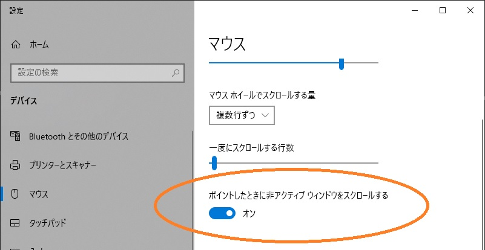
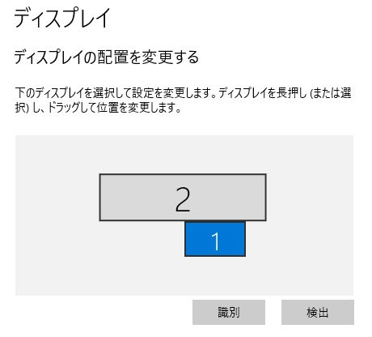

[2022](README.md#2022) [1月](2022-01.md) [2月](2022-02.md) [3月](2022-03.md) [4月](2022-04.md) [5月](2022-05.md) [6月](2022-06.md) [7月](2022-07.md) [8月](2022-08.md) [9月](2022-09.md) [10月](2022-10.md) [11月](2022-11.md) [今月](2022-12.md)  
[2021](README.md#2021) [1月](2021-01.md) [2月](2021-02.md) [3月](2021-03.md) [4月](2021-04.md) [5月](2021-05.md) [6月](2021-06.md) [7月](2021-07.md) [8月](2021-08.md) [9月](2021-09.md) [10月](2021-10.md) [11月](2021-11.md) [12月](2021-12.md)  
[2020](README.md#2020)  

2022年12月
=========

|Sun|Mon|Tue|Wen|Thu|Fri|Sat|
|---|---|---|---|---|---|---|
|[27](2022-11.md#1127-日)|[28](2022-11.md#1128-月)|[29](2022-11.md#1129-火)|[30](2022-11.md#1130-水)|[1](#1201-木)|[2](#1202-金)|[3](#1203-土)|
|[4](#1204-日)|[5](#1205-月)|[6](#1206-火)|[7](#1207-水)|[8](#1208-木)|[9](#1209-金)|[10](#1210-土)|
|[11](#1211-日)|[12](#1212-月)|[13](#1213-火)|[14](#1214-水)|[15](#1215-木)|[16](#1216-金)|[17](#1217-土)|
|[18](#1218-日)|[19](#1219-月)|[20](#1220-火)|[21](#1221-水)|[22](#1222-木)|[23](#1223-金)|[24](#1224-土)|
|[25](#1225-日)|[26](#1226-月)|[27](#1227-火)|[28](#1228-水)|[29](#1229-木)|[30](#1230-金)|[31](#1231-土)|

## 12/22 木

- 7:00の目覚ましを8:00に掛け直して8:40に起床。飲み過ぎ。
- 水やりをまたサボった。寒いけど2日続けては良くない。
- __ランチ__ は `やっぱりステーキ` で赤身コンボと替え肉の熟成アメリカ牛。
  - お代わり自由のサラダバーがキャベツの千切りとマカロニサラダだけ。
- ワイヤレスイヤホンの電池が切れた。1時間半しかもたないのは厳しい。
  - 長い打ち合わせの時や、いくつも打ち合わせが続く時には、片方ずつ使うようにしているが、今回は忘れてた。
- https://google.github.io/comprehensive-rust/
- 昔は [DDAについて英語のWikipediaが詳しかったと記憶しているが、今見たらそうでもなかった](https://en.wikipedia.org/wiki/Digital_differential_analyzer_(graphics_algorithm))。
- 職場での会話の声がまあまあ大きくて、気になって集中できない。
  - 今までの職場でも、周りの声が気になることは多く、そんなときは音楽を聴いていた。
  - 今までの職場では、自分の机があったので古いiPhoneなどを置いていた。
    - フリーアドレスでロッカーもないと、それができない。
      - と思っていたが、持ち歩けばいいか。
  - 今日は普段使うiPhoneで音楽を聴いている。
    - バッテリーを使いたくないが、普段からモバイルバッテリーを持ち歩いている。
    - それでも席を立つ度にイヤホンを抜き差しするのは面倒だ。
  - SE3にはイヤホン端子がない。Lightningケーブルのイヤホンと、充電のケーブルを一緒に使うためのコネクタを持っているのだが、使ってみたらイヤホンを認識しなかった。
    - Lightningイヤホン単体では認識したので、コネクタの問題だ。少なくとも相性問題。
- 昔から気になっていたんだけど、iPhoneのイヤホン音量が大きい。
  - 調整可能範囲のかなり小さい方で聞いているんだけど、その辺りだと1ステップ変えるだけで結構変わってしまう。
- 共有ロッカーの暗証番号を教えて頂いたので、音楽用のiPhoneを置いておけることになった。
- 職場の趣味系Slackチャンネルを漁った。
- いつものようにDeepLを酷使してたら `in my opinion` が出てきた。
  - レビューするときに `IMO` を重宝して多用してた。キツい感じを緩めるため。
- `スワンレイク` に行くつもりだったが、地図を調べようとしたら、再開発に巻き込まれて閉店していた。

## 12/21 水

- 7:00の目覚ましで8:10起床。
- 水やりをサボった。
- 昨日買ったUSB-C HDMIを試す。
  - 一発で認識してミラーモードになったが、拡張モードにしようと思ったらexplorerが壊れているようで設定を開けない。再起動した。
- マウスパッドの調子が悪いと思ったら裏返しだった。
- PR を peer と聞き間違える。
- 新しいブラウザウインドウでGitHubにログインできない、と思っていたがEnterpriseでアドレス自体がgithub.comじゃない。
- テクスチャが生成できないと言って、Unityを2つ立ち上げておけない。
- `Enumerable.Skip()` にマイナスの値を入れても不具合が起こらない。
  - どころか、コレクションの長さ以上にSkip()してもエラーにならない。
  - Skip()しつくしてからアクセス(例えばFirst())すると、そこで `InvalidOperationException` になる。
- __ランチ__ は社食。
- 職場にITサポートデスクというコーナーがあり、キーボードの修理を依頼しに行った。
  - レアな依頼で機材がないという。
  - 頑張ってくれるというので、作業の間に休憩に行ったが、担当者の予定があって、途中で終わった。
- 帰りに寄り道。
  - __神田__ がこんなに近いのは、僕にとっては驚きだった。
  - 念願の `デビルクラフト` で __晩酌__ 。
    - ハーフ4杯とサラダとバッファローチキン。
  - その近くの `びあマ` 神田店で __一杯__ 。
    - タップが8種類と、沢山のボトルビール。地図で見つけただけで、どんな店か調べていなかったが、素晴らしい店だ。
  - 国産のクラフトビールは安い。素晴らしい。
  - __東西線__ を使ってみようと思って __日本橋駅__ の改札を通ったが、何も考えずに乗ったら __半蔵門線__ だった。
    - 2駅先の __大手町駅__ で乗り換えた。結構遠かった。まあ、運動になると思えば。
  - __落合駅__ で降りて __東中野__ のビアバーで一杯。
  - 東中野のバーで一杯。
  - 近所のバーで一杯。やっぱり、コレは書く必要はないな。

## 12/20 火

- 7:00の目覚ましで7:30に起きた。
- 水やりをサボった。
- 日記のpushを忘れた。
- 出勤時に `Take Five` で __コーヒーをテイクアウト__ 。
- 職場の __コーヒー__ メーカーに豆の量の設定とお湯の量の設定がある。
  - 真ん中よりも薄めの方が美味しい。
  - お湯の量を増やすと薄くなるのか試してみたが、薄くなった。
    - 豆の量が濃さで、出来上がりのコーヒーの量を示しているのではなかった。
- いくつも買って放置してある英文法の本を、そろそろ読まねばならない環境になったが、腰が重い。
- 借りてるノートPCには映像出力端子がない。自宅で仕事をするなら、USB-Cから何らかのコネクタに変換する必要がある。
  - ウチのディスプレイの入力にDPやHDMIはあったかな？DVI-Dはあるんだけど。
    - DVIは今後ディスプレイを買い替えると使いまわしができなそうだ。HDMIなら当面大丈夫だろう。
  - 前の取引先のPCを繋いでディスプレイから音が出ていた気がするので、HDMIはありそうな気がするけどどうだったろうか。
- [How to install NuGet packages in Unity](https://www.hiroakit.com/archives/82)
- [キートップを付け直す](https://support.lenovo.com/jp/ja/solutions/ht104954)
- __ランチ__ は社食のパンとワッフル。
  - なんとなくタイミングを逃した。
- 英語で自己紹介を書く。DeepL助かる。
- 帰りに寄り道。
  - __東京駅__ 近くの `ギョバー` で __晩酌__ 。
    - たまたまだけど、タバコがかなりヘビー。
    - 店員さんがアチコチからテキーラを奢られている。楽しくて良い。
    - 表の看板にクラフトビールとあるから入ったのだが、品揃えは多くなかった。
  - もう一軒、近くの `ニホンバシブルワリーTS` で一杯。
  - 近所のバーは臨時休業。

## 12/19 月

- 目覚まし無しで6:00起床。
- 記憶にないが、起きたらポテトチップスの空袋があった。
- ワールドカップ、アルゼンチンvsフランスの配信を視聴。
- PKまで行って、家を出る時間ギリギリになった。
  - 動画の長さが5時間だったので、嫌な予感はしていた。
  - アルゼンチンがリードしている間、「動画が長い理由はセレモニーだといいんだけど」と思っていた。
- 水やりはサボった。
- Wordle5手。
- __ランチ__ は職場のビルの 1Fの `和牛バーガー` の小さい方と `ミカドコーヒー` のコーヒーフロート。
  - 和牛バーガーが15分くらいかかるというので、その間にコーヒーを買いに。
    - いつもと違う出口からビルを出て、道を間違えた。
- もう通信容量が無くなった。
- へえ。 `Please take a gander` ... ちょっと見て。
- [SharpLabでLinqが最適化されないか見てみたが、当然こうなるというコードが出力された。](https://sharplab.io/#v2:C4LglgNgPgAgTARgLACgYAYAEMEBYDcqG2CAdADJgB2AjoSkQMyYDOwATgK4DGwmAagFNeAe3a5MAb2zMAZhBEBDPgA8ANJgCeGgF4aA7vkwBfJiQBs2OJgCiK4IKoswIp1NSZPMiyUYAeeSVgAD5MAEEWGypOAFtBdkUAIwhBAApgAAswFgFhYDEJADcASncULwqSBGwAdkxC0hV6Sq8capg6hs1mlqra+tIdHpa2/obDDy9TFGmzeEwAYTKKmGYYCQBZVNLJSZbCxXZ6zABeTCpBfVzRcW3hypwATlSAEgAiSQaIqNj4pJTtqQAMoAazAAAdUnBiqQAGJgdhsbbGN7Fe7TYxAA)
  - 仮想メソッド呼び出しがないからil2cppでアグレッシブに最適化してくれないかと思ったが、IDisposeとかBoxとかが付いてくるのでどうしようもない。
- 貸与して頂いているノートPCの右ctrlキーが外れた。
- 帰りに寄り道。
  - `アンテナアメリカ` で __晩酌__ 。
    - タップに繋がってるのは、サイズがパイントからだった。4種類飲み比べがあって、いくつも飲みたいならソッチがいい。
    - ハラペーニョポッパーが結構大きい。
  - 近所のバーで一杯。
    - 常連が持ってきたカツオのたたきの差し入れを頂いた。
      - 高知の道の駅で食べておいしかったのを、同じ会社から通販で買ってるそうで、なるほど美味しい。

## 12/18 日

- 目覚まし無しで9:00起床。悪くない。
- クロアチアvsモロッコの録画を視聴。
- __園芸__
  - 外気温は9°Cなのに、本棚の上段は40°C近かった。寒かったから、カーテンで隙間を覆っていた。もうやらない方がいい。
    - カーテンを開けて少ししたら30°C程度まで下がった。
  - 水やりは5本。しっかり。
    - 梅の木にも久しぶりに潅水。
  - __豊後__ の葉っぱも落ちた。コイツは花が咲くだろうが、 __南高梅__ と __白加賀__ はどうだろうか。花粉が必要なんだけど。
  - カイガラムシ掃除。数は少ないのに、気が付くと大きいのがいる。
    - __ライム__ の実にもベトベトとスス病の黒カビがあるんだけど、虫自体は見えない。
      - 移動しているのか、落ちるのか、捕食者がいるのか。
- `Slay the Spire` は少し行き詰ったので4人目を始める。
- `Wordle` の初手を `Spear` にしたら -bbbH だった。
  - 答えは `Taper` だった。2手目に入れようと思ったけど、絞るのが先かと思って Climb と Fight を試した。
  - SpearやSpareの方が初手政界の可能性がある。Stareとどっちがいいだろうか。
- __歩いて__ __お出掛け__ 。
  - `萬国コーヒー` で __コーヒーをテイクアウト__ 。
    - カップオブエクセレンスの豆。
  - __幡ヶ谷__ のもつ焼き屋を目指したが、臨時休業だった。
  - __笹塚__ の `Pintology` で __一杯__ 。
  - 笹塚と幡ヶ谷の間くらいの `Our days` で __一杯__ 。
  - 近所のもつ焼き屋で __晩酌__ 。
  - 近所のバーで一杯。

## 12/17 土

- 水やりはサボった。
- `Slay the Spire` は3キャラ目をクリアして、その先を目指す。
- __お出掛け__ 。遊んでいて21:00くらいになった。
  - 割と最近できた __東中野__ のもんじゃ焼き屋 `ぐんちゃん` で差し入れをテイクアウト。
  - 東中野のバーに差し入れして __晩酌__ 。
  - 近所のコンビニで、ワールドカップ観戦のためのビールとつまみを購入。
- クロアチアvsモロッコを観戦。前半が終わったところで寝落ち。

## 12/16 金

- 7:00の目覚ましで8:40起床。
  - 7:30頃にフランスvsモロッコ戦を再生開始し、1.5倍速で音だけ聞きながら寝床にいて、8:40に起き上がった。
- また整髪料を付けるのを忘れて出社した。一昨年はほとんど忘れなかったと思うんだけど。
- Chromeの文字起こしのウィンドウがMeet中にも出るようになった 🙌
- そうか、インターフェースのデフォルト実装じゃなくて、拡張メソッドか。
- __ランチ__ は島根料理の `主水` で鯖しゃぶ定食。
  - 帰りに `やなかコーヒー` で __コーヒーをテイクアウト__ 。
  - 少し地上を歩いた。行列が出来ている店がいくつかある。
  - 検索に出てこなかった喫茶店がいくつもある。
  - 謎解きの店があって、クラフトビールもボトルで2種類あるそうで、その内に仕事帰りに寄りたい。
- 清澄白河まで2.7kmらしい。
  - クラフトビールを飲みに行って、帰りは大江戸線が使える。
- 同僚に誘われて飲みに行く。
  - 東京駅直結の __ヤエチカ__ にある `アンテナアメリカ` に行ったが満席だった。
  - 他も満席ばかり。流石は12月の金曜。時間もまあまあ早いし、空席を待つのも時間がかかりそうだ。
  - 神田に移動しよう、ということになって歩いていたが、通り道にオフィスの入っているビルがあり、 `CRAFTROCK` で聞いてみたら少し待てば入れるということだったので、そこで __晩酌__ 。
    - 今週3回目。
  - 同僚の馴染みの神田の居酒屋へ顔を出そうという話になって行ってみたが満席だった。
  - 解散。
- __高田馬場__ に移動して __一杯__ 。
- 近所のバーに寄ろうと思ったが、人が多かったので敬遠した。眠いし。

## 12/15 木

- 7:00の目覚ましで7:30起床。
- 目方は微増。ポテチ200g以上食べた割にはマイルドで助かる。
- __コーヒー__ を湯温91°Cでウェーブフィルターで淹れた。豆を使ってしまわないと。
  - 中挽きで、お湯の落ちるのが早過ぎたかと思ったが、丁度良いかも知れない。
- コーヒー淹れて日記書いてたら、ワールドカップ観戦する時間じゃない。フランスvsモロッコは面白そうだけど。
  - 今日はニュースを見ないで帰ろうか迷う。会食の予定があるから、どうせ結果を聞かされそうだけど。
- 水やりはペットボトル2本。
- 貸与PCに自宅WiFiの設定を使用と思ったら、一昨日の夜にやったらしい。
  - 昨日出社したらWeb版vscodeのタブがあって、そうかな、と思ってたらそうだった。
- マウスくらいは常に持ち歩いてもいいかもね。マウスパッドも持ち歩くかは微妙だが。
  - ビックカメラ日本橋三越店がすぐ近くにあった。
- フリーアドレスなのに袖机があって、誰が何のために使うのだろうか。
- Google Mapのリストを、貸与PCからも編集したい。
  - https://www.google.co.jp/maps/@35.6794083,139.764146,17z/data=!3m1!4b1!4m3!11m2!2sozseitZtT_2ZikvuTpZnWQ!3e3?hl=ja
  - 編集OKにして共有しているんだけど、何がどう間違っているのか分からない。
  - マイマップで作るべきなのか。
    - iPhoneから作れないようだから、自宅で作って職場アカウントに共有かな。
    - iPhoneから追加できない感じだ。
- ノートPCのタッチパネルのダブルタップで、ドラッグ開始になる。
  - 最初のタップでウィンドウを選択して、すぐにマウスカーソルを移動すると発動してしまい、僕の習慣からすると不便だ。
-  なんか、そんな挙動をしているような気はしていたが、一番上じゃないウィンドウでもホイールのスクロールが効く。嬉しい♪
- __昼休み__ に __無線マウス__ とマウスパッドを買ってきた。
  - 間違えて、WiFiアダプタ付きのを買ってしまった。
    - 1個しかないUSB Aソケットを占有してしまうが、Bluetooth版に買い直すか、どうしよう。
  - マウスパッドはカバンの中で曲がっても大丈夫そうな柔らかいもの。
    - 結構厚くて大きい。もっと適当なマット加工のシリコンシートでいいんだけど。
      - 100均に探しに行こうか。
  - Qiで充電できるものを買って、iPhoneも無線イヤホンも充電できるようにQi充電器も買ってこようかと思ったんだけど、電池1本で1年もつらしいので電池タイプにした。
    - 無線イヤホンは貸与PCのUSB C充電器で充電できるし、iPhoneはモバイルバッテリを持ち歩いている。
- __ランチ__ は `クリスプサラダワークス` 。買い物に行って時間が少なかったので。
- このPCはアンダースコア `_` のキーが小さくて困る。
- `stuck` のお手上げ的な意味の単語を、 `stack` だと思い込んでいた。
- 貸与PCをロック（スリープ？）すると、内蔵カメラを見失う。
  - fnキーを使ってカメラを一度無効にしてまた有効にすると復活する。
- Chromeの自動文字起こしという機能があるのを教えてもらった。
  - 動画を再生すると、ウィンドウが開いて文字起こししたものを流してくれる。
  - Meetの字幕を翻訳で使うと英語が表示されない。そして、少し溜めてくれるから、聞き逃した単語を探せる。
  - それが、僕の環境では、YouTubeでは動くのに、Meetでは働かない。泣ける。
- __東中野__ の焼肉屋で会食。
  - JR東中野駅が目的地に近いのだけど、丁度良い乗り換えが分からない。結局、半蔵門線三越前駅から青山一丁目で大江戸線に乗り換えた。
    - 改札を出ないで乗り換えられて、案外楽だった。これなら東中野で少し遠くなっても、トータルでは歩く距離が短いのではないか。
- 東中野のバー2軒と近所で一杯。
- ワールドカップのフランスvsモロッコを再生したが、15分くらいで寝落ち。

## 12/14 水

- 7:00の目覚ましを7:30に掛け直して8:00起床。
  - 7:00にワールドカップを見ようとしたら木曜朝だったので寝た。
- 水やりはサボった。
- 朝に日記を書くと、この起床時間ではコーヒーを淹れる時間がない。
  - 職場のコーヒーが十分に美味しいから、家の豆を使うタイミングがないかも知れない。
- 整髪料を忘れた。
- __ランチ__ は社食。
  - 社食のコーヒーは2種類あった。エスプレッソとドリップがあって、前はアメリカーノでいまいちだった。今日はドリップにしてみたが、やはり無料の方が美味しい。
  - 外で食べるつもりだったけど、
- キーボードのfnキーがダルいので、ファンクションキー側をデフォルトにしたい。
  - 起動時のBIOS的な画面で設定するのかと思って、再起動が面倒くさいなと思っていたが、ESCキーのところに __fnロック__ があった。素晴らしい。
- フリーアドレスだと、サンダルも箱ティッシュも面倒だし、置き傘も難しい。
- 職場のデスクに、かなり横長の湾曲ディスプレイがある。
  - 横向きに並べる設定をしていたが、マウスカーソルを動かす距離が長過ぎるので、縦並びにした。
  -  幅がかなり違うので、出入り口の位置を調整する。
- Chromeが、ページを翻訳するかどうかイチイチ聞いてくるのが鬱陶しいのでDeepL拡張を入れてGoogle翻訳を切った。
- `attend` は自分が能動的に何かする意味の方が第一義だったのか。日本での使い方から、世話を焼く方だと思ってた。
- `git configure credential.useHttpPath true` && `url = https://KeiOguro@github.com/kei-oguro/documents/`
- [WSL(Ubuntu)からホストの共有フォルダをマウントする](https://xn--v6q832hwdkvom.com/post/wsl%E3%81%A7%E3%83%8D%E3%83%83%E3%83%88%E3%83%AF%E3%83%BC%E3%82%AF%E3%83%89%E3%83%A9%E3%82%A4%E3%83%96%E3%82%92%E3%83%9E%E3%82%A6%E3%83%B3%E3%83%88%E3%81%99%E3%82%8B/) 。
- 今回の取引先は `Woven Alpha` さん。働いていることをネットに書いてもいいと許可を得た。
  - 美味しい無料コーヒーの素晴らしい職場。
  - 銀座線三越前駅改札を出たら地上に出ずに出社できる、素晴らしい立地。
  - 検索すると、クラフトビールを飲める店が沢山ある。銀座まで楽に歩けそうなことも素晴らしい。
- Slackを送るのに、DeepLに頼り切り。
- Slackアイコンを追加しようと思ったが、僕の作ったのは日本語表記のばかりだ。
- vscode Live Shareやりたい。
- フリーアドレスでロッカーもないと、空腹を誤魔化すための買い置きも、毎日持ち歩くことになるのか。
- C#でローカル変数を `readonly` に出来ないのが悲しかったが、7.2から [`ref readonly` にできる](https://learn.microsoft.com/en-us/dotnet/csharp/language-reference/proposals/csharp-7.2/readonly-ref#declaring-and-using-ref-readonly-locals) そうだ！
- 会社の近くの `クラフトビアマーケット` 三越前店で __晩酌__ 。
- `アンテナアメリカ` にも寄るつもりだったが、少し遅いし、外気温がかなり寒く感じるので帰宅。
  - 会社で、近所のクラフトビール屋さんを調べてて、オフィスを出るのが20:00になった。
- 近所のバーで一杯。
- NHKが受信契約の案内のDMを郵便局以外の業者を使って発送したら、それは信書だから郵便法違反だそうだ。
  - メールならいいのか、ということを考えると、郵便法もそろそろ考え直す時期かもね。
    - ユニバーサルサービス、という論点なんだと思うけど。
- __夜食__ にポテチを2袋食べてしまう。
- ワールドカップは今朝で合ってた。ウチのAbemaのアプリの調子が悪くて「放送開始までお待ち下さい」のままだった。夜に帰宅してもそのままだった。
  - 結果を知りつつアルゼンチンvsクロアチアを観戦。
  - メッシがPKを決めた辺りで寝落ち。

## 12/13 火

- 7:00の目覚ましを掛け直して7:30起床。
- __コーヒー__ をプレスで豆多めで淹れた。今日はちゃんと沸騰させた。温度を測ろうと思っていたが忘れた。
- コーヒーのプレスの待ち時間に、久しぶりにストレッチをした。
  - 時期によっては毎回やっていたのだが、ここのところずっとやってなかった。
  - かなり固くなっていた。
- 水やりはペットボトル2本。
  - 雨降りなのに風が無くて鉢に水が入らない。
- 食べログで「三越前駅 ランチ 300m」で検索したら3.48の店が沢山。ここに天井があるんだな。
- 9:00に家を出ても間に合った。
  - 丸の内線が、新宿の手前で間隔調整で止まった。コロナになってから初めて遭遇した。
  - 銀座線でも間隔調整してた。こちらは駅で待ってた。
- __ランチ__ は昨日も行った職場のビルの1階の `CRAFTROCK` でベジプレートとミニカレー。
  - べ時プレートは割いたチキンとトルティーヤが付く。ソフトタコスセットみたいなもの。
  - カレーにライスが無かった。ライス付きのランチと一緒に頼むものらしい。
- 久しぶりに職場で椅子に座ったら、髪の毛を背中と背もたれで挟む。
  - 髪を切ろう。
- ノートPCのキーボードやトラックパッドがダルいから、キーボードやマウスを持ってくるべきだった。
  - Home, End と Page Up, Page Down を fn キーで切り替えるのはダルい。
- 職場がフリーアドレス。
  - 私物を色々持ってきたいが、ロッカーを借りれるか分からない。
    - キーボードやマウスを毎日持ち歩くのは嫌だ。
    - コーヒーを淹れる器具とか、箸やスプーンとか、サラダを食べる調味料とか。
- ビデオ会議をするのに、HUAWEIのワイヤレスイヤホンのマイクが後ろの人の声を拾う。
  - ヘッドセットが必要だろうか。
- 職場でタダで飲めるコーヒーがあるが、美味しい。社食の100円のよりも美味しい。
  - その場で豆を挽いて淹れてくれる。エスプレッソ気味。
  - コップ置き場があり、ステンレス真空マグカップを持って行った。
- 職場が __英語だらけ__ 。
  - 海外出身者が多く、英語の打ち合わせが多い。
  - 「権限」を追加して欲しい、とお願いしようとして単語が出てこなかったが permission だった。
- 貸与して頂いているノートPCで日記を書くのに、ブラウザのシークレットモードから[Web版のvscode](https://vscode.dev/)に接続しようとしたら、cdnに接続できない。
  - ファイアウォールかな？
    - iPhoneからは接続できた。PCブラウザ版とはダウンロードするアドレスが違うかも知れないけど。
  - GitHubの `Codespaces` を設定しようとした。思ったよりも面倒だった。
  - なんとなく、バレないようにコソコソしようと考えたが、普通にcloneして構わない気がしてきた。
- 帰りに近くのビルの `八海山 千年こうじ` で __晩酌__ 。
  - コロナ前からずっと来たかった。これまでは、わざわざ東京駅までくる用事がなかった。
  - 八海山はビールも作っていて、IPAが楽しみだったが今日はヴァイツェンとスタウトだって。尖った取り合わせ。
- 近所のバーで一杯。

## 12/12 月

- 7:00の目覚ましで7:10起床。
  - トイレに起きてそこから寝付けなかったが、少し明るくなったくらいからウトウトした。
- __コーヒー__ をプレスで淹れた。
  - 湯温が87°Cで少し低い。
  - 豆は今日から `K.Base` オリジナルブレンド。
- 水やりはサボった。
- 8:40に家を出て、9:23に三越前到着。
- 初出社。会社のTシャツを1枚くれる。
- __ランチ__ は社食でカニコロッケ。
  - 社食のメニューの注文の仕方が分からなかった。4種類のメニューの内、生姜焼きを頼みたかった。メニューごとに違うカウンターに並ぶ仕組みだった。
- 社食でコーヒーが安く飲める。アメリカーノを100円で飲んで、悪くはないけど、選択肢があるなら他のを飲みたい。
  - タダで飲めるコーヒーもあるそうだけど、ソッチは味見してない。
  - 折角 __日本橋__ で、イイ感じの豆を売ってる店が沢山あるだろうから、自分で淹れて飲みたい。
- 座席はフリーアドレスだそうで、ノートPCは出退勤の度に持って行くようだ。
  - 会社に置いて毎日出社したいのだけれども。
  - 会社に置いといてはいけないと確認したワケではない。
- PCのセットアップは終わらなかった。
- 帰りに職場のビルの1階の `CRAFTROCK` で __晩酌__ 。
  - クラフトビールのお店。
  - ランチをちゃんと食べたから食事はカロリー控えめにしたかったが、ハラペーニョにチーズを詰めて揚げたハラペーニョボムを食べた。
- あの辺は __室町という名の町__ らしい。
- `スタバ` で季節商品のミルフィーユラテを買って味見して残りは近所のバーの店員に押し付けた。
- 近所のバーで一杯。

## 12/11 日

- 7:00の目覚ましで7:40起床。
  - 明日が本番。昨日早起き出来ているのが理想だったが。今日は寝付けるかどうか。
- __園芸__
  - 水やりはペットボトル1本。
  - __ライム__ のカイガラムシ掃除。久しぶりなので大きくなってるヤツがいたが、寒くなったからか数の増え方は減った。
  - __ヨモギ__ と __食用菊__ もカイガラムシ退治のためにシャワーした。
    - 食用菊は蕾が付いたまま枯れそうだが、下から出てる新芽？は元気なようだ。
      - 食用菊の雑草をいくらか取った。どれが雑草の根っこか分かりにくいので、植え替えの時にちゃんと取る。
      - ちょっと前は、雑草の花が咲くのを待つつもりだったが、シャワーしたついでなので。
      - 寒くなるんだし、下草を残しておいた方が保温になって良かっただろうか。
    - ヨモギは自立できないんだけど、放置でいいのかな？土から
- ワールドカップのイングランドvsフランスをAbemaの見逃し配信で観戦。
  - 結果を知らないまま見れたのは良かったけど、動画の長さで延長するかどうかは分かってしまった。
- Create or Overwriteは何て名前にするんだ？
  - すでにファイルがあれば上書き、無ければ作成ってのは普通だと思うんだけど。
- `Slay the Spire` の2キャラで鍵を得た。3キャラ目ももう少しだったが微妙に錯誤で負けた。
- __お出掛け__
  - __中野__ で約束があって、少し早く出てコーヒーをテイクアウトしようと思っていたんだけど、混んでいて腰が引けた。
  - 中野五差路付近の `お揚がり` で会食。
  - 北口のバーで __一杯__ 飲んで、差し入れを作ってもらう。
  - 近所のバーの店員が遅刻で、一度家に帰って `Slay the Spire` で少し遊ぶ。
  - 近所のバーに差し入れして一杯。
- 寝付けるように暑いシャワーを浴びて寝る。

## 12/10 土

- 10:00の目覚ましでは当然起きず、それでも12:30起床。
- 水やりはサボった。
- __お出かけ__
  - __ランチ__ は大久保の `半月` の相掛けカレーと `ダイス` の相掛けカレー。カレーはしご。
  - お腹の皮が痛い。
  - __新宿野村ビル__ の `ビール工房` で __一杯__ 。
  - `BBB` という自家焙煎の喫茶店で __コーヒーをテイクアウト__ 。
- `Slay the Spire` は基本3キャラでノーマルクリアした。
- [若い読者のための経済学史](https://www.amazon.co.jp/dp/4799106848) という本によると、アマルティア・センという人が「飢饉の阻止には民主主義と報道の自由が大切」というようなことを言ったのだと。
  - どこで飢餓がヒドいかを考えると、そうなんだろうね。
- ネットニュースで、英国でサッカーと言ったら馬鹿にしたような笑い方をされた、というようなのを読んだ。
  - 「suck する人」に聞こえたんじゃないの？
  - 英国ではfootballだというのは知っていたが、イタリアではカルチョだし、むしろ多数派かも？と思って主要国の翻訳を見ると、フランスもドイツもスペインも他アチコチもfootball系だった。
- __お出掛け__
  - 近所のステーキ屋で差し入れを買う。
  - 出来上がりを待つ間、近所の喫茶店でコーヒーを飲む。
  - __東中野__ のお目当てのバーが満席だったので差し入れを置いて他の店に。
  - 東中野のビアバーとまた別のバーで __一杯__ 。
  - お目当てのバーに戻って一杯。
  - 近所のバーに最後に寄るつもりだったが、自宅でワールドカップを見たいのでスルー。
- ワールドカップ観戦。モロッコvsポルトガル。
- 無事に眠くなって就寝。延長しなくて良かった。

## 12/09 金

- ランチまで頑張るつもりだったが9:00に寝た。
- 1時間のタイマーを掛けて、目は覚ましたがもう1時間かけ直した。
  - それを繰り返して、14:00過ぎにようやく起床。
- 水やりはペットボトル2本。
- `Slay the Spire` で少し進むようになってきたが、攻略サイトを見たら安定しなくなった。
  - 寝転がって遊ぶためにiPad ProからChrome Desktopに繋いでいたが、PCの画面を直接見ながら遊んでみたらfpsが違った。
  - 3キャラ中2キャラで初クリアした。
    - 初クリアは押せ押せで問題無かった。特に最初のキャラは長引くと不利な敵がいるので手数が多いやり方が良い。
- 夜はどこかで食べようと思っていたが、ダラダラしてたら夜中になった。
- __晩飯__ はカップ麺とお菓子。
- ワールドカップ観戦。クロアチアvsブラジル、オランダvsアルゼンチン。
- W杯1戦目が終わったら寝ようと思っていたが、PK決着で3時になり、ダラダラしてたら2戦目も始まってしまった。
- そのままPK決着となり、就寝は7:00。
  - 目覚ましを7:00にかけていて、10:00に掛け直した。

## 12/08 木

- 水やりはサボった。
- __お出かけ__
  - 近所のバーで __一杯__ 。
    - ここは今年初めてだしコロナの頃は来てなったし3年以上になる。
    - クラフトビールのタップがあるので、たまに寄りたい。
  - 近くの中華で一杯。
  - __四ツ谷__ の `CRUZ Burgers` で __晩酌__ 。
    - 高円寺の `Beer Engine` でお勧めされた。
    - ベーコンが厚切りで歯応えが強くて美味しい。
  - __新宿御苑__ の `ハイバリー` で __一杯__ 。
  - 歌舞伎町の `サモイドコーヒー` で ___コーヒーをテイクアウト__ 。
  - 近所のバーで一杯。
- 時間のかかるランチに行くつもりだったが、飲み過ぎで起きる気力がなかったのと、昨日のローストビーフでまだ空腹を感じないので、昼には出かけなかった。
- 23:30頃に就寝したが、2:30くらいに起きてしまい、そこから眠れなかった。

## 12/07 水

- 水やりは3本でまあまあ。
- __歩いて__ __池袋__ へ __お出掛け__ 。
  - コーヒーを買って飲みながら行こうと思ったけど、 `早川亭` は定休日だった。
  - 久しぶりに距離を計測して 6.51.km 。
    - 途中まあまあ走ったつもりだけど時速6kmに達しない。
  - __ランチ__ は池袋の `牛恋` という焼肉屋でローストビーフ丼。
    - こぼれるまで盛り放題を謳い、ストップというまで盛ってくれる。
      - 本当にこぼれるまで盛ってもらうつもりだったが、その前に倒れそうなので止めて貰った。
      - 1kg以上はあると言っていた。
    - このローストビーフをつまみに、メガハイボール3杯。
    - 満腹。割と無理して押し込んだ。
  - どこかでコーヒーやクラフトビールを飲みながら休憩したかったが、歩いていれば適当にどこかにあるだろうと思っていたら、通りかからなかった。
  - `雑司ヶ谷墓地` に通りかかる。
    - スマホの地図にジョン万次郎の墓が表示されて、なんとなく寄った。
    - 鳥が多い。草木が多いから虫も沢山いるんだろう。
    - 小泉八雲、永井荷風、夏目漱石、ジョン万次郎の墓を見てきた。お祈りもお供えもせずに見るだけ。
      - 永井荷風の墓の周りが手入れされた樹木でこじんまりしていてオシャレだった。
      - 漱石の墓は立派だった。
  - __代々木__ の `ウォータリングホール` で __一杯__ 。
  - 8.44km。時速5km未満。遅過ぎる。
    - こんなに大きな数字になるとは思わなかった。
  - __新宿駅__ の西口地下タクシー乗り場から都庁へ行く方の __小田急エース北館__ の都庁側半分が再開していた。インスタの広告で見てたんだけど。
    - 残り半分は小田急本館の建て替えに巻き込まれるのだろう。
  - __小田急ハルク__ の地下の `まい泉` で差し入れを購入。
  - __新宿野村ビル__ の `ポールバセット` で __コーヒーをテイクアウト__ 。
  - `DAISO` で紙皿や使い捨て食器とケーキに立てるロウソクを購入。
  - __東中野__ のバーに差し入れして一杯。
  - 東中野のビアバーで一杯。
  - 近所の閉店したビアバーの跡地に出来たバーで一杯。
  - 近所のバーで一杯。
- アレだけ食べたのに、 __夜食__ にカップスープとポテチを食べる。

## 12/06 火

- 水やりをサボった。
- __FX__ が少し盛り返した。
  - グズグズしていたユーロドルは損切り。豪ドル米ドルはもう少し様子を見たい。
  - 南アランドが損切りポイントより上がっていて悔しい。が、再エントリーは今じゃない。
- インスタのストーリーで誕生日の話が流れていたのを見て、バーの店員の誕生日にケーキを買いに行ったが、その人の出勤は火曜ではなく水曜だったし、先週お祝いしていたことを思い出した。
  - 持ち帰って自分で食べた。
- __夕食__ はカップ麺に豆腐とフェンピー。
  - カップ麺を食べている間に豆腐とフェンピーを塩茹でして、麺が無くなったらザルに上げた両者を投入。悪くない。
- `Slay the Spire` は面白いけど気が遠くなる。
- ワールドカップ観戦。
  - スペインvsモロッコ。
  - ポルトガルvsスイスは後半の最初で寝落ち。

## 12/05 月

- 仕事はまだだが10:00起床。
  - 遅かったから起きれると思ってなかった。初出社までに、もっと早起きのサイクルにしたい。
- コンブチャに生姜を入れてレンジで温めて飲む。
- __園芸__
  - 水やりは少し。
  - 雑草が茂っているが、対処が面倒。寒くなってきたのもある。
- 筋力が落ちて代謝が悪くなったのだろうが、寒さに弱くなった。
  - 太っていた時は寒さに強かった。
  - 太るか運動するか。
- __お出掛け__
  - 近所の引退した人と落合の `岸由` で __ランチ__ 。
  - 散歩で __中井__ に `ラム酒とチョコレートのお店` を探しに行く。
  - 歩いて __中野__ の喫茶店 `LOU` に。
  - __新中野__ の `柴田屋酒店` でワインの飲み比べ5種で __一杯__ 。
  - 近所のもつ焼き屋で一杯。
  - 他の店はまだ開いてないので帰宅。
- 帰宅時の室温が17°Cだったので20°C設定でエアコンを入れた。
- 仮眠して20:00起床。
- `Slay the Spire` で遊んでみた。
  - AndroidモニタでSteam Linkで遊ぼうと思っていたが、手持ちのBluetoothコントローラはペアリングできなかった。iOS専用のようだ。
  - iPad ProでChrome Remote Desktopで繋ぐことにした。コントローラをPCに接続した方がいいだろうから。
  - PlayStationコントローラを繋いで、PlayStationコントローラ設定を有効にしているのにXboxコントローラのボタン表示だと思ったら、このデバイスドライバはXboxコントローラだと偽装するものだったことを思い出した。
- 遊んでたら0:00時になっていて、慌ててAbemaのW杯日本戦を付けたら入場制限で入れなく、急いで近所のバーへ移動。
- 日本戦終了後に隣のバーへ移動したら、テレビが設置されていた。

## 12/04 日

- __お出かけ__ 。
  - 近所のもつ焼き屋で __晩酌__ 。
  - クラフトビールが飲みたかったけど、近所の店頭でメニューを見たら好みでなかったので、スルー。
  - コンビニでお菓子とカップ麺のストックを補充。
- サッカー観戦。フランスvsポーランド、イングランドvsセネガル。
- お菓子3袋とカップスープ1杯を摂取してしまう。
- 第2試合の前に寝るつもりだったけど、結局全部見た。

## 12/03 土

- __お出かけ__
  - __東中野__ の `ITSUKI` で __コーヒーをテイクアウト__ 。
  - 東中野のビアバーで一杯。
  - __高田馬場__ の `一番飯店` という中華で __テイクアウト__ を注文。
    - 手塚治虫が愛した店という触れ込み。
  - 待っている間に、高田馬場のビアバー `ビール食堂` で __一杯__ 。
    - お店の前から見えるようにロースターが回っていて、いつか注文したい。
  - 東中野のバーに差し入れして晩酌。
    - 一番飯店は美味しい。エビチリがニンニクたっぷりでインパクトが大きい。
  - その店で知り合いに会って、一緒に近所に移動。
  - 中野坂上で2軒行って一杯。
- ワールドカップのウルグアイvsオーストラリア戦はキックオフ前に寝落ちした。

## 12/02 金

- 飲み過ぎで頭痛い。
- 何点取って取られたかと、勝ったことは覚えてるが、試合内容を全く覚えていない。
- __園芸__
  - 水やりをしっかり。
- Amazon Prime Gamingなんてのがあるのを初めて知った。
- __お出かけ__
  - __新中野__ の `鈴忠` で __晩酌__ 。おでんと串揚げ。
    - 知り合いがいなくて残念だった。
  - その隣に同じ系列でエスニック居酒屋があったんだけど、別業態になってて残念。
  - `柴田屋酒店` で __一杯__ 。Instagramでメンションすると1杯タダだそうで、1杯分の値段で2杯飲んできた。
  - `ミンピマニス` で __一杯__ 。
    - サッカースペイン戦の録画を見ていた。前半を見てきたが、ほとんど覚えていない。
  - カラオケスナックで一杯。自分から行くことは滅多にないんだけど、ここはマスターも知り合いだし、客にも知ってる人が何人もいる。
  - 近所のバーでスマホでワールドカップを見ようとしたら興味ない客ばかりでうるさかったので隣へ移動。
    - 韓国vsポルトガル戦を観戦。
    - フードをテイクアウトして隣に持ち込み。
  - 近所のバーで一杯。
    - カメルーンvsブラジル戦を観戦。

## 12/01 木

- 今日からお休み。
  - 収入が減ると嬉しくない。残業させてくれるかな？20時間かそこらはしたい。
  - 折角10日も休みだから、何か生産的なことをした方がいいけど、ダラダラしてそうな気がするな。公開物を作るのは無理でも、ゲームくらいはしたいな。
- 電車で __お出かけ__ 。
  - __東中野__ の `On Flowers` で __コーヒーをテイクアウト__ 。
  - __ランチ__ は __高円寺__ の `チャイニーズ元` 。ユアンと読む。
  - 最近知り合った人の高円寺の古着屋 `Rugged` でシャツを購入。ラルフローレン。
    - 知り合いは昼は `酎ハイ酒場standハイスタ` にいる。
  - 帰りは歩き。
  - 早稲田通りの `F.F.O. FLOWERS AND COFFEE` で __コーヒーをテイクアウト__ 。
    - 次に行った時、毎回この正式名称を書きたくないな。
- 昨日までの取引先から借りていたPCを発送した。 `ヤマト運輸` に家まで集荷に来て貰った。
- 取引先のPCを繋いでいたモニタを自宅PCに繋いだ。
  - 調子が悪くて、何度か繋ぎ直したり再起動したりした。
  - Webカメラを繋ぎ直したり、ワイヤレスヘッドセットをペアリングし直したりすべきだが、まだやってない。
- __FX__ は昨日今日でかなり調子が悪い。 __取引余力がマイナス__ になった。
  - 南アランド(ZAR/JPY)は大統領の不祥事のニュースがあったそうで、インフレや需給の問題じゃないから損切りした。
    - むしろドテンしたいが、取引余力がない。
  - ポン米(GBP/USD)も損切り。
  - ユーロ米(EUR/USD)と豪米(AUD/USD)も近いうちに損切りしたいが、タイミングを見てみる。
  - 対円はホールド。
- 水やりを忘れた。
- README.md の10月11月の要約を書いてない。
- __お出掛け__
  - __東中野__ のビアバーで __晩酌__ 。
  - `Hacker's Bar` で __一杯__ 。
  - 東中野のバーで一杯。
  - 近所のバーと隣のバーを行ったり来たりしながらワールドカップ観戦。

<!-- cSpell: words Abema -->
